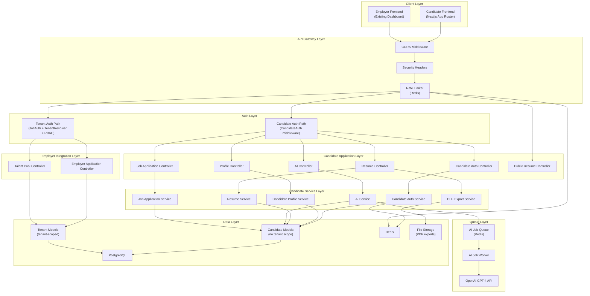
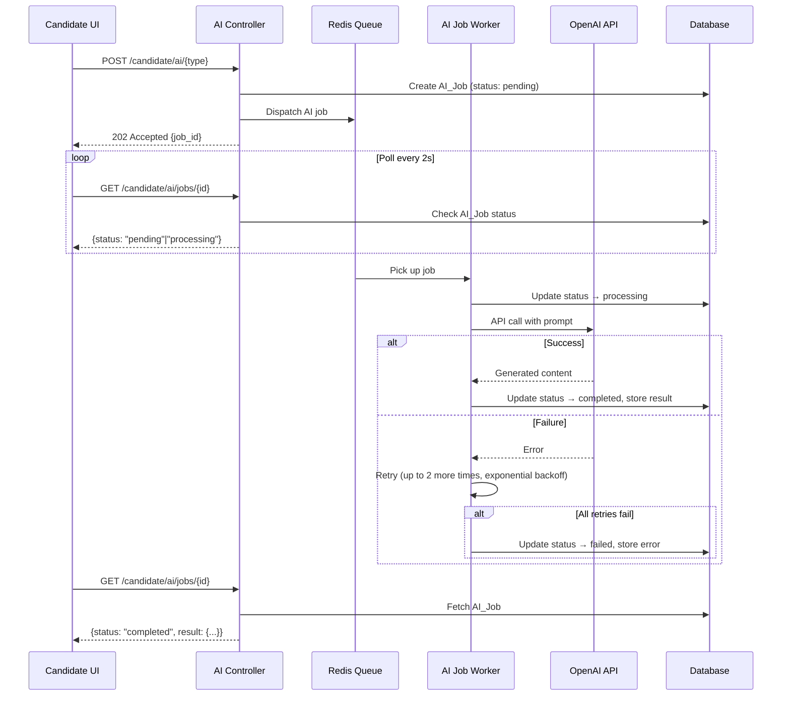
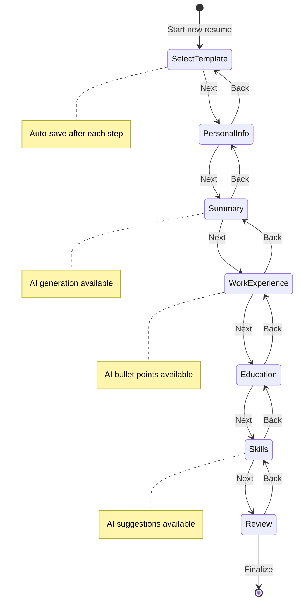
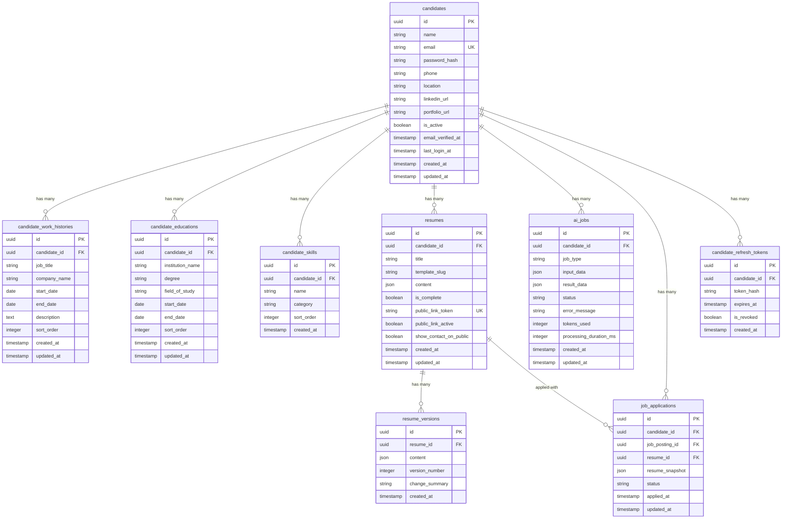
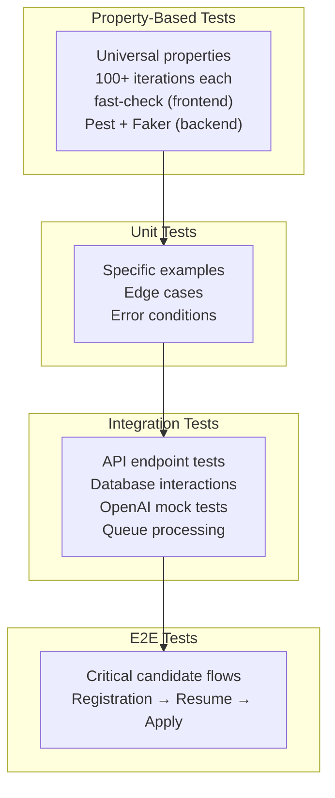

# Design Document — AI Resume Builder

## Overview

The AI Resume Builder extends HavenHR into a two-sided platform by adding a candidate-facing experience alongside the existing employer dashboard. Candidates register as platform-level users (no tenant association), build AI-powered resumes through a step-by-step wizard, manage multiple resume versions, export to PDF, share via public links, and apply to jobs posted by any company on the platform.

The design introduces a parallel authentication path for Candidates that reuses the existing JWT infrastructure but operates independently from the tenant-scoped User model. AI content generation is handled asynchronously via Laravel's Redis-backed queue system, with the OpenAI GPT-4 API providing professional summaries, work experience bullet points, skill suggestions, ATS keyword optimization, and content improvement. Resume content is stored as JSON for template-agnostic flexibility, and a PDF export service renders resumes using server-side HTML-to-PDF conversion.

### Key Design Decisions

| Decision | Choice | Rationale |
|---|---|---|
| Candidate identity model | Separate `candidates` table, no `tenant_id` | Candidates are platform-level users independent of any tenant; avoids polluting the tenant-scoped `users` table |
| Candidate auth | Same JWT library (tymon/jwt-auth), separate guard | Reuses existing token infrastructure; `role: "candidate"` claim distinguishes from tenant users |
| AI processing | Async via Laravel jobs + Redis queue | Keeps UI responsive; handles OpenAI latency and rate limits gracefully |
| AI job status polling | Client polls every 2s via REST | Simple, stateless; avoids WebSocket complexity for MVP |
| Resume content storage | JSON column on `resumes` table | Template-agnostic; allows flexible section ordering and custom fields |
| Resume versioning | Separate `resume_versions` table with full content snapshots | Simple rollback; avoids complex diff/patch logic |
| PDF generation | Server-side HTML-to-PDF (DomPDF or Browsershot) | DomPDF is pure PHP (no external deps); Browsershot gives better CSS support via headless Chrome |
| Public sharing | Unguessable UUID token in URL | No auth required; token regenerated on re-enable for security |
| Job application resume | Frozen JSON snapshot at application time | Prevents post-application edits from altering submitted content |
| Candidate middleware | New `CandidateAuth` middleware, no `TenantResolver` | Candidates have no tenant context; existing tenant middleware would reject them |

---

## Architecture

### High-Level System Architecture



### AI Job Processing Flow



### Resume Builder Wizard Flow



---

## Components and Interfaces

### Backend Components

#### 1. Candidate Auth Service

**Responsibility:** Handle candidate registration, login, token refresh, and logout — parallel to the existing tenant `AuthService`.

**Endpoints:**

| Method | Path | Rate Limit | Auth Required |
|---|---|---|---|
| POST | `/api/v1/candidate/auth/register` | 5/min/IP | No |
| POST | `/api/v1/candidate/auth/login` | 5/min/IP | No |
| POST | `/api/v1/candidate/auth/refresh` | 60/min/user | No (uses refresh token) |
| POST | `/api/v1/candidate/auth/logout` | 60/min/user | Yes (candidate) |
| GET | `/api/v1/candidate/auth/me` | 60/min/user | Yes (candidate) |

**Registration Request:**

| Field | Type | Validation |
|---|---|---|
| name | string | required, max:255 |
| email | string | required, RFC 5322 email, unique in `candidates` table |
| password | string | required, min:12, 1 uppercase, 1 lowercase, 1 digit, 1 special char |

**Registration Response (201):**
```json
{
  "data": {
    "candidate": { "id": "uuid", "name": "string", "email": "string" },
    "access_token": "jwt-string",
    "refresh_token": "opaque-string"
  }
}
```

**Registration Flow:**
1. Validate input (same password rules as tenant registration)
2. Check email uniqueness in `candidates` table only (candidate and tenant user emails are independent)
3. Hash password with bcrypt (cost 12)
4. Create `candidates` record with UUID PK
5. Generate JWT with claims: `{ sub: candidate_id, role: "candidate" }` (no `tenant_id`)
6. Generate opaque refresh token, store hash in `candidate_refresh_tokens` table
7. Dispatch `candidate.registered` event
8. Return candidate data + tokens

**Login Flow:**
1. Look up candidate by email in `candidates` table (timing-safe: always hash if not found)
2. Verify bcrypt password
3. Generate JWT Access_Token (15 min) with `{ sub: candidate_id, role: "candidate" }`
4. Generate Refresh_Token (7 day), store hash
5. Dispatch `candidate.login` event
6. Return tokens

**JWT Custom Claims (Candidate):**
```json
{
  "sub": "candidate-uuid",
  "role": "candidate",
  "iat": 1234567890,
  "exp": 1234568790
}
```

Note: No `tenant_id` claim. The `CandidateAuth` middleware checks for `role: "candidate"` and resolves the Candidate model instead of User.

#### 2. Candidate Auth Middleware (`CandidateAuth`)

**Responsibility:** Verify JWT and resolve the authenticated Candidate model. Replaces `JwtAuth` + `TenantResolver` + `RbacMiddleware` for candidate routes.

**Flow:**
1. Extract JWT from Authorization header (Bearer token)
2. Verify signature and expiration
3. Check JTI against Redis blocklist
4. Verify `role` claim equals `"candidate"`
5. Resolve `Candidate` model from `sub` claim
6. Set candidate on request via `$request->setUserResolver()`

#### 3. Candidate Profile Service

**Responsibility:** CRUD operations on candidate profile data (personal info, work history, education, skills).

**Endpoints:**

| Method | Path | Description |
|---|---|---|
| GET | `/api/v1/candidate/profile` | Get full profile |
| PUT | `/api/v1/candidate/profile` | Update personal info |
| POST | `/api/v1/candidate/profile/work-history` | Add work history entry |
| PUT | `/api/v1/candidate/profile/work-history/{id}` | Update work history entry |
| DELETE | `/api/v1/candidate/profile/work-history/{id}` | Delete work history entry |
| PUT | `/api/v1/candidate/profile/work-history/reorder` | Reorder work history |
| POST | `/api/v1/candidate/profile/education` | Add education entry |
| PUT | `/api/v1/candidate/profile/education/{id}` | Update education entry |
| DELETE | `/api/v1/candidate/profile/education/{id}` | Delete education entry |
| PUT | `/api/v1/candidate/profile/education/reorder` | Reorder education |
| PUT | `/api/v1/candidate/profile/skills` | Replace skills list |

All endpoints require `CandidateAuth` middleware. All queries scoped to the authenticated candidate's ID.

**Profile Response:**
```json
{
  "data": {
    "id": "uuid",
    "name": "string",
    "email": "string",
    "phone": "string|null",
    "location": "string|null",
    "linkedin_url": "string|null",
    "portfolio_url": "string|null",
    "work_history": [
      {
        "id": "uuid",
        "job_title": "string",
        "company_name": "string",
        "start_date": "YYYY-MM",
        "end_date": "YYYY-MM|null",
        "description": "string",
        "sort_order": 0
      }
    ],
    "education": [
      {
        "id": "uuid",
        "institution_name": "string",
        "degree": "string",
        "field_of_study": "string",
        "start_date": "YYYY-MM",
        "end_date": "YYYY-MM|null",
        "sort_order": 0
      }
    ],
    "skills": [
      { "id": "uuid", "name": "string", "category": "technical|soft", "sort_order": 0 }
    ]
  }
}
```

#### 4. Resume Service

**Responsibility:** CRUD for resumes, version management, template selection, public sharing.

**Endpoints:**

| Method | Path | Description |
|---|---|---|
| GET | `/api/v1/candidate/resumes` | List all resumes |
| POST | `/api/v1/candidate/resumes` | Create new resume |
| GET | `/api/v1/candidate/resumes/{id}` | Get resume detail |
| PUT | `/api/v1/candidate/resumes/{id}` | Update resume (auto-save) |
| DELETE | `/api/v1/candidate/resumes/{id}` | Delete resume |
| POST | `/api/v1/candidate/resumes/{id}/finalize` | Mark as complete, create version |
| GET | `/api/v1/candidate/resumes/{id}/versions` | List version history |
| POST | `/api/v1/candidate/resumes/{id}/versions/{versionId}/restore` | Restore a version |
| POST | `/api/v1/candidate/resumes/{id}/share` | Enable/disable public sharing |
| POST | `/api/v1/candidate/resumes/{id}/export-pdf` | Export to PDF |

**Resume Content JSON Structure:**
```json
{
  "personal_info": {
    "name": "string",
    "email": "string",
    "phone": "string",
    "location": "string",
    "linkedin_url": "string",
    "portfolio_url": "string"
  },
  "summary": "string",
  "work_experience": [
    {
      "job_title": "string",
      "company_name": "string",
      "start_date": "YYYY-MM",
      "end_date": "YYYY-MM|null",
      "bullets": ["string"]
    }
  ],
  "education": [
    {
      "institution_name": "string",
      "degree": "string",
      "field_of_study": "string",
      "start_date": "YYYY-MM",
      "end_date": "YYYY-MM|null"
    }
  ],
  "skills": ["string"]
}
```

**Version Creation Flow:**
1. Serialize current resume content to JSON
2. Increment version number (max of existing + 1)
3. Create `resume_versions` record
4. Enforce max 50 versions per resume (reject if at limit)

**Public Sharing Flow:**
1. Enable: Generate UUID v4 token → set `public_link_token`, `public_link_active = true`
2. Disable: Set `public_link_active = false`
3. Re-enable: Generate new UUID v4 token (old link invalidated)

**Resume Limits:**
- Max 20 resumes per candidate (enforced at creation)
- Max 50 versions per resume (enforced at version creation)

#### 5. AI Service

**Responsibility:** Manage AI content generation requests via async job queue.

**Endpoints:**

| Method | Path | Description |
|---|---|---|
| POST | `/api/v1/candidate/ai/summary` | Generate professional summary |
| POST | `/api/v1/candidate/ai/bullets` | Generate work experience bullets |
| POST | `/api/v1/candidate/ai/skills` | Suggest skills |
| POST | `/api/v1/candidate/ai/ats-optimize` | ATS keyword optimization |
| POST | `/api/v1/candidate/ai/improve` | Improve existing text |
| GET | `/api/v1/candidate/ai/jobs/{id}` | Poll job status |

**Rate Limits (per candidate):**
- 20 requests/hour
- 100 requests/day
- Max 5000 characters per request input

**AI Job Types and Prompts:**

| Type | Input | Output |
|---|---|---|
| `summary` | job_title, years_experience, work_history (optional) | 3–5 sentence professional summary |
| `bullets` | job_title, company_name, description | 4–6 bullet points (action verb + accomplishment format) |
| `skills` | job_title, industry (optional), existing_skills | 10–15 skills categorized as technical/soft, excluding existing |
| `ats_optimize` | job_description, resume_content | Missing keywords, present keywords, categorized suggestions |
| `improve` | original_text | Improved text with grammar fixes and tone consistency |

**AI Job Processing Flow:**
1. Validate input (max 5000 chars)
2. Check rate limits (20/hr, 100/day)
3. Create `ai_jobs` record (status: `pending`)
4. Dispatch `ProcessAIJob` to Redis queue
5. Return 202 with job ID

**Worker Processing:**
1. Update status → `processing`
2. Build prompt based on job type
3. Call OpenAI API (GPT-4, temperature 0.7 for creative content)
4. On success: store result, update status → `completed`, record token usage + duration
5. On failure: retry up to 2 more times with exponential backoff (2s, 8s)
6. After all retries fail: status → `failed`, store error, move to failed-jobs queue
7. Max execution timeout: 30 seconds per job

#### 6. PDF Export Service

**Responsibility:** Render resumes as PDF files using the selected template.

**Approach:** Use DomPDF (pure PHP, no external dependencies) for PDF generation. Each template is a Blade view that receives the resume JSON content and renders styled HTML. DomPDF converts the HTML to PDF.

**Flow:**
1. Load resume content and template slug
2. Render Blade template with resume data → HTML string
3. Pass HTML to DomPDF with US Letter page size (8.5" × 11")
4. Generate PDF binary
5. Store PDF in file storage (local disk in dev, S3 in prod)
6. Return download URL (signed, time-limited)
7. Timeout: 10 seconds max

**Templates:** Each template is a Blade view at `resources/views/resume-templates/{slug}.blade.php` with inline CSS for PDF compatibility.

#### 7. Job Application Service

**Responsibility:** Handle candidate job applications and employer-side application queries.

**Candidate Endpoints:**

| Method | Path | Description |
|---|---|---|
| POST | `/api/v1/candidate/applications` | Submit application |
| GET | `/api/v1/candidate/applications` | List my applications |

**Employer Endpoints (tenant-scoped):**

| Method | Path | Permission | Description |
|---|---|---|---|
| GET | `/api/v1/jobs/{jobId}/applications` | `applications.view` | List applications for a job |
| GET | `/api/v1/applications/{id}` | `applications.view` | Get application detail |
| GET | `/api/v1/talent-pool` | `applications.view` | List all applicant candidates |

**Application Submission Flow:**
1. Validate job posting exists and is active
2. Check for duplicate application (candidate_id + job_posting_id unique constraint)
3. Snapshot current resume content as JSON
4. Create `job_applications` record
5. Dispatch `candidate.applied` event with candidate_id, job_posting_id, tenant_id

**Employer Query Scoping:**
All employer application queries are scoped by `tenant_id` via the existing `TenantResolver` middleware. Employers can only see applications for their own job postings.

#### 8. Public Resume Controller

**Responsibility:** Serve read-only resume views for unauthenticated users via public links.

**Endpoint:**

| Method | Path | Auth Required |
|---|---|---|
| GET | `/api/v1/public/resumes/{token}` | No |

**Flow:**
1. Look up resume by `public_link_token` where `public_link_active = true`
2. If not found → 404
3. Return resume content with template slug
4. Exclude email and phone unless `show_contact_on_public = true`

### Frontend Components

#### 9. Candidate Pages

| Page | Route | Auth Required |
|---|---|---|
| Candidate Registration | `/candidate/register` | No |
| Candidate Login | `/candidate/login` | No |
| Candidate Dashboard | `/candidate/dashboard` | Yes (candidate) |
| Profile Editor | `/candidate/profile` | Yes (candidate) |
| Resume Builder Wizard | `/candidate/resumes/new` | Yes (candidate) |
| Resume Editor | `/candidate/resumes/[id]/edit` | Yes (candidate) |
| Resume Preview | `/candidate/resumes/[id]` | Yes (candidate) |
| Public Resume View | `/r/[token]` | No |

**Candidate Auth Context:** A separate `CandidateAuthContext` provider manages candidate authentication state, token storage, and refresh logic — parallel to the existing `AuthContext` for tenant users.

**Resume Builder Wizard Component:**
- Multi-step form with progress indicator
- Each step auto-saves on completion via `PUT /candidate/resumes/{id}`
- Real-time preview panel (side-by-side on desktop, below form on mobile < 768px)
- AI action buttons integrated into summary, work experience, and skills steps
- AI results displayed inline with accept/reject/edit controls

**AI Polling Hook (`useAIJob`):**
- Accepts job ID, polls `GET /candidate/ai/jobs/{id}` every 2 seconds
- Returns `{ status, result, error, isLoading }`
- Stops polling on `completed` or `failed`
- Shows loading spinner during `pending`/`processing`

**Visual Identity:**
- Candidate pages use a distinct color scheme (e.g., teal/green primary vs. the employer blue)
- Separate navigation layout (no sidebar — top nav with candidate-specific links)
- Shared Tailwind design tokens for brand consistency (typography, spacing, border radius)

---

## Data Models

### Entity Relationship Diagram



### Table Details

**candidates**
- `id`: UUID v4, primary key
- `email`: unique index (platform-wide uniqueness for candidates; independent from `users.email`)
- `password_hash`: bcrypt hash, cost factor 12
- `is_active`: default `true`
- No `tenant_id` column — candidates are platform-level

**candidate_refresh_tokens**
- Mirrors the existing `refresh_tokens` table structure but references `candidate_id` instead of `user_id`
- `token_hash`: SHA-256 hash, indexed for fast lookup
- `is_revoked`: default `false`
- No `tenant_id` column

**candidate_work_histories**
- `candidate_id`: NOT NULL, foreign key, indexed
- `end_date`: nullable (null = current position)
- `sort_order`: integer for custom ordering (default: ordered by start_date DESC)

**candidate_educations**
- `candidate_id`: NOT NULL, foreign key, indexed
- `end_date`: nullable
- `sort_order`: integer for custom ordering

**candidate_skills**
- `candidate_id`: NOT NULL, foreign key, indexed
- `category`: enum (`technical`, `soft`)
- Composite unique index on `(candidate_id, name)` to prevent duplicate skills

**resumes**
- `candidate_id`: NOT NULL, foreign key, indexed
- `template_slug`: one of `clean`, `modern`, `professional`, `creative`
- `content`: JSON column containing the full resume structure
- `public_link_token`: nullable, unique index (UUID v4 when sharing is enabled)
- `public_link_active`: default `false`
- `show_contact_on_public`: default `false`
- `is_complete`: default `false`, set to `true` on finalization

**resume_versions**
- `resume_id`: NOT NULL, foreign key, indexed
- `content`: JSON snapshot of the full resume at that point in time
- `version_number`: auto-incremented per resume
- `change_summary`: nullable, auto-generated or user-provided
- Composite index on `(resume_id, version_number)`

**ai_jobs**
- `candidate_id`: NOT NULL, foreign key, indexed
- `job_type`: enum (`summary`, `bullets`, `skills`, `ats_optimize`, `improve`)
- `status`: enum (`pending`, `processing`, `completed`, `failed`)
- `input_data`: JSON containing the request parameters
- `result_data`: nullable JSON containing the AI-generated content
- `tokens_used`: nullable, recorded after completion for cost tracking
- `processing_duration_ms`: nullable, recorded after completion
- Composite index on `(candidate_id, created_at)` for rate limit queries

**job_applications**
- `candidate_id`: NOT NULL, foreign key
- `job_posting_id`: NOT NULL, foreign key (references future `job_postings` table)
- `resume_id`: NOT NULL, foreign key
- `resume_snapshot`: JSON — frozen copy of resume content at application time
- `status`: enum (`submitted`, `reviewed`, `shortlisted`, `rejected`), default `submitted`
- Unique composite constraint on `(candidate_id, job_posting_id)` — one application per job per candidate
- Index on `job_posting_id` for employer-side queries

### Indexes Summary

| Table | Index | Type |
|---|---|---|
| candidates | `email` | Unique |
| candidate_refresh_tokens | `token_hash` | Standard |
| candidate_refresh_tokens | `(candidate_id, is_revoked)` | Composite |
| candidate_work_histories | `candidate_id` | Standard |
| candidate_educations | `candidate_id` | Standard |
| candidate_skills | `(candidate_id, name)` | Unique composite |
| resumes | `candidate_id` | Standard |
| resumes | `public_link_token` | Unique (where not null) |
| resume_versions | `(resume_id, version_number)` | Unique composite |
| ai_jobs | `(candidate_id, created_at)` | Composite |
| ai_jobs | `(candidate_id, status)` | Composite |
| job_applications | `(candidate_id, job_posting_id)` | Unique composite |
| job_applications | `job_posting_id` | Standard |


---

## Correctness Properties

*A property is a characteristic or behavior that should hold true across all valid executions of a system — essentially, a formal statement about what the system should do. Properties serve as the bridge between human-readable specifications and machine-verifiable correctness guarantees.*

### Property 1: Registration creates candidate record and returns tokens

*For any* valid registration payload (name, email, password meeting complexity rules), the Candidate Auth Service SHALL create a new candidate record with a UUID primary key, the provided name and email, a bcrypt-hashed password, and return a JWT access token containing the candidate ID as `sub` and `"candidate"` as the `role` claim (with no `tenant_id` claim), plus an opaque refresh token.

**Validates: Requirements 1.1**

### Property 2: Duplicate candidate email is rejected

*For any* email address that is already associated with an existing candidate record, a registration attempt using that same email SHALL be rejected and no new candidate record SHALL be created.

**Validates: Requirements 1.2**

### Property 3: Invalid registration input produces field-specific errors

*For any* candidate registration payload with one or more invalid or missing required fields (missing name, invalid email format, password not meeting complexity rules), the Input_Validator SHALL reject the request with a 422 response listing each invalid field with a specific validation error message.

**Validates: Requirements 1.6**

### Property 4: Password complexity validation

*For any* string submitted as a password during candidate registration, the Input_Validator SHALL accept it if and only if it has at least 12 characters, at least one uppercase letter, one lowercase letter, one digit, and one special character.

**Validates: Requirements 1.4**

### Property 5: Candidate login returns correctly-structured JWT

*For any* registered candidate with valid credentials, a login request SHALL return a JWT access token containing the candidate ID as `sub`, `"candidate"` as the `role` claim, a 15-minute expiration, and no `tenant_id` claim, plus a refresh token with a 7-day expiration.

**Validates: Requirements 2.1**

### Property 6: Candidate logout invalidates both tokens

*For any* authenticated candidate performing logout, the associated refresh token SHALL be revoked in the database and the access token's JTI SHALL be added to the Redis blocklist with a TTL equal to the token's remaining lifetime.

**Validates: Requirements 2.3**

### Property 7: Candidate token refresh with replay detection

*For any* valid, non-expired, non-revoked candidate refresh token, submitting it SHALL return a new access/refresh token pair and revoke the old refresh token. *For any* previously revoked candidate refresh token, submitting it SHALL cause ALL refresh tokens for that candidate to be revoked and return a 401 response.

**Validates: Requirements 2.4**

### Property 8: Profile personal information round-trip

*For any* valid personal information update (name, phone, location, linkedin_url, portfolio_url), updating the candidate profile and then retrieving it SHALL return the same values that were submitted.

**Validates: Requirements 3.1**

### Property 9: Profile collection entry persistence

*For any* valid work history entry (job_title, company_name, start_date, end_date, description) or education entry (institution_name, degree, field_of_study, start_date, end_date), adding it to the candidate profile and then retrieving the profile SHALL include that entry with all submitted field values preserved.

**Validates: Requirements 3.2, 3.3**

### Property 10: Profile collection ordering

*For any* candidate profile with multiple work history or education entries, retrieving the profile SHALL return entries ordered by start_date descending. After a reorder operation, retrieving the profile SHALL return entries in the new specified order.

**Validates: Requirements 3.5, 3.6**

### Property 11: Skills replacement is total

*For any* list of skill names submitted as a skills update, the candidate's skills collection SHALL be replaced entirely — the resulting skills SHALL exactly match the submitted list with no additions or omissions from the previous state.

**Validates: Requirements 3.4**

### Property 12: Resume pre-population from profile

*For any* candidate with a populated profile (personal info, work history, education, skills), creating a new resume SHALL pre-populate the resume content fields with the corresponding profile data.

**Validates: Requirements 4.2**

### Property 13: Wizard navigation preserves data

*For any* resume builder wizard state with entered data, navigating forward and then backward (or any sequence of forward/backward navigation) SHALL preserve all previously entered data without loss.

**Validates: Requirements 4.3**

### Property 14: AI job creation returns pending job for all types

*For any* valid AI content generation request of any type (summary, bullets, skills, ats_optimize, improve), the AI Service SHALL create an AI_Job record with `"pending"` status and return the job ID to the client with a 202 response.

**Validates: Requirements 5.1, 6.1, 8.1, 9.1, 17.1**

### Property 15: AI job result retrieval

*For any* completed AI job, retrieving it by job ID SHALL return the stored result data with the correct structure for the job type — summary jobs return text, bullets jobs return an array of strings, skills jobs return categorized skill lists, ATS jobs return missing/present keyword lists, and improve jobs return both original and improved text.

**Validates: Requirements 5.3, 6.3, 8.3, 9.3**

### Property 16: AI retry on failure

*For any* AI job where the OpenAI API call fails, the worker SHALL retry up to 2 additional times with exponential backoff. If all retries fail, the AI_Job status SHALL be set to `"failed"` with a descriptive error message.

**Validates: Requirements 5.5, 7.4**

### Property 17: Skills suggestion excludes existing skills

*For any* set of AI-suggested skills and any set of skills already present on the resume, the filtered suggestion list SHALL contain no skills that are already on the resume.

**Validates: Requirements 7.3**

### Property 18: Template switching preserves content

*For any* resume with content and any template switch from one template_slug to another, the resume content JSON SHALL remain identical before and after the switch — only the template_slug changes.

**Validates: Requirements 10.3**

### Property 19: All templates render all sections

*For any* resume template and any resume content containing all sections (personal_info, summary, work_experience, education, skills), the rendered output SHALL include content from every section.

**Validates: Requirements 10.4**

### Property 20: Resume save creates version snapshot

*For any* resume save operation, the Resume Service SHALL create a new resume_version record containing a full JSON snapshot of the resume content at that point in time, with an incremented version number and a creation timestamp.

**Validates: Requirements 12.2, 4.5**

### Property 21: Multiple resumes per candidate

*For any* candidate, creating multiple resumes with distinct titles SHALL succeed, and listing resumes SHALL return all created resumes with their correct titles.

**Validates: Requirements 12.1**

### Property 22: Version history ordering

*For any* resume with multiple versions, retrieving the version history SHALL return all versions ordered by creation date descending.

**Validates: Requirements 12.3**

### Property 23: Version restore round-trip

*For any* resume and any previous version, restoring that version SHALL create a new version record with the restored content as the current version, the full version history SHALL be preserved (no versions deleted), and the new current content SHALL match the restored version's content.

**Validates: Requirements 12.4**

### Property 24: Public sharing toggle generates and invalidates links

*For any* resume, enabling public sharing SHALL generate a unique UUID token. Disabling sharing SHALL cause the public link to return 404. Re-enabling sharing SHALL generate a new token different from any previously generated token for that resume.

**Validates: Requirements 13.1, 13.3, 13.4**

### Property 25: Public link hides contact information by default

*For any* resume accessed via a public link, the response SHALL exclude the candidate's email and phone number when `show_contact_on_public` is `false`, and SHALL include them when `show_contact_on_public` is `true`.

**Validates: Requirements 13.5**

### Property 26: Application resume snapshot is frozen

*For any* job application, the `resume_snapshot` JSON SHALL match the resume content at the time of application. *For any* subsequent edit to the source resume, the application's `resume_snapshot` SHALL remain unchanged.

**Validates: Requirements 14.1, 14.2**

### Property 27: Duplicate application rejected

*For any* candidate who has already applied to a specific job posting, a second application to the same job posting SHALL be rejected and no new application record SHALL be created.

**Validates: Requirements 14.3**

### Property 28: Employer application queries scoped by tenant

*For any* tenant user querying job applications, the results SHALL include only applications for job postings belonging to that tenant. Applications for job postings in other tenants SHALL never be returned.

**Validates: Requirements 15.1, 15.3**

### Property 29: Employer sees candidate profile and frozen resume

*For any* job application viewed by an authorized employer, the response SHALL include the candidate's name, location, skills, work history summary, and the frozen resume content from the application snapshot.

**Validates: Requirements 15.2**

### Property 30: Talent pool de-duplication

*For any* tenant where a single candidate has applied to multiple job postings, the talent pool query SHALL return that candidate exactly once.

**Validates: Requirements 15.4**

### Property 31: RBAC enforces applications.view permission

*For any* tenant user without the `applications.view` permission, requests to job application or talent pool endpoints SHALL receive a 403 Forbidden response. *For any* tenant user with the `applications.view` permission, the same requests SHALL succeed.

**Validates: Requirements 15.5**

### Property 32: AI rate limit returns 429 with Retry-After

*For any* candidate who has exceeded the AI rate limit (20/hour or 100/day), subsequent AI requests SHALL receive a 429 response with a `Retry-After` header indicating when the next request is allowed.

**Validates: Requirements 16.3**

### Property 33: AI job records contain all monitoring fields

*For any* completed AI job, the database record SHALL contain the candidate_id, job_type, tokens_used (non-null integer), and processing_duration_ms (non-null integer).

**Validates: Requirements 16.4**

### Property 34: AI job status transitions

*For any* AI job, the status SHALL transition through `pending` → `processing` → `completed` (on success) or `pending` → `processing` → `failed` (after all retries exhausted). No other transitions SHALL occur.

**Validates: Requirements 17.3, 17.4, 17.5**

### Property 35: Frontend inline validation error display

*For any* set of field-level validation errors returned by the API in a 422 response, the frontend form SHALL display each error message inline next to its corresponding form field.

**Validates: Requirements 18.5**

---

## Error Handling

### Error Response Format

All candidate API errors follow the same JSON structure as the existing platform:

```json
{
  "error": {
    "code": "ERROR_CODE",
    "message": "Human-readable message",
    "details": {}
  }
}
```

### HTTP Status Code Mapping (Candidate-Specific)

| Status | Usage |
|---|---|
| 201 | Successful registration, resource creation |
| 202 | AI job accepted (async processing) |
| 400 | Malformed request (bad JSON, missing Content-Type) |
| 401 | Authentication failure (invalid/expired/blocklisted candidate token) |
| 403 | Authorization failure (non-candidate token on candidate routes, insufficient employer permissions) |
| 404 | Resource not found (resume, version, public link, job posting) |
| 409 | Conflict (duplicate candidate email, duplicate job application) |
| 422 | Validation failure (invalid fields, password too weak, input too long) |
| 429 | Rate limit exceeded (auth or AI endpoints) |
| 500 | Unexpected server error |
| 503 | AI service unavailable (OpenAI down after retries) |

### Candidate Authentication Errors

- **Invalid credentials**: Generic `"Invalid credentials"` message (same as tenant auth — no email/password distinction)
- **Expired token**: 401 with `"TOKEN_EXPIRED"` code
- **Blocklisted token**: 401 with `"TOKEN_BLOCKLISTED"` code
- **Non-candidate token on candidate route**: 403 with `"FORBIDDEN"` — a tenant user token cannot access candidate endpoints
- **Non-tenant token on employer route**: 401 with `"UNAUTHENTICATED"` — a candidate token cannot access tenant-scoped endpoints

### AI Service Errors

```json
{
  "error": {
    "code": "AI_RATE_LIMIT_EXCEEDED",
    "message": "You have exceeded the AI usage limit. Please try again later.",
    "details": {
      "retry_after": 1800,
      "limit_type": "hourly",
      "limit": 20,
      "used": 20
    }
  }
}
```

**AI Job Failure Response (when polling a failed job):**
```json
{
  "data": {
    "id": "uuid",
    "status": "failed",
    "error_message": "AI service temporarily unavailable. Please try again.",
    "created_at": "ISO 8601"
  }
}
```

**Input Too Long:**
```json
{
  "error": {
    "code": "VALIDATION_ERROR",
    "message": "The given data was invalid.",
    "details": {
      "fields": {
        "text": {
          "messages": ["The text must not exceed 5000 characters."]
        }
      }
    }
  }
}
```

### Resume Limit Errors

```json
{
  "error": {
    "code": "RESUME_LIMIT_REACHED",
    "message": "You have reached the maximum of 20 resumes. Please delete an existing resume before creating a new one."
  }
}
```

```json
{
  "error": {
    "code": "VERSION_LIMIT_REACHED",
    "message": "This resume has reached the maximum of 50 versions."
  }
}
```

### PDF Export Errors

```json
{
  "error": {
    "code": "PDF_GENERATION_FAILED",
    "message": "Unable to generate PDF. Please try again.",
    "details": {
      "reason": "timeout"
    }
  }
}
```

PDF failures are logged with full context (resume ID, template, error stack trace) for debugging.

### Job Application Errors

**Duplicate Application:**
```json
{
  "error": {
    "code": "DUPLICATE_APPLICATION",
    "message": "You have already applied to this job."
  }
}
```

**Inactive Job Posting:**
```json
{
  "error": {
    "code": "JOB_NOT_AVAILABLE",
    "message": "This job posting is no longer accepting applications."
  }
}
```

### Unhandled Exceptions

Same pattern as existing platform:
- Log full stack trace (not exposed to client)
- Return generic 500 with correlation ID
- Dispatch `system.error` event

---

## Testing Strategy

### Testing Layers



### Property-Based Testing

**Backend Library:** Pest PHP with Faker for random data generation (same as existing platform). Properties implemented as Pest tests running 100+ iterations.

**Frontend Library:** fast-check (already installed) with Vitest.

**Configuration:**
- Minimum 100 iterations per property test
- Each test tagged with: `Feature: ai-resume-builder, Property {N}: {title}`
- Generators produce valid and invalid data covering edge cases (empty strings, unicode, max-length strings, special characters, boundary dates)

**Backend Properties to Implement (Pest + Faker):**
- Properties 1–4: Candidate registration and validation
- Properties 5–7: Candidate authentication lifecycle
- Properties 8–11: Profile management CRUD
- Properties 14–17: AI job creation, retrieval, retry, and skill filtering
- Properties 18–19: Template behavior
- Properties 20–23: Resume versioning
- Properties 24–25: Public sharing
- Properties 26–27: Job application snapshots and uniqueness
- Properties 28–31: Employer integration and RBAC
- Properties 32–34: AI rate limiting and job status

**Frontend Properties to Implement (fast-check):**
- Property 12: Resume pre-population from profile data
- Property 13: Wizard navigation data preservation
- Property 35: Inline validation error display mapping

### Unit Tests

Focus on specific examples and edge cases not covered by property tests:

**Auth:**
- Candidate email independent from tenant user email (Req 1.3)
- Invalid credentials return generic error (Req 2.2)
- Auth rate limit: 6th request returns 429 (Req 2.5)

**AI Service:**
- AI summary quality spot-check with mocked OpenAI (Req 5.4)
- Bullet point format validation (Req 6.4)
- Accept/reject/edit individual bullets (Req 6.5)
- Skills suggestion UI rendering (Req 7.2)
- ATS results display with navigation (Req 8.5)
- Side-by-side improvement display (Req 9.4)
- Max 5000 character input rejection (Req 16.5)
- 30-second job timeout (Req 17.6)

**Resume:**
- Max 20 resumes per candidate enforcement (Req 12.5)
- Max 50 versions per resume enforcement (Req 12.6)
- PDF formatted for US Letter dimensions (Req 11.2)
- PDF generation within 10 seconds (Req 11.4)
- PDF failure returns descriptive error (Req 11.5)

**Templates:**
- Four template options exist (Req 10.1)
- Template selection renders within 1 second (Req 10.2)

**Job Applications:**
- Application validates job posting exists and is active (Req 14.5)

**Frontend:**
- Wizard step order (Req 4.1)
- Real-time preview updates (Req 4.6)
- Mobile-first responsive layout (Req 4.7, 18.2)
- Loading indicators during async operations (Req 18.4)
- Distinct visual identity for candidate pages (Req 18.6)
- WCAG 2.1 AA checks with axe-core (Req 18.3)

### Integration Tests

**AI Pipeline:**
- Full AI job lifecycle with mocked OpenAI (pending → processing → completed)
- AI job failure after all retries with mocked OpenAI
- Failed job moves to failed-jobs queue (Req 17.5)
- Event dispatch on candidate registration (Req 1.5)
- Event dispatch on job application (Req 14.4)

**PDF Export:**
- Full PDF generation with DomPDF (Req 11.1)
- PDF contains all resume sections (Req 11.3)

**Public Sharing:**
- Public link accessible without auth (Req 13.2)

**Database:**
- Schema smoke tests for all candidate tables (Req 19.1–19.9)
- UUID primary keys on all tables
- Foreign key constraints
- Unique constraints (candidate email, public_link_token, candidate+job_posting)

### E2E Tests

Critical candidate journeys tested with Playwright:

1. **Candidate Registration → Profile → Resume**: Register, fill profile, create resume via wizard, verify preview
2. **AI Content Generation**: Start resume, request AI summary, poll for result, accept generated content
3. **Resume Export**: Complete resume, export PDF, verify download
4. **Public Sharing**: Enable sharing, access public link in incognito, verify read-only view
5. **Job Application**: Browse jobs, apply with resume, verify application in employer dashboard
6. **Resume Versioning**: Edit resume multiple times, view version history, restore old version

### Test Organization

```
backend/tests/
├── Feature/
│   ├── Candidate/
│   │   ├── CandidateAuthTest.php
│   │   ├── CandidateProfileTest.php
│   │   ├── ResumeTest.php
│   │   ├── ResumeVersionTest.php
│   │   ├── PublicResumeTest.php
│   │   ├── AIJobTest.php
│   │   ├── JobApplicationTest.php
│   │   └── EmployerApplicationTest.php
│   └── ...existing tests...
├── Unit/
│   ├── Services/
│   │   ├── CandidateAuthServiceTest.php
│   │   ├── AIServiceTest.php
│   │   ├── PDFExportServiceTest.php
│   │   └── ResumeServiceTest.php
│   ├── Middleware/
│   │   └── CandidateAuthMiddlewareTest.php
│   └── ...existing tests...
├── Property/
│   ├── CandidateRegistrationPropertyTest.php
│   ├── CandidateAuthPropertyTest.php
│   ├── CandidateProfilePropertyTest.php
│   ├── ResumePropertyTest.php
│   ├── ResumeVersionPropertyTest.php
│   ├── PublicSharingPropertyTest.php
│   ├── AIJobPropertyTest.php
│   ├── JobApplicationPropertyTest.php
│   ├── EmployerIntegrationPropertyTest.php
│   └── AIRateLimitPropertyTest.php
└── ...existing tests...

frontend/src/__tests__/
├── components/
│   ├── candidate/
│   │   ├── ResumeWizard.test.tsx
│   │   ├── ProfileEditor.test.tsx
│   │   ├── AIContentPanel.test.tsx
│   │   └── PublicResumeView.test.tsx
│   └── ...existing tests...
├── properties/
│   ├── resume-prepopulation.property.test.ts
│   ├── wizard-navigation.property.test.ts
│   └── validation-errors.property.test.ts
└── ...existing tests...
```
