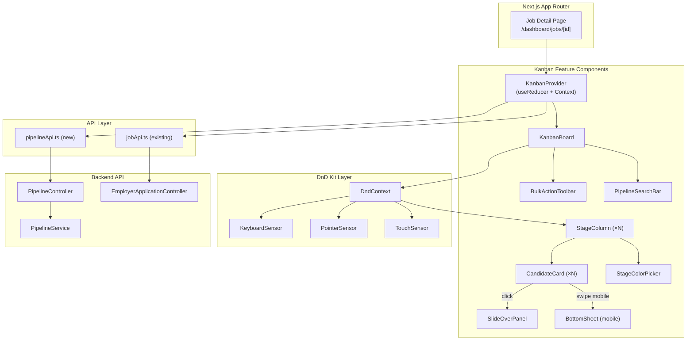
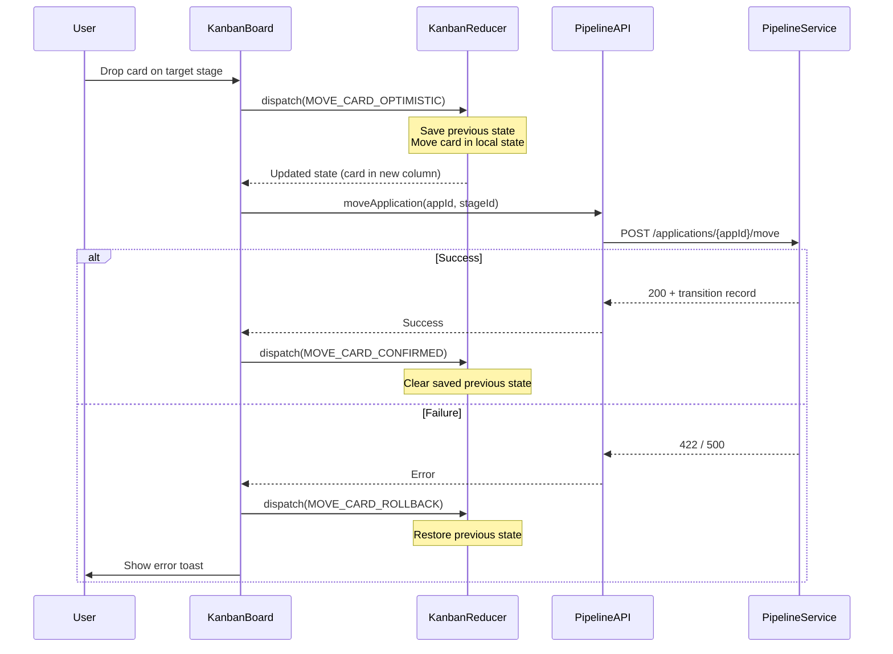
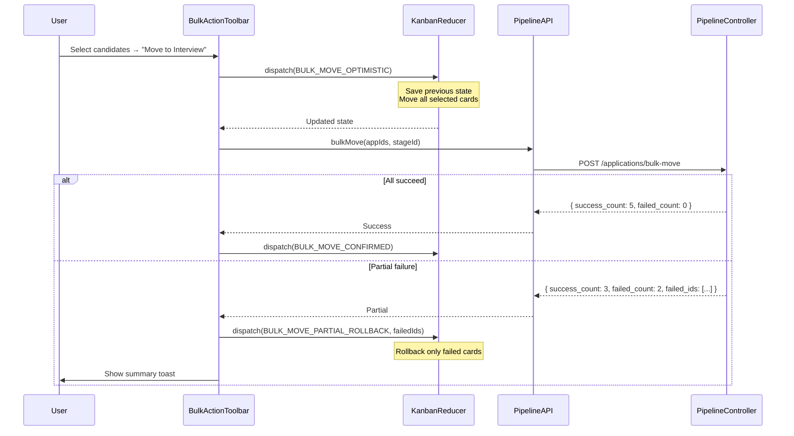
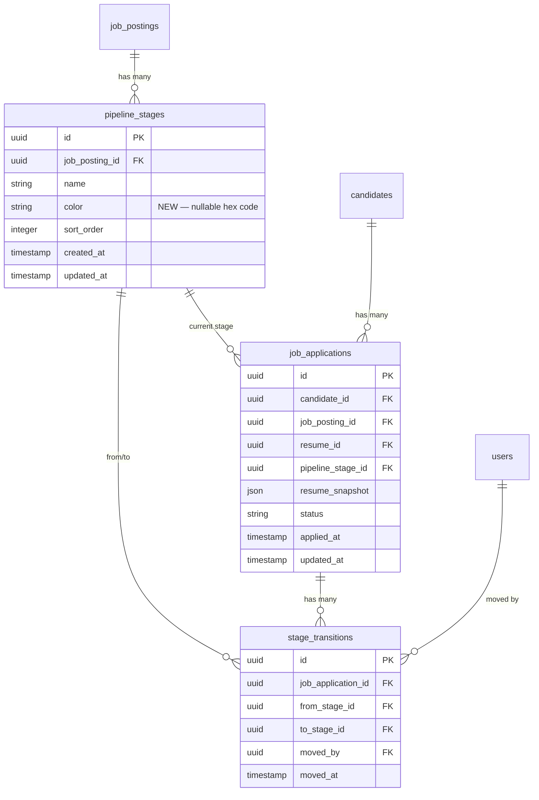

# Design Document — Candidate Pipeline (Kanban)

## Overview

The Candidate Pipeline feature replaces the existing dropdown-based stage-move UI on the employer job detail page with a full interactive Kanban board. The current implementation (`/dashboard/jobs/[id]/page.tsx`) already renders pipeline stages as columns with candidate cards and a "Move to…" `<select>` dropdown — this spec upgrades that to drag-and-drop on desktop, swipe-to-move on mobile, a slide-over candidate detail panel, bulk actions, client/server-side search, stage customization (rename + color), and WCAG 2.1 AA accessibility.

The design is primarily frontend-focused. The backend already provides `PipelineService.moveApplication()`, `addStage()`, `reorderStages()`, `removeStage()`, and `createDefaultStages()` via `PipelineController`. Backend enhancements are limited to:
- New bulk move/reject endpoints
- Stage rename and color update endpoints (+ `color` column migration)
- Server-side `q` search parameter on the applications listing endpoint
- `notification_eligible` field on the `ApplicationStageChanged` event payload

### Key Design Decisions

| Decision | Choice | Rationale |
|---|---|---|
| Drag-and-drop library | `@dnd-kit/core` + `@dnd-kit/sortable` | Already the standard React DnD library; supports keyboard, touch, and screen readers out of the box; tree-shakeable |
| State management | React `useReducer` + Context in `KanbanProvider` | Local to the pipeline page; avoids adding a global state library for one feature; reducer pattern handles optimistic updates and rollbacks cleanly |
| Optimistic updates | Immediate UI move → API call → rollback on failure | Keeps the board feeling instant; reducer stores previous state for rollback |
| Mobile interaction | Swipe gesture → Bottom Sheet stage picker | Touch-friendly; avoids drag-and-drop complexity on small screens; Bottom Sheet is a familiar mobile pattern |
| Slide-over panel | Right-side panel (desktop) / full-screen overlay (mobile) | Keeps Kanban board visible on desktop for context; full-screen on mobile for usability |
| Client-side search threshold | 200 candidates | Below 200, all data is already loaded — filtering in JS is instant. Above 200, server-side search avoids loading the full dataset |
| Stage color storage | `color` column on `pipeline_stages` table | Simple, no extra table needed; nullable with default `null` (no color) |
| Bulk operations | Single POST endpoint with array of IDs | Reduces HTTP round-trips; backend processes in a DB transaction for atomicity |
| Accessibility | `@dnd-kit` keyboard sensors + ARIA live regions + focus management | `@dnd-kit` provides keyboard DnD natively; we add ARIA announcements and focus trapping for the slide-over |

---

## Architecture

### High-Level Component Architecture



### Kanban State Flow (Optimistic Update Pattern)



### Bulk Action Flow



---

## Components and Interfaces

### Frontend Components

#### 1. KanbanProvider (State Management)

**File:** `frontend/src/components/pipeline/KanbanProvider.tsx`

**Responsibility:** Manages all Kanban board state via `useReducer`. Provides state and dispatch to child components through React Context.

**State Shape:**
```typescript
interface KanbanState {
  stages: KanbanStage[];           // Stages with their applications
  selectedIds: Set<string>;        // Selected application IDs for bulk actions
  searchQuery: string;             // Current search text
  stageFilter: string | null;      // Filter to single stage ID
  sortBy: 'applied_at_desc' | 'applied_at_asc' | 'candidate_name'; // Sort order
  slideOverAppId: string | null;   // Currently open slide-over application
  isLoading: boolean;
  error: string | null;
  previousState: KanbanStage[] | null; // For optimistic rollback
  totalCandidates: number;         // Total count for search strategy decision
}

interface KanbanStage {
  id: string;
  name: string;
  color: string | null;
  sort_order: number;
  applications: KanbanApplication[];
}

interface KanbanApplication {
  id: string;
  candidate_name: string;
  candidate_email: string;
  current_stage: string;
  status: string;
  applied_at: string;
}
```

**Reducer Actions:**
```typescript
type KanbanAction =
  | { type: 'SET_DATA'; stages: KanbanStage[]; totalCandidates: number }
  | { type: 'SET_LOADING'; isLoading: boolean }
  | { type: 'SET_ERROR'; error: string | null }
  | { type: 'MOVE_CARD_OPTIMISTIC'; appId: string; fromStageId: string; toStageId: string }
  | { type: 'MOVE_CARD_CONFIRMED' }
  | { type: 'MOVE_CARD_ROLLBACK' }
  | { type: 'BULK_MOVE_OPTIMISTIC'; appIds: string[]; toStageId: string }
  | { type: 'BULK_MOVE_CONFIRMED' }
  | { type: 'BULK_MOVE_PARTIAL_ROLLBACK'; failedIds: string[] }
  | { type: 'TOGGLE_SELECT'; appId: string }
  | { type: 'SELECT_ALL_IN_STAGE'; stageId: string }
  | { type: 'CLEAR_SELECTION' }
  | { type: 'SET_SEARCH'; query: string }
  | { type: 'SET_STAGE_FILTER'; stageId: string | null }
  | { type: 'SET_SORT'; sortBy: KanbanState['sortBy'] }
  | { type: 'OPEN_SLIDE_OVER'; appId: string }
  | { type: 'CLOSE_SLIDE_OVER' }
  | { type: 'UPDATE_STAGE'; stageId: string; name?: string; color?: string | null };
```

#### 2. KanbanBoard

**File:** `frontend/src/components/pipeline/KanbanBoard.tsx`

**Responsibility:** Top-level board component. Wraps `DndContext` from `@dnd-kit`, renders the search bar, stage columns, and bulk action toolbar. Handles the `onDragEnd` callback to dispatch move actions.

**Key Behaviors:**
- Configures `PointerSensor` (desktop), `KeyboardSensor` (accessibility), and `TouchSensor` (mobile) via `useSensors()`
- On `onDragEnd`: extracts `active.id` (application ID) and `over.id` (target stage ID), dispatches `MOVE_CARD_OPTIMISTIC`, calls API, then dispatches confirm or rollback
- Applies client-side search/filter/sort to the state before rendering columns
- On mobile (viewport < 768px): renders as a horizontally scrollable snap container showing one column at a time with stage navigation dots
- Announces drag operations via an ARIA live region

**Props:** None (reads from KanbanProvider context)

#### 3. StageColumn

**File:** `frontend/src/components/pipeline/StageColumn.tsx`

**Responsibility:** Renders a single pipeline stage as a droppable column. Displays stage header (name, count badge, color accent), and contains CandidateCards.

**Key Behaviors:**
- Uses `useDroppable` from `@dnd-kit` to register as a drop target
- Renders stage color as a 4px top border on the column header
- Shows inline edit mode for stage name on double-click (if user has `pipeline.manage` permission)
- Shows color picker button in header (if user has `pipeline.manage` permission)
- Highlights with a blue border when a card is being dragged over it
- Vertical scroll for cards within the column (max-height with overflow-y-auto)

**Props:**
```typescript
interface StageColumnProps {
  stage: KanbanStage;
  applications: KanbanApplication[];  // Already filtered/sorted
  isOver: boolean;                     // DnD hover state
  canManage: boolean;                  // Has applications.manage permission
  canCustomize: boolean;               // Has pipeline.manage permission
}
```

#### 4. CandidateCard

**File:** `frontend/src/components/pipeline/CandidateCard.tsx`

**Responsibility:** Renders a single candidate application as a draggable card within a stage column.

**Key Behaviors:**
- Uses `useDraggable` from `@dnd-kit` to register as a drag source
- Displays: candidate name, email, applied date, resume link
- Shows selection checkbox when bulk selection mode is active
- On click (not drag): dispatches `OPEN_SLIDE_OVER`
- On mobile swipe: opens BottomSheet with target stage options
- Semi-transparent appearance while being dragged (via CSS transform from `@dnd-kit`)
- Keyboard accessible: Enter/Space to open slide-over, Ctrl+Arrow to move between stages
- Minimum 44×44px touch target on mobile

**Props:**
```typescript
interface CandidateCardProps {
  application: KanbanApplication;
  isSelected: boolean;
  isDragging: boolean;
  canManage: boolean;
  onSelect: (appId: string) => void;
  onClick: (appId: string) => void;
}
```

#### 5. SlideOverPanel

**File:** `frontend/src/components/pipeline/SlideOverPanel.tsx`

**Responsibility:** Right-side panel (desktop) or full-screen overlay (mobile) showing full candidate details.

**Key Behaviors:**
- Fetches application detail + transition history from API on open
- Sections: candidate info, resume snapshot viewer, notes area, stage history timeline, quick actions
- Quick actions: "Move to…" dropdown, "Reject" button, "Shortlist" (next stage) button
- Quick actions dispatch moves through KanbanProvider, updating the board in real time
- Focus trap: Tab cycles within the panel while open
- Close via: close button (×), Escape key, click outside (desktop only)
- On mobile (< 768px): renders as full-screen overlay with back button
- Loading skeleton while fetching data
- ARIA: `role="dialog"`, `aria-modal="true"`, `aria-labelledby` pointing to candidate name heading

**Props:**
```typescript
interface SlideOverPanelProps {
  applicationId: string;
  stages: KanbanStage[];
  onClose: () => void;
  onMoveApplication: (appId: string, stageId: string) => void;
}
```

#### 6. BulkActionToolbar

**File:** `frontend/src/components/pipeline/BulkActionToolbar.tsx`

**Responsibility:** Floating toolbar that appears when one or more candidates are selected.

**Key Behaviors:**
- Shows selected count, "Move to Stage" dropdown, "Reject All" button, "Clear Selection" button
- "Move to Stage" opens a dropdown listing all stages (excluding stages where all selected candidates already are)
- On action: dispatches bulk optimistic update, calls bulk API, handles confirm/partial rollback
- On mobile: renders as a fixed bottom bar
- Hidden when user lacks `applications.manage` permission

#### 7. PipelineSearchBar

**File:** `frontend/src/components/pipeline/PipelineSearchBar.tsx`

**Responsibility:** Search input, stage filter dropdown, and sort selector above the Kanban board.

**Key Behaviors:**
- Search input with debounce (300ms) — dispatches `SET_SEARCH`
- Stage filter dropdown — dispatches `SET_STAGE_FILTER`
- Sort selector (Applied: Newest, Applied: Oldest, Name: A-Z) — dispatches `SET_SORT`
- Shows match count and "Clear" button when search is active
- For pipelines with > 200 candidates: search triggers server-side API call with `q` parameter instead of client-side filtering

#### 8. BottomSheet

**File:** `frontend/src/components/pipeline/BottomSheet.tsx`

**Responsibility:** Mobile-only action sheet that slides up from the bottom of the screen.

**Key Behaviors:**
- Used for: stage selection (swipe-to-move), bulk action menus, confirmation dialogs
- Displays stage names with color indicators
- Excludes the candidate's current stage from the list
- Backdrop overlay; tap outside or swipe down to dismiss
- ARIA: `role="dialog"`, focus trapped while open

#### 9. StageColorPicker

**File:** `frontend/src/components/pipeline/StageColorPicker.tsx`

**Responsibility:** Small popover for selecting a stage color.

**Key Behaviors:**
- Preset palette of 8-10 colors + "No color" option
- On select: calls stage color update API, dispatches `UPDATE_STAGE` to update local state
- Only visible to users with `pipeline.manage` permission

### Backend Enhancements

#### 10. New API Endpoints

**Bulk Move:**

| Method | Path | Permission | Description |
|---|---|---|---|
| POST | `/api/v1/applications/bulk-move` | `applications.manage` | Move multiple applications to a target stage |

**Request:**
```json
{
  "application_ids": ["uuid-1", "uuid-2", "uuid-3"],
  "stage_id": "target-stage-uuid"
}
```

**Response (200):**
```json
{
  "data": {
    "success_count": 3,
    "failed_count": 0,
    "failed_ids": []
  }
}
```

**Bulk Reject:**

| Method | Path | Permission | Description |
|---|---|---|---|
| POST | `/api/v1/applications/bulk-reject` | `applications.manage` | Move multiple applications to their Rejected stage |

**Request:**
```json
{
  "application_ids": ["uuid-1", "uuid-2", "uuid-3"]
}
```

**Response (200):**
```json
{
  "data": {
    "success_count": 3,
    "failed_count": 0,
    "failed_ids": []
  }
}
```

**Stage Rename:**

| Method | Path | Permission | Description |
|---|---|---|---|
| PATCH | `/api/v1/jobs/{jobId}/stages/{stageId}` | `pipeline.manage` | Update stage name and/or color |

**Request:**
```json
{
  "name": "Phone Screen",
  "color": "#3B82F6"
}
```

**Response (200):**
```json
{
  "data": {
    "id": "stage-uuid",
    "name": "Phone Screen",
    "color": "#3B82F6",
    "sort_order": 1
  }
}
```

**Validation:** `name` is optional string max 255. `color` is optional, must match `^#[0-9a-fA-F]{6}$` or be `null` (to clear).

**Enhanced Applications Listing:**

The existing `GET /api/v1/jobs/{jobId}/applications` endpoint gains two new query parameters:

| Parameter | Type | Default | Description |
|---|---|---|---|
| q | string | — | Search by candidate name or email (case-insensitive partial match) |
| sort | string | applied_at | Sort field: `applied_at` (desc) or `candidate_name` (asc) |

#### 11. PipelineService Enhancements

**New Methods:**

```php
/**
 * Move multiple applications to a target stage in a single transaction.
 * Returns counts of successes and failures.
 */
public function bulkMove(array $applicationIds, string $targetStageId, string $userId): array

/**
 * Move multiple applications to their respective job posting's Rejected stage.
 */
public function bulkReject(array $applicationIds, string $userId): array

/**
 * Update a pipeline stage's name and/or color.
 */
public function updateStage(string $stageId, array $data): PipelineStage
```

**bulkMove Flow:**
1. Load target stage, verify it exists
2. Load all applications by IDs, verify they belong to the same job posting as the target stage
3. Wrap in a DB transaction
4. For each application: update `pipeline_stage_id`, create `StageTransition` record, dispatch event
5. Return `{ success_count, failed_count, failed_ids }`

**bulkReject Flow:**
1. Load all applications by IDs
2. For each application: find the "Rejected" stage for that application's job posting (stage with name "Rejected")
3. Wrap in a DB transaction
4. For each application: update `pipeline_stage_id` to Rejected stage, create `StageTransition`, dispatch event
5. Return `{ success_count, failed_count, failed_ids }`

**updateStage Flow:**
1. Load stage by ID, verify it belongs to a job posting in the current tenant
2. Update `name` if provided (validate max 255 chars)
3. Update `color` if provided (validate hex pattern or null)
4. Save and return updated stage

#### 12. Database Migration: Add `color` Column

**Migration:** `add_color_to_pipeline_stages_table`

```php
Schema::table('pipeline_stages', function (Blueprint $table) {
    $table->string('color', 7)->nullable()->after('name');
});
```

- Column: `color`, type `VARCHAR(7)`, nullable, default `NULL`
- Stores hex color codes like `#3B82F6`
- No index needed (never queried by color)

#### 13. ApplicationStageChanged Event Enhancement

The existing `ApplicationStageChanged` event payload gains a `notification_eligible` field:

```php
event(new ApplicationStageChanged(
    $tenantId,
    $userId,
    [
        'application_id' => $applicationId,
        'from_stage' => $fromStageId,
        'to_stage' => $targetStageId,
        'notification_eligible' => true,
    ],
));
```

This prepares for future email notification integration without changing the event structure.

#### 14. Form Request Classes

**BulkMoveRequest:**
```php
class BulkMoveRequest extends BaseFormRequest
{
    public function rules(): array
    {
        return [
            'application_ids' => 'required|array|min:1|max:100',
            'application_ids.*' => 'required|uuid',
            'stage_id' => 'required|uuid',
        ];
    }
}
```

**BulkRejectRequest:**
```php
class BulkRejectRequest extends BaseFormRequest
{
    public function rules(): array
    {
        return [
            'application_ids' => 'required|array|min:1|max:100',
            'application_ids.*' => 'required|uuid',
        ];
    }
}
```

**UpdatePipelineStageRequest:**
```php
class UpdatePipelineStageRequest extends BaseFormRequest
{
    public function rules(): array
    {
        return [
            'name' => 'sometimes|string|max:255',
            'color' => 'sometimes|nullable|regex:/^#[0-9a-fA-F]{6}$/',
        ];
    }
}
```

### Frontend API Functions

**File:** `frontend/src/lib/pipelineApi.ts`

```typescript
// New API functions for pipeline-specific operations

export async function bulkMoveApplications(
  appIds: string[],
  stageId: string
): Promise<ApiResponse<BulkActionResult>>

export async function bulkRejectApplications(
  appIds: string[]
): Promise<ApiResponse<BulkActionResult>>

export async function updatePipelineStage(
  jobId: string,
  stageId: string,
  data: { name?: string; color?: string | null }
): Promise<ApiResponse<PipelineStageDetail>>

export async function fetchJobApplicationsWithSearch(
  jobId: string,
  params?: {
    page?: number;
    per_page?: number;
    q?: string;
    sort?: string;
  }
): Promise<PaginatedResponse<EmployerJobApplication>>
```

### Frontend Type Extensions

**File:** `frontend/src/types/job.ts` (additions)

```typescript
/** Extended pipeline stage with color support. */
export interface PipelineStageDetail extends PipelineStage {
  color: string | null;
}

/** Result of a bulk action (move or reject). */
export interface BulkActionResult {
  success_count: number;
  failed_count: number;
  failed_ids: string[];
}
```

---

## Data Models

### Updated Entity Relationship (Pipeline Focus)



### Schema Changes Summary

| Table | Change | Details |
|---|---|---|
| `pipeline_stages` | Add column | `color VARCHAR(7) NULLABLE` after `name` |
| `pipeline_stages` | Update model fillable | Add `color` to `$fillable` array |

No other schema changes are needed. The existing `pipeline_stages`, `stage_transitions`, and `job_applications` tables already support all required operations.

### Updated Route Registration

New routes added to `backend/routes/api.php` inside the existing authenticated middleware group:

```php
// Bulk pipeline operations
Route::post('/applications/bulk-move', [PipelineController::class, 'bulkMove'])
    ->middleware('rbac:applications.manage');
Route::post('/applications/bulk-reject', [PipelineController::class, 'bulkReject'])
    ->middleware('rbac:applications.manage');

// Stage update (rename + color) — added alongside existing stage routes
Route::patch('/jobs/{jobId}/stages/{stageId}', [PipelineController::class, 'updateStage'])
    ->middleware('rbac:pipeline.manage');
```

---

## Correctness Properties

*A property is a characteristic or behavior that should hold true across all valid executions of a system — essentially, a formal statement about what the system should do. Properties serve as the bridge between human-readable specifications and machine-verifiable correctness guarantees.*

### Property 1: Candidate card and stage column rendering completeness

*For any* pipeline stage with a name, color, and application count, and *for any* candidate application with a name, email, applied date, and resume link, the rendered StageColumn SHALL display the stage name and correct candidate count badge, and the rendered CandidateCard SHALL display the candidate's name, email, applied date, and resume link.

**Validates: Requirements 1.2, 1.3**

### Property 2: Optimistic move and rollback round-trip

*For any* Kanban board state with stages and applications, dispatching `MOVE_CARD_OPTIMISTIC` (moving an application from one stage to another) followed by `MOVE_CARD_ROLLBACK` SHALL produce a state identical to the original state. Additionally, after `MOVE_CARD_OPTIMISTIC` alone, the application SHALL appear in the target stage and not in the source stage, and the source stage's application count SHALL decrease by 1 while the target stage's count increases by 1.

**Validates: Requirements 2.3, 2.4, 2.5**

### Property 3: Bottom sheet excludes current stage

*For any* set of pipeline stages and *for any* candidate application currently in a specific stage, the BottomSheet stage list SHALL contain all stages except the candidate's current stage. The list SHALL display each stage's name and associated color.

**Validates: Requirements 3.4**

### Property 4: Slide-over panel content and timeline ordering

*For any* application detail with candidate information and *for any* set of stage transitions, the SlideOverPanel SHALL display the candidate name, email, resume snapshot, notes area, stage history timeline, and quick action buttons. The stage history timeline SHALL display all transitions ordered by `moved_at` ascending, with each entry showing the stage name, who moved the candidate, and the timestamp.

**Validates: Requirements 4.2, 4.3**

### Property 5: Bulk move correctness

*For any* set of valid application IDs belonging to the same job posting and *for any* valid target stage belonging to that job posting, calling `bulkMove` SHALL update every application's `pipeline_stage_id` to the target stage, create a `StageTransition` record for each application with correct `from_stage_id`, `to_stage_id`, `moved_by`, and `moved_at`, and return `success_count` equal to the number of applications moved. The total number of applications across all stages SHALL remain unchanged.

**Validates: Requirements 5.3, 10.1**

### Property 6: Bulk reject correctness

*For any* set of valid application IDs, calling `bulkReject` SHALL move every application to the "Rejected" stage of its respective job posting, create a `StageTransition` record for each, and return `success_count` equal to the number of applications. After bulk reject, every affected application's `pipeline_stage_id` SHALL point to a stage named "Rejected".

**Validates: Requirements 5.4, 10.2**

### Property 7: Client-side search filtering

*For any* set of candidate applications and *for any* non-empty search query string, the client-side filter SHALL return exactly those applications where the candidate name or email contains the search term as a case-insensitive substring. Every application in the result SHALL match the query, and every application not in the result SHALL not match the query. The displayed match count SHALL equal the number of filtered results.

**Validates: Requirements 6.1, 6.5**

### Property 8: Client-side stage filter and sort

*For any* set of pipeline stages with applications, when a stage filter is applied, only the selected stage's column and its applications SHALL be visible. When a sort option is applied, applications within each visible stage SHALL be ordered by the selected criterion: `applied_at` descending (newest first), `applied_at` ascending (oldest first), or `candidate_name` alphabetical ascending. When both filter and sort are combined with a search query, all three criteria SHALL be applied simultaneously.

**Validates: Requirements 6.2, 6.3, 6.4**

### Property 9: Server-side search filtering

*For any* search query string passed as the `q` parameter to the job applications listing endpoint, every returned application SHALL have a candidate name or email that contains the search term as a case-insensitive substring. No application whose candidate name and email both do not contain the search term SHALL be returned.

**Validates: Requirements 6.7, 10.6**

### Property 10: Server-side sort ordering

*For any* set of applications returned by the job applications listing endpoint, when `sort=applied_at` the results SHALL be ordered by `applied_at` descending, and when `sort=candidate_name` the results SHALL be ordered by candidate name alphabetical ascending.

**Validates: Requirements 10.7**

### Property 11: Stage update round-trip

*For any* valid stage name (string ≤ 255 characters) and *for any* valid hex color code (matching `^#[0-9a-fA-F]{6}$`) or null, calling `updateStage` with the name and/or color SHALL return a stage record with the updated values. Re-fetching the stage SHALL return the same updated values, confirming persistence.

**Validates: Requirements 7.1, 7.2, 10.3, 10.4**

### Property 12: Stage insertion preserves sort_order contiguity

*For any* job posting with N existing pipeline stages (sort_order 0 through N-1) and *for any* insertion position P (0 ≤ P ≤ N), adding a new stage at sort_order P SHALL result in N+1 total stages where the new stage has sort_order P and all stages that previously had sort_order ≥ P now have sort_order incremented by 1. The resulting sort_orders SHALL be contiguous from 0 to N.

**Validates: Requirements 7.4**

### Property 13: Hex color validation

*For any* string, the stage color update endpoint SHALL accept the string if and only if it matches the pattern `^#[0-9a-fA-F]{6}$` or is null. All other strings SHALL be rejected with a 422 validation error. Valid examples: `#3B82F6`, `#000000`, `#FFFFFF`. Invalid examples: `red`, `#GGG`, `3B82F6`, `#3B82F6FF`.

**Validates: Requirements 10.5**

### Property 14: Color contrast accessibility

*For any* hex color assigned as a Stage_Color, the text rendered against that color background SHALL maintain a contrast ratio of at least 4.5:1 as defined by WCAG 2.1 AA. The system SHALL compute the relative luminance of the background color and select either white or dark text to ensure the minimum contrast ratio is met.

**Validates: Requirements 11.5**

---

## Error Handling

### Error Response Format

All errors follow the existing HavenHR JSON structure:

```json
{
  "error": {
    "code": "ERROR_CODE",
    "message": "Human-readable message",
    "details": {}
  }
}
```

### Backend Error Scenarios

| Scenario | Status | Code | Message |
|---|---|---|---|
| Bulk move with invalid application IDs | 422 | `VALIDATION_ERROR` | Validation failure on `application_ids` |
| Bulk move target stage not in same job posting | 422 | `INVALID_STAGE` | The target stage does not belong to this job posting |
| Bulk move with > 100 application IDs | 422 | `VALIDATION_ERROR` | Maximum 100 applications per bulk operation |
| Stage color invalid hex format | 422 | `VALIDATION_ERROR` | Color must match hex format #RRGGBB |
| Stage rename empty name | 422 | `VALIDATION_ERROR` | Name is required |
| Stage rename name > 255 chars | 422 | `VALIDATION_ERROR` | Name must not exceed 255 characters |
| Bulk move partial failure | 200 | — | Returns `failed_count > 0` with `failed_ids` array |
| Application not found | 404 | `NOT_FOUND` | Application not found |
| Stage not found | 404 | `NOT_FOUND` | Stage not found |
| Insufficient permissions | 403 | `FORBIDDEN` | Insufficient permissions |

### Frontend Error Handling

| Scenario | Behavior |
|---|---|
| Single move API failure | Rollback optimistic update, show error toast: "Failed to move {candidate_name}. Please try again." |
| Bulk move partial failure | Rollback failed cards only, show summary toast: "Moved {success_count} candidates. {failed_count} failed." |
| Bulk move complete failure | Rollback all cards, show error toast: "Failed to move candidates. Please try again." |
| Stage rename API failure | Revert inline edit to previous name, show error toast |
| Stage color update failure | Revert color to previous value, show error toast |
| Slide-over data load failure | Show error state within panel with retry button |
| Pipeline data load failure | Show error state with retry button (Requirement 1.6) |
| Network timeout | Show toast: "Network error. Please check your connection." |

### Optimistic Update Rollback Strategy

The `KanbanReducer` maintains a `previousState` snapshot before any optimistic update. On failure:

1. **Single move rollback:** Restore the entire `stages` array from `previousState`
2. **Bulk move partial rollback:** Iterate `failed_ids`, move those applications back to their original stages (stored in `previousState`), keep successfully moved applications in their new positions
3. **Clear `previousState`** after confirm or rollback to free memory

---

## Testing Strategy

### Dual Testing Approach

This feature uses both unit tests and property-based tests for comprehensive coverage.

**Property-Based Testing Library:** `fast-check` (already installed in `frontend/package.json`) for frontend properties. Pest PHP with custom property helpers for backend properties.

**Test Runner:** Vitest (frontend), Pest (backend)

**Tag Format:** `Feature: candidate-pipeline, Property {number}: {property_text}`

### Property-Based Tests

Each correctness property maps to a property-based test with minimum 100 iterations:

**Frontend Properties (fast-check + Vitest):**

- **Property 1** (Card/column rendering): Generate random stage names, colors, counts, and candidate data. Render components, verify all fields present.
- **Property 2** (Optimistic move round-trip): Generate random board states. Apply MOVE_CARD_OPTIMISTIC then MOVE_CARD_ROLLBACK. Assert state equality with original.
- **Property 3** (Bottom sheet exclusion): Generate random stage lists and current stage. Verify exclusion.
- **Property 4** (Slide-over content): Generate random application details and transitions. Verify all sections present and timeline ordering.
- **Property 7** (Client-side search): Generate random candidate lists and search queries. Verify filter correctness.
- **Property 8** (Filter + sort): Generate random candidates, stages, sort options. Verify filter and ordering.
- **Property 14** (Color contrast): Generate random hex colors. Compute WCAG contrast ratio. Verify ≥ 4.5:1.

**Backend Properties (Pest PHP):**

- **Property 5** (Bulk move): Generate random application sets and target stages. Verify all moved with transitions.
- **Property 6** (Bulk reject): Generate random application sets. Verify all in Rejected stage.
- **Property 9** (Server search): Generate random candidates and queries. Verify API filtering.
- **Property 10** (Server sort): Generate random candidates. Verify API ordering.
- **Property 11** (Stage update round-trip): Generate random names and colors. Verify persistence.
- **Property 12** (Stage insertion): Generate random stage sets and insertion positions. Verify sort_order contiguity.
- **Property 13** (Hex validation): Generate random strings. Verify acceptance/rejection.

### Unit Tests (Example-Based)

| Area | Test Cases |
|---|---|
| KanbanBoard loading state | Verify skeleton renders when `isLoading=true` |
| KanbanBoard error state | Verify error message and retry button on API failure |
| Drag-and-drop disabled | Verify draggable is disabled when `canManage=false` |
| Swipe disabled | Verify swipe gesture disabled when `canManage=false` |
| Bulk toolbar visibility | Verify toolbar hidden without `applications.manage` permission |
| Slide-over close mechanisms | Test close button, Escape key, click outside |
| Slide-over focus trap | Verify Tab cycles within panel |
| Mobile full-screen overlay | Verify slide-over renders as overlay at < 768px |
| Stage inline edit | Verify double-click activates edit mode |
| Stage edit read-only | Verify no edit controls without `pipeline.manage` permission |
| Keyboard navigation | Test Tab between columns, Arrow between cards, Enter to open |
| ARIA live regions | Verify announcements on card move and bulk actions |
| Notification eligible field | Verify event payload includes `notification_eligible: true` |
| Bulk action limit | Verify 422 when > 100 application IDs submitted |
| Client vs server search threshold | Verify client-side search for ≤ 200 candidates, server-side for > 200 |

### Integration Tests

| Area | Test Cases |
|---|---|
| Full drag-and-drop flow | Drag card → API call → state update → count update |
| Full bulk move flow | Select candidates → bulk move → API call → state update |
| Slide-over quick actions | Open panel → reject → verify board updates |
| Stage customization flow | Rename stage → verify API → verify board updates |
| RBAC enforcement | Verify 403 for bulk-move/reject without `applications.manage` |
| RBAC enforcement | Verify 403 for stage update without `pipeline.manage` |
| Server-side search | Verify `q` parameter filters correctly on applications endpoint |
| Mobile swipe flow | Swipe card → bottom sheet → select stage → verify move |
