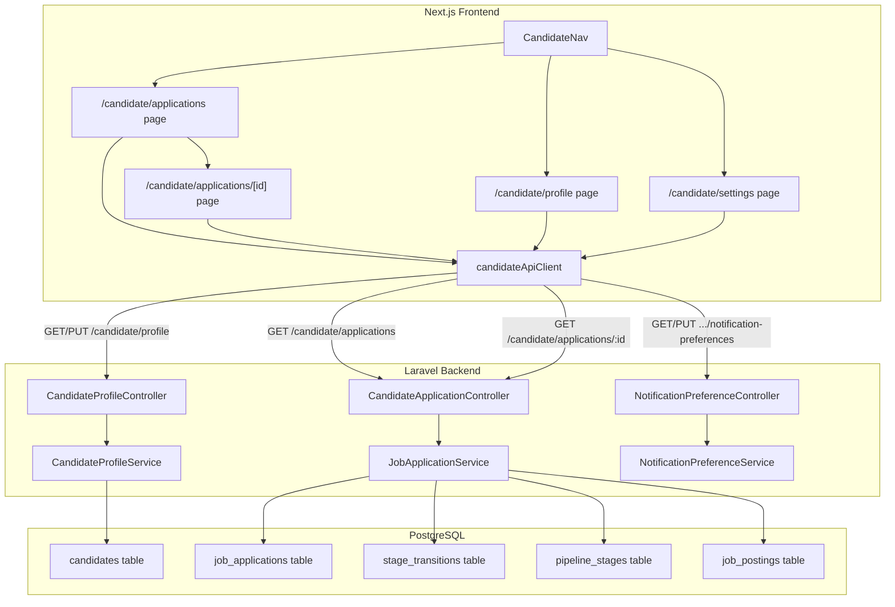

# Design Document: Candidate Portal Enhancement

## Overview

This design extends the existing HavenHR candidate portal with five capabilities: an application tracking dashboard, an application detail view, enhanced profile fields, a notification preferences settings UI, and improved navigation. The implementation spans the Laravel backend (new API endpoints, migration, validation) and the Next.js frontend (new pages, updated components, extended types).

The architecture follows the established patterns in the codebase:
- **Backend**: Laravel controllers → service layer → Eloquent models, with `candidate.auth` JWT middleware and `/api/v1/candidate/` prefix.
- **Frontend**: Next.js App Router pages under `/candidate/`, using `candidateApiClient` for API calls, Tailwind CSS for styling, and the existing `CandidateAuthProvider` context.

### Key Design Decisions

1. **Application detail as a new `show` method on `CandidateApplicationController`** — mirrors the employer-side `EmployerApplicationController::show` pattern, scoped to the authenticated candidate.
2. **Profile completeness calculated client-side** — avoids a dedicated API endpoint; the profile response already contains all the data needed to compute the percentage.
3. **New columns added via a single migration** — `professional_summary` (text), `github_url` (string), `is_profile_public` (boolean) on the `candidates` table.
4. **Filtering and sorting on the applications list** — handled server-side via query parameters on the existing `GET /candidate/applications` endpoint, keeping the frontend stateless.
5. **Navigation updated in-place** — the existing `CandidateNav` component is extended with new items (Job Board, Settings) rather than replaced.

## Architecture



## Components and Interfaces

### Backend Components

#### 1. CandidateApplicationController (extended)

**New method: `show(Request $request, string $id): JsonResponse`**

- Route: `GET /api/v1/candidate/applications/{id}`
- Loads the application with eager-loaded relationships: `jobPosting.company`, `pipelineStage`, `jobPosting.pipelineStages`
- Loads stage transitions via `StageTransition::where('job_application_id', $id)`
- Verifies `candidate_id` matches the authenticated candidate; returns 404 if not
- Returns the full application detail payload

**Extended method: `index(Request $request): JsonResponse`**

- Accepts optional query parameters: `status`, `sort_by` (applied_at | job_title), `sort_dir` (asc | desc)
- Passes parameters through to `JobApplicationService::listCandidateApplications`
- Returns enriched application list with pipeline stage info and all pipeline stages for each job

#### 2. JobApplicationService (extended)

**Updated: `listCandidateApplications(string $candidateId, ?string $status, string $sortBy, string $sortDir): array`**

- Adds optional `status` filter via `->where('status', $status)` when provided
- Adds sorting by `applied_at` (default) or `job_title` (via join on `job_postings`)
- Enriches each application with all pipeline stages for the job (for the visual pipeline indicator)

**New: `getCandidateApplicationDetail(string $candidateId, string $applicationId): ?array`**

- Loads the application with all relationships
- Verifies ownership (candidate_id match)
- Returns null if not found or not owned
- Includes: job posting details, current stage, all pipeline stages, stage transitions, resume snapshot

#### 3. CandidateProfileService (extended)

**Updated: `updatePersonalInfo`**

- Adds `professional_summary`, `github_url`, `is_profile_public` to the allowed fields list

**Updated: `getProfile`**

- Includes `professional_summary`, `github_url`, `is_profile_public` in the response array

#### 4. UpdatePersonalInfoRequest (extended)

- Adds validation rules:
  - `professional_summary`: `sometimes|nullable|string|max:2000`
  - `github_url`: `sometimes|nullable|url|max:500`
  - `is_profile_public`: `sometimes|boolean`

#### 5. Database Migration

- Adds three columns to `candidates` table:
  - `professional_summary` — `text`, nullable
  - `github_url` — `string(500)`, nullable
  - `is_profile_public` — `boolean`, default `false`

### Frontend Components

#### 1. CandidateNav (updated)

- Adds "Job Board" (`/candidate/jobs`) and "Settings" (`/candidate/settings`) to `NAV_ITEMS`
- Renames "Applications" label to "My Applications" for clarity
- No structural changes; same hamburger menu, active state, and sign-out behavior

#### 2. Applications Dashboard Page (`/candidate/applications/page.tsx`)

- Fetches `GET /candidate/applications` with query params
- Renders a card list with: job title, company name, pipeline stage indicator, status badge, applied date
- Pipeline stage indicator: horizontal step bar showing all stages with the current stage highlighted
- Filter bar: status dropdown (all, submitted, reviewed, shortlisted, rejected)
- Sort controls: sort by applied date or job title, ascending/descending
- Empty state: message + link to `/candidate/jobs`
- Loading state: spinner
- Error state: alert banner
- Each card links to `/candidate/applications/[id]`

#### 3. Application Detail Page (`/candidate/applications/[id]/page.tsx`)

- Fetches `GET /candidate/applications/{id}`
- Sections:
  - **Job Info**: title, company, location, employment type
  - **Stage Indicator**: visual pipeline progress bar
  - **Applied Date**: formatted human-readable
  - **Stage Timeline**: vertical timeline of transitions (stage name + date)
  - **Resume Snapshot**: rendered resume content from the JSON snapshot
- Back link to `/candidate/applications`
- Loading and error states

#### 4. Profile Page (updated, `/candidate/profile/page.tsx`)

- **Avatar placeholder**: circle with first letter of name, placed at top of page
- **Profile completeness indicator**: progress bar with percentage, calculated from: name, phone, location, professional_summary, linkedin_url, github_url, portfolio_url, ≥1 work history, ≥1 education, ≥1 skill
- **New fields in PersonalInfoSection**: `professional_summary` (textarea), `github_url` (URL input)
- **Profile visibility toggle**: switch for `is_profile_public`

#### 5. Settings Page (`/candidate/settings/page.tsx`)

- Fetches `GET /candidate/profile/notification-preferences`
- Toggle switches for `stage_change_emails` and `application_confirmation_emails`
- On toggle: `PUT /candidate/profile/notification-preferences` with updated values
- Success toast on save, error alert with toggle revert on failure
- Loading state while fetching

#### 6. TypeScript Types (extended, `frontend/src/types/candidate.ts`)

- `CandidateProfile`: add `professional_summary`, `github_url`, `is_profile_public`
- New `ApplicationListItem`: enriched application with job title, company, stage info, all stages
- New `ApplicationDetail`: full detail with job posting info, stages, transitions, resume snapshot
- New `PipelineStageInfo`: `{ id, name, color, sort_order }`
- New `StageTransitionInfo`: `{ from_stage_name, to_stage_name, moved_at }`

## Data Models

### Candidates Table (modified)

| Column | Type | Nullable | Default | Notes |
|---|---|---|---|---|
| id | uuid | no | — | PK |
| name | string(255) | no | — | |
| email | string(255) | no | — | unique |
| password_hash | string | no | — | |
| phone | string(50) | yes | null | |
| location | string(255) | yes | null | |
| linkedin_url | string(500) | yes | null | |
| portfolio_url | string(500) | yes | null | |
| **professional_summary** | **text** | **yes** | **null** | **NEW — max 2000 chars enforced at validation** |
| **github_url** | **string(500)** | **yes** | **null** | **NEW — validated as URL** |
| **is_profile_public** | **boolean** | **no** | **false** | **NEW** |
| is_active | boolean | no | true | |
| notification_preferences | json | yes | null | |
| email_verified_at | timestamp | yes | null | |
| last_login_at | timestamp | yes | null | |
| created_at | timestamp | yes | null | |
| updated_at | timestamp | yes | null | |

### API Response Shapes

**GET /candidate/applications (enriched)**

```json
{
  "data": [
    {
      "id": "uuid",
      "job_posting_id": "uuid",
      "resume_id": "uuid",
      "status": "submitted",
      "applied_at": "2025-01-15T10:00:00Z",
      "job_title": "Software Engineer",
      "company_name": "Acme Corp",
      "location": "Remote",
      "employment_type": "full-time",
      "pipeline_stage": {
        "name": "Screening",
        "color": "#3B82F6"
      },
      "all_stages": [
        { "name": "Applied", "color": "#6B7280", "sort_order": 0 },
        { "name": "Screening", "color": "#3B82F6", "sort_order": 1 },
        { "name": "Interview", "color": "#8B5CF6", "sort_order": 2 },
        { "name": "Offer", "color": "#10B981", "sort_order": 3 }
      ]
    }
  ]
}
```

**GET /candidate/applications/{id}**

```json
{
  "data": {
    "id": "uuid",
    "job_posting_id": "uuid",
    "resume_id": "uuid",
    "status": "submitted",
    "applied_at": "2025-01-15T10:00:00Z",
    "job_title": "Software Engineer",
    "company_name": "Acme Corp",
    "location": "Remote",
    "employment_type": "full-time",
    "pipeline_stage": {
      "name": "Screening",
      "color": "#3B82F6"
    },
    "all_stages": [
      { "name": "Applied", "color": "#6B7280", "sort_order": 0 },
      { "name": "Screening", "color": "#3B82F6", "sort_order": 1 },
      { "name": "Interview", "color": "#8B5CF6", "sort_order": 2 },
      { "name": "Offer", "color": "#10B981", "sort_order": 3 }
    ],
    "transitions": [
      {
        "from_stage": "Applied",
        "to_stage": "Screening",
        "moved_at": "2025-01-16T14:30:00Z"
      }
    ],
    "resume_snapshot": { "personal_info": {}, "summary": "...", "work_experience": [], "education": [], "skills": [] }
  }
}
```

**GET /candidate/profile (enriched)**

```json
{
  "data": {
    "id": "uuid",
    "name": "Jane Doe",
    "email": "jane@example.com",
    "phone": "+1234567890",
    "location": "San Francisco, CA",
    "linkedin_url": "https://linkedin.com/in/janedoe",
    "portfolio_url": "https://janedoe.dev",
    "professional_summary": "Experienced software engineer...",
    "github_url": "https://github.com/janedoe",
    "is_profile_public": false,
    "work_history": [],
    "education": [],
    "skills": []
  }
}
```

## Correctness Properties

*A property is a characteristic or behavior that should hold true across all valid executions of a system — essentially, a formal statement about what the system should do. Properties serve as the bridge between human-readable specifications and machine-verifiable correctness guarantees.*

### Property 1: Application list returns all candidate applications in default order

*For any* candidate with a set of applications, calling `GET /candidate/applications` without filters SHALL return every application belonging to that candidate and no others, ordered by `applied_at` descending.

**Validates: Requirements 1.1**

### Property 2: Application list status filter returns only matching applications

*For any* candidate with applications of mixed statuses and *for any* valid status value, calling `GET /candidate/applications?status={value}` SHALL return only applications whose status equals the filter value, and SHALL not omit any matching applications.

**Validates: Requirements 1.4, 6.2**

### Property 3: Application list sorting produces correctly ordered results

*For any* candidate with multiple applications and *for any* valid `sort_by` / `sort_dir` combination, the returned list SHALL be ordered such that each consecutive pair of items satisfies the sort constraint (e.g., `applied_at` ascending means each item's `applied_at` ≤ the next).

**Validates: Requirements 1.5, 6.3**

### Property 4: Application list items contain all required fields

*For any* application returned by `GET /candidate/applications`, the response item SHALL include non-null values for `job_title`, `company_name`, `pipeline_stage` (with `name`), `status`, and `applied_at`, plus an `all_stages` array with at least one entry.

**Validates: Requirements 1.2, 6.1**

### Property 5: Application detail response contains complete data

*For any* application belonging to the authenticated candidate, calling `GET /candidate/applications/{id}` SHALL return a response containing: `job_title`, `company_name`, `location`, `employment_type`, `pipeline_stage` (name, color), `all_stages` (array of stages with name, color, sort_order), `transitions` (array), `resume_snapshot`, `status`, and `applied_at`.

**Validates: Requirements 2.2, 2.5, 2.6, 2.7, 6.1**

### Property 6: Application detail enforces candidate ownership

*For any* application that does not belong to the authenticated candidate, calling `GET /candidate/applications/{id}` SHALL return a 404 response, regardless of whether the application exists.

**Validates: Requirements 2.8, 2.9**

### Property 7: Profile completeness calculation

*For any* candidate profile state, the profile completeness percentage SHALL equal `(count of filled fields / 10) × 100`, where the 10 fields are: name, phone, location, professional_summary, linkedin_url, github_url, portfolio_url, at least one work history entry, at least one education entry, and at least one skill.

**Validates: Requirements 3.1, 3.2**

### Property 8: New profile fields round-trip persistence

*For any* valid `professional_summary` (≤ 2000 chars), valid `github_url` (valid URL format), and `is_profile_public` (boolean), saving these values via `PUT /candidate/profile` and then fetching via `GET /candidate/profile` SHALL return the same values that were saved.

**Validates: Requirements 3.6, 3.7, 3.9, 6.4, 6.8**

### Property 9: Invalid GitHub URL is rejected

*For any* string that is not a valid URL format, submitting it as `github_url` via `PUT /candidate/profile` SHALL return a 422 validation error.

**Validates: Requirements 3.10, 6.5**

### Property 10: Professional summary exceeding max length is rejected

*For any* string longer than 2000 characters, submitting it as `professional_summary` via `PUT /candidate/profile` SHALL return a 422 validation error.

**Validates: Requirements 6.6**

### Property 11: Navigation active state correctness

*For any* page path in the candidate portal, the navigation `isActive` function SHALL return `true` for exactly one navigation item — the one whose `href` matches or is a prefix of the current path — and `false` for all others.

**Validates: Requirements 5.2**

## Error Handling

### Backend Error Handling

| Scenario | HTTP Status | Error Code | Message |
|---|---|---|---|
| Application not found | 404 | NOT_FOUND | Application not found. |
| Application not owned by candidate | 404 | NOT_FOUND | Application not found. |
| Invalid `github_url` format | 422 | VALIDATION_ERROR | The github url field must be a valid URL. |
| `professional_summary` > 2000 chars | 422 | VALIDATION_ERROR | The professional summary field must not be greater than 2000 characters. |
| `is_profile_public` not boolean | 422 | VALIDATION_ERROR | The is profile public field must be true or false. |
| Invalid `status` filter value | 422 | VALIDATION_ERROR | The selected status is invalid. |
| Invalid `sort_by` value | 422 | VALIDATION_ERROR | The selected sort by is invalid. |

All validation errors follow Laravel's standard 422 response format with field-level error messages, consistent with the existing `BaseFormRequest` pattern.

### Frontend Error Handling

- **API errors**: Caught via `ApiRequestError`, displayed as inline alert banners within the relevant section.
- **Network failures**: Generic "Failed to load" message with retry option.
- **Notification preference toggle failure**: Toggle reverts to previous state, error message displayed.
- **Profile save errors**: Field-level validation errors displayed below the form, generic errors as alert banner.

## Testing Strategy

### Unit Tests (Example-Based)

- **Backend**:
  - `CandidateApplicationController::show` — test with valid owned application, non-owned application (404), non-existent ID (404)
  - `CandidateApplicationController::index` — test with no filters, with status filter, with sort params, with invalid params (422)
  - `UpdatePersonalInfoRequest` — test new field validation rules (valid URL, invalid URL, summary at boundary, boolean values)
  - `CandidateProfileService::getProfile` — test response includes new fields
  - `CandidateProfileService::updatePersonalInfo` — test new fields are persisted

- **Frontend**:
  - Applications dashboard: renders loading state, error state, empty state, populated list
  - Application detail: renders all sections, handles loading/error
  - Profile page: renders avatar, completeness indicator, new fields, visibility toggle
  - Settings page: renders toggles, handles save success/error with revert
  - CandidateNav: renders all nav items, active state, mobile menu open/close/escape

### Property-Based Tests

Property-based tests use **Pest** (PHP, already in the project) with a property testing approach for backend logic, and **fast-check** for frontend pure functions.

- Minimum **100 iterations** per property test
- Each test tagged with: `Feature: candidate-portal-enhancement, Property {N}: {title}`

**Backend properties to test:**
- Property 1: Application list completeness and ordering
- Property 2: Status filter correctness
- Property 3: Sort correctness
- Property 4: List response shape completeness
- Property 5: Detail response shape completeness
- Property 6: Ownership enforcement
- Property 8: Profile field round-trip
- Property 9: Invalid URL rejection
- Property 10: Summary max length rejection

**Frontend properties to test:**
- Property 7: Profile completeness calculation (pure function)
- Property 11: Navigation active state (pure function)

### Integration Tests

- End-to-end flow: register candidate → create profile → apply to job → list applications → view detail
- Migration: verify new columns exist and have correct defaults
- Notification preferences: fetch → update → verify persistence

