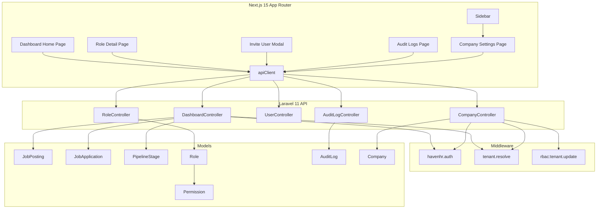

# Design Document: Dashboard Enhancement

## Overview

This design covers five major enhancements to the HavenHR employer dashboard:

1. **Dashboard Home Page** — Replace the minimal welcome message with a metrics-driven home page featuring stat cards, a recent activity feed, quick action buttons, and an applications-by-stage bar chart.
2. **Role Detail Page** — Add a `/dashboard/roles/[id]` page that displays a role's permissions grouped by resource category.
3. **User Invite/Create Flow** — Add an invite modal on the Users page that creates a new user with a generated temporary password.
4. **Audit Log Filtering** — Enhance the audit logs page with action type, date range, and user filters, all persisted in URL query parameters.
5. **Company Settings Page** — Add a `/dashboard/settings` page for viewing and editing company name, with placeholder sections for future features.

All enhancements follow existing patterns: Laravel controllers with `apiClient` on the frontend, RBAC via `rbac:{permission}` middleware on the backend and `useAuth().hasPermission()` on the frontend, tenant-scoped queries via `BelongsToTenant` trait, and the standard `{ data, meta }` paginated response shape.

## Architecture

The system follows the existing layered architecture:



### New Backend Components

| Component | Type | Purpose |
|---|---|---|
| `DashboardController` | Controller | Serves `/dashboard/metrics` and `/dashboard/applications-by-stage` |
| `CompanyController` | Controller | Serves `GET /company` and `PUT /company` |
| `UpdateCompanyRequest` | Form Request | Validates company update payload |

### Modified Backend Components

| Component | Change |
|---|---|
| `RoleController::show` | Eager-load `permissions` relationship |
| `AuditLogController::index` | Add `from`, `to`, `user_id` filter support |
| `routes/api.php` | Register new routes for dashboard, company |

### New Frontend Components

| Component | Path | Purpose |
|---|---|---|
| Dashboard Home | `app/dashboard/page.tsx` | Rewrite with stat cards, activity feed, quick actions, chart |
| StatCard | `components/dashboard/StatCard.tsx` | Reusable metric card |
| ActivityFeed | `components/dashboard/ActivityFeed.tsx` | Recent audit log entries with relative timestamps |
| StageChart | `components/dashboard/StageChart.tsx` | Bar chart for applications by stage |
| Role Detail | `app/dashboard/roles/[id]/page.tsx` | Role detail with grouped permissions |
| InviteUserModal | `components/dashboard/InviteUserModal.tsx` | Modal for creating/inviting users |
| AuditLogFilterBar | `components/dashboard/AuditLogFilterBar.tsx` | Filter controls for audit logs |
| Company Settings | `app/dashboard/settings/page.tsx` | Company settings form |

### Modified Frontend Components

| Component | Change |
|---|---|
| `Sidebar.tsx` | Add "Settings" nav item with `tenant.update` permission |
| `audit-logs/page.tsx` | Integrate filter bar, URL param persistence |
| `users/page.tsx` | Add "Invite User" button and modal integration |
| `roles/page.tsx` | Make role cards clickable, link to detail page |

## Components and Interfaces

### Backend API Endpoints

#### 1. Dashboard Metrics — `GET /api/v1/dashboard/metrics`

**Controller:** `DashboardController@metrics`
**Middleware:** `havenhr.auth`, `tenant.resolve`
**Permission:** None (any authenticated tenant user)

**Response (200):**
```json
{
  "data": {
    "open_jobs_count": 5,
    "total_candidates": 42,
    "applications_this_week": 12,
    "pipeline_conversion_rate": 67.3
  }
}
```

**Logic:**
- `open_jobs_count`: `JobPosting::where('status', 'published')->count()`
- `total_candidates`: `JobApplication::distinct('candidate_id')->count('candidate_id')` scoped to tenant via job postings
- `applications_this_week`: `JobApplication` joined with tenant's `JobPosting`, where `applied_at >= now()->subDays(7)`
- `pipeline_conversion_rate`: percentage of applications whose `pipeline_stage_id` references a stage with `sort_order > 1` (i.e., moved beyond the first stage), rounded to 1 decimal

#### 2. Applications by Stage — `GET /api/v1/dashboard/applications-by-stage`

**Controller:** `DashboardController@applicationsByStage`
**Middleware:** `havenhr.auth`, `tenant.resolve`
**Permission:** None (any authenticated tenant user)

**Response (200):**
```json
{
  "data": [
    { "stage_name": "Applied", "count": 25 },
    { "stage_name": "Screening", "count": 15 },
    { "stage_name": "Interview", "count": 8 },
    { "stage_name": "Offer", "count": 3 }
  ]
}
```

**Logic:**
- Join `pipeline_stages` → `job_applications` → `job_postings` (tenant-scoped)
- Group by `pipeline_stages.name`, order by `pipeline_stages.sort_order` ASC
- Aggregate `count(job_applications.id)` per stage

#### 3. Company Read — `GET /api/v1/company`

**Controller:** `CompanyController@show`
**Middleware:** `havenhr.auth`, `tenant.resolve`

**Response (200):**
```json
{
  "data": {
    "id": "uuid",
    "name": "Acme Corp",
    "email_domain": "acme.com",
    "subscription_status": "active",
    "settings": {}
  }
}
```

#### 4. Company Update — `PUT /api/v1/company`

**Controller:** `CompanyController@update`
**Middleware:** `havenhr.auth`, `tenant.resolve`, `rbac:tenant.update`

**Request Body:**
```json
{
  "name": "Acme Corporation"
}
```

**Validation (UpdateCompanyRequest):**
- `name`: required, string, max 255

**Response (200):** Same shape as GET, with updated values.

**Error (422):**
```json
{
  "error": {
    "code": "VALIDATION_ERROR",
    "message": "The given data was invalid.",
    "details": { "fields": { "name": { "value": "", "messages": ["The name field is required."] } } }
  }
}
```

#### 5. Enhanced Role Detail — `GET /api/v1/roles/{id}`

**Controller:** `RoleController@show` (modified)
**Change:** Eager-load `permissions` relationship.

**Response (200):**
```json
{
  "data": {
    "id": "uuid",
    "name": "Admin",
    "description": "Full administrative access",
    "is_system_default": true,
    "permissions": [
      {
        "id": "uuid",
        "name": "users.create",
        "resource": "users",
        "action": "create",
        "description": "Create new users"
      }
    ]
  }
}
```

#### 6. Enhanced Audit Logs — `GET /api/v1/audit-logs`

**Controller:** `AuditLogController@index` (modified)
**New Query Parameters:**
- `action` (string) — filter by action type (existing)
- `from` (ISO 8601 date) — filter logs created on or after this date
- `to` (ISO 8601 date) — filter logs created on or before this date
- `user_id` (UUID) — filter logs by user

**Validation:** Invalid date strings for `from`/`to` are silently ignored. All filters can be combined.

### Frontend Components

#### StatCard Component

```typescript
interface StatCardProps {
  label: string;
  value: string | number;
  icon: React.ReactNode;
  loading?: boolean;
}
```

Renders a white card with border, icon on the left, label above value. When `loading` is true, renders a skeleton placeholder (pulsing gray bars).

#### ActivityFeed Component

```typescript
interface ActivityFeedProps {
  logs: AuditLog[];
  loading: boolean;
}
```

Renders a list of recent audit log entries. Each entry shows:
- Color-coded action badge (reuses existing `ActionBadge`)
- Human-readable description derived from `action` + `resource_type`
- Relative timestamp (e.g., "2 hours ago") computed client-side
- "View All" link at the bottom

#### StageChart Component

```typescript
interface StageChartProps {
  data: { stage_name: string; count: number }[];
  loading: boolean;
}
```

Renders a horizontal bar chart using pure CSS/Tailwind (no chart library dependency). Each bar is proportional to the max count. Stage name on the left, count on the right.

#### InviteUserModal Component

```typescript
interface InviteUserModalProps {
  isOpen: boolean;
  onClose: () => void;
  onSuccess: () => void;
}
```

Modal with form fields: name (text), email (email), role (select dropdown populated from `GET /api/v1/roles`). On submit, generates a 16-character temporary password client-side, sends `POST /api/v1/users` with `{ name, email, password, role_id }`. On success, displays the temporary password in a copyable success message.

**Password Generation:** Uses `crypto.getRandomValues()` to generate a secure 16-character string containing uppercase, lowercase, digits, and special characters.

#### AuditLogFilterBar Component

```typescript
interface AuditLogFilterBarProps {
  filters: {
    action?: string;
    from?: string;
    to?: string;
    user_id?: string;
  };
  onFilterChange: (filters: Record<string, string | undefined>) => void;
  onClear: () => void;
  hasActiveFilters: boolean;
}
```

Renders a row of filter controls:
- Action type dropdown (predefined list of action types)
- From date input (`type="date"`)
- To date input (`type="date"`)
- User dropdown (populated from `GET /api/v1/users`)
- Clear Filters button (visually distinct when filters are active)

## Data Models

### Existing Models (No Schema Changes)

All required data already exists in the database. No migrations are needed.

| Model | Relevant Fields | Notes |
|---|---|---|
| `JobPosting` | `status`, `tenant_id` | Filter by `status = 'published'` for open jobs |
| `JobApplication` | `candidate_id`, `job_posting_id`, `pipeline_stage_id`, `applied_at` | Tenant-scoped via `job_postings.tenant_id` |
| `PipelineStage` | `name`, `sort_order`, `job_posting_id` | Ordered by `sort_order` for chart |
| `AuditLog` | `action`, `user_id`, `created_at`, `resource_type`, `resource_id` | Append-only, tenant-scoped |
| `Role` | `name`, `description`, `is_system_default` | Has `permissions()` BelongsToMany |
| `Permission` | `name`, `resource`, `action`, `description` | Grouped by `resource` on frontend |
| `Company` | `name`, `email_domain`, `subscription_status`, `settings` | Updated via `PUT /company` |
| `User` | `name`, `email`, `password_hash`, `is_active`, `tenant_id` | Created via `POST /users` |

### API Response Types (Frontend)

```typescript
// Dashboard metrics
interface DashboardMetrics {
  open_jobs_count: number;
  total_candidates: number;
  applications_this_week: number;
  pipeline_conversion_rate: number;
}

// Applications by stage
interface StageCount {
  stage_name: string;
  count: number;
}

// Role with permissions (extended)
interface RoleWithPermissions extends Role {
  permissions: Permission[];
}

interface Permission {
  id: string;
  name: string;
  resource: string;
  action: string;
  description: string;
}

// Company
interface CompanyData {
  id: string;
  name: string;
  email_domain: string;
  subscription_status: string;
  settings: Record<string, unknown>;
}

// Audit log filters
interface AuditLogFilters {
  action?: string;
  from?: string;
  to?: string;
  user_id?: string;
  page?: number;
}
```


## Correctness Properties

*A property is a characteristic or behavior that should hold true across all valid executions of a system — essentially, a formal statement about what the system should do. Properties serve as the bridge between human-readable specifications and machine-verifiable correctness guarantees.*

### Property 1: Open jobs count matches published postings

*For any* set of job postings within a tenant with arbitrary statuses (draft, published, closed, archived), the `open_jobs_count` metric SHALL equal the count of job postings whose status is exactly "published" within that tenant.

**Validates: Requirements 1.2**

### Property 2: Total candidates is a distinct count

*For any* set of job applications within a tenant where some candidates have applied to multiple jobs, the `total_candidates` metric SHALL equal the number of distinct `candidate_id` values across all applications for that tenant's job postings.

**Validates: Requirements 1.3**

### Property 3: Applications this week counts only recent applications

*For any* set of job applications with arbitrary `applied_at` timestamps, the `applications_this_week` metric SHALL equal the count of applications whose `applied_at` falls within the last 7 calendar days (inclusive) for the current tenant's job postings.

**Validates: Requirements 1.4**

### Property 4: Pipeline conversion rate calculation

*For any* set of job applications at various pipeline stages, the `pipeline_conversion_rate` SHALL equal `(count of applications at stages with sort_order > 1) / (total applications) * 100`, rounded to one decimal place. When there are zero total applications, the rate SHALL be 0.0.

**Validates: Requirements 1.5**

### Property 5: Relative timestamp accuracy

*For any* audit log entry with a `created_at` timestamp, the relative timestamp string produced by the Activity Feed SHALL accurately reflect the time difference between `created_at` and the current time (e.g., "2 hours ago" for a timestamp approximately 2 hours in the past).

**Validates: Requirements 3.3**

### Property 6: Permission-gated quick action visibility

*For any* quick action button that requires a specific permission, and *for any* user permission set, the button SHALL be visible if and only if the required permission is included in the user's permission set.

**Validates: Requirements 4.5, 4.6**

### Property 7: Applications-by-stage ordering

*For any* set of pipeline stages with arbitrary `sort_order` values, the applications-by-stage API response SHALL return stages ordered by `sort_order` in ascending order.

**Validates: Requirements 5.2**

### Property 8: Permission grouping by resource

*For any* set of permissions with arbitrary `resource` values, grouping by `resource` SHALL produce groups where every permission appears exactly once, each permission is in the group matching its `resource` field, and each permission's `name` and `description` are preserved in the output.

**Validates: Requirements 6.5, 6.6**

### Property 9: Temporary password generation

*For any* generated temporary password, it SHALL be exactly 16 characters long and SHALL contain at least one uppercase letter, at least one lowercase letter, at least one digit, and at least one special character.

**Validates: Requirements 7.6**

### Property 10: Audit log action filter

*For any* set of audit logs with various `action` values, filtering by a specific `action` parameter SHALL return only logs whose `action` field exactly matches the filter value.

**Validates: Requirements 8.3**

### Property 11: Audit log date range filter

*For any* set of audit logs with arbitrary `created_at` timestamps and *for any* valid `from` and/or `to` date range, the filtered results SHALL contain only logs whose `created_at` falls within the specified range (inclusive). When only `from` is provided, all results SHALL have `created_at >= from`. When only `to` is provided, all results SHALL have `created_at <= to`.

**Validates: Requirements 9.3, 14.1, 14.2**

### Property 12: Audit log user filter

*For any* set of audit logs with various `user_id` values, filtering by a specific `user_id` parameter SHALL return only logs whose `user_id` matches the filter value.

**Validates: Requirements 10.3, 14.3**

### Property 13: Audit log combined filters

*For any* set of audit logs and *for any* combination of `action`, `from`, `to`, and `user_id` filter parameters applied simultaneously, every log in the result set SHALL satisfy ALL active filter conditions. No filter SHALL interfere with or override another.

**Validates: Requirements 14.6**

### Property 14: Company name update round trip

*For any* valid company name string (non-empty, at most 255 characters), sending a PUT request to update the company name and then a GET request to read it back SHALL return the same name string.

**Validates: Requirements 13.2**

## Error Handling

### Backend Error Responses

All backend errors follow the existing `{ error: { code, message, details? } }` format.

| Scenario | HTTP Status | Error Code | Message |
|---|---|---|---|
| Unauthenticated request | 401 | `UNAUTHENTICATED` | "Token is invalid or expired." |
| Missing permission (RBAC) | 403 | `FORBIDDEN` | "You do not have permission to perform this action." |
| Role not found | 404 | `ROLE_NOT_FOUND` | "Role not found." |
| Duplicate email on user create | 409 | `EMAIL_ALREADY_EXISTS` | "A user with this email already exists in this workspace." |
| Company name validation failure | 422 | `VALIDATION_ERROR` | "The given data was invalid." |
| Invalid date format in audit filters | — | — | Silently ignored; filter not applied |

### Frontend Error Handling

| Component | Error Behavior |
|---|---|
| Dashboard Home (metrics) | Displays inline error message in the metrics section; stat cards show error state |
| Dashboard Home (activity feed) | Displays "Failed to load activity" message |
| Dashboard Home (stage chart) | Displays "Failed to load chart data" message |
| Role Detail Page | Displays "Role not found" for 404; generic error for other failures |
| Invite User Modal | Displays specific error for 409 (duplicate email); API error message for other failures |
| Audit Logs (with filters) | Displays error alert banner; preserves current filter state |
| Company Settings | Displays error message below the form; preserves form state |

### Loading States

Every data-fetching component displays a loading skeleton or spinner while awaiting API responses. Submit buttons are disabled during form submission to prevent double-submits.

## Testing Strategy

### Unit Tests (Example-Based)

Unit tests cover specific scenarios, UI rendering, and integration points:

**Backend:**
- `DashboardController@metrics` returns correct response shape with all four fields
- `DashboardController@applicationsByStage` returns correct response shape
- `CompanyController@show` returns company data for authenticated tenant
- `CompanyController@update` returns 422 for empty name, 422 for name > 255 chars
- `RoleController@show` includes `permissions` array in response
- `RoleController@show` returns empty `permissions` array for role with no permissions
- `AuditLogController@index` ignores invalid date format parameters
- Unauthenticated requests to new endpoints return 401
- Requests without required permissions return 403

**Frontend:**
- Dashboard Home renders four stat cards with correct labels
- Dashboard Home shows loading skeletons while fetching
- Dashboard Home shows error message on API failure
- Activity Feed renders 10 entries with action badges and relative timestamps
- Activity Feed shows "No recent activity." when empty
- Activity Feed includes "View All" link to `/dashboard/audit-logs`
- Quick action buttons navigate to correct routes
- Role Detail Page renders role name, description, and "System Role" badge
- Role Detail Page shows "Role not found" on 404
- Invite User Modal opens/closes correctly
- Invite User Modal validates required fields (name, email)
- Invite User Modal shows success message with temporary password
- Invite User Modal shows error for duplicate email
- Invite User Modal disables submit button during submission
- Audit Log Filter Bar renders all filter controls
- Audit Log Filter Bar reads initial values from URL params
- Audit Log Filter Bar resets page to 1 on filter change
- Clear Filters button removes all URL params
- Company Settings Page renders editable name and read-only domain
- Company Settings Page shows success notification on save
- Company Settings Page shows "Coming Soon" placeholder sections
- Sidebar shows "Settings" item only with `tenant.update` permission

### Property-Based Tests

Property-based tests verify universal properties across generated inputs. Each test runs a minimum of 100 iterations.

**Library:** [fast-check](https://github.com/dubzzz/fast-check) for TypeScript/JavaScript tests, PHPUnit with custom data providers for PHP backend tests.

| Property | Test Location | Tag |
|---|---|---|
| Property 1: Open jobs count | Backend | Feature: dashboard-enhancement, Property 1: open_jobs_count matches published postings |
| Property 2: Distinct candidates | Backend | Feature: dashboard-enhancement, Property 2: total_candidates is a distinct count |
| Property 3: Applications this week | Backend | Feature: dashboard-enhancement, Property 3: applications_this_week counts only recent |
| Property 4: Conversion rate | Backend | Feature: dashboard-enhancement, Property 4: pipeline_conversion_rate calculation |
| Property 5: Relative timestamps | Frontend | Feature: dashboard-enhancement, Property 5: relative timestamp accuracy |
| Property 6: Permission-gated visibility | Frontend | Feature: dashboard-enhancement, Property 6: permission-gated quick action visibility |
| Property 7: Stage ordering | Backend | Feature: dashboard-enhancement, Property 7: applications-by-stage ordering |
| Property 8: Permission grouping | Frontend | Feature: dashboard-enhancement, Property 8: permission grouping by resource |
| Property 9: Password generation | Frontend | Feature: dashboard-enhancement, Property 9: temporary password generation |
| Property 10: Action filter | Backend | Feature: dashboard-enhancement, Property 10: audit log action filter |
| Property 11: Date range filter | Backend | Feature: dashboard-enhancement, Property 11: audit log date range filter |
| Property 12: User filter | Backend | Feature: dashboard-enhancement, Property 12: audit log user filter |
| Property 13: Combined filters | Backend | Feature: dashboard-enhancement, Property 13: audit log combined filters |
| Property 14: Company name round trip | Backend | Feature: dashboard-enhancement, Property 14: company name update round trip |

### Test Organization

```
backend/tests/Feature/
  DashboardControllerTest.php      # Properties 1-4, 7 + unit tests
  AuditLogFilterTest.php           # Properties 10-13 + unit tests
  CompanyControllerTest.php        # Property 14 + unit tests
  RoleControllerPermissionsTest.php # Unit tests for role detail

frontend/src/__tests__/
  dashboard/
    DashboardHome.test.tsx         # Unit tests for stat cards, feed, chart, quick actions
    RelativeTimestamp.test.ts      # Property 5
    PermissionGating.test.tsx      # Property 6
    PermissionGrouping.test.ts     # Property 8
    PasswordGeneration.test.ts     # Property 9
  audit-logs/
    AuditLogFilters.test.tsx       # Unit tests for filter bar
  roles/
    RoleDetail.test.tsx            # Unit tests for role detail page
  users/
    InviteUserModal.test.tsx       # Unit tests for invite modal
  settings/
    CompanySettings.test.tsx       # Unit tests for settings page
```
