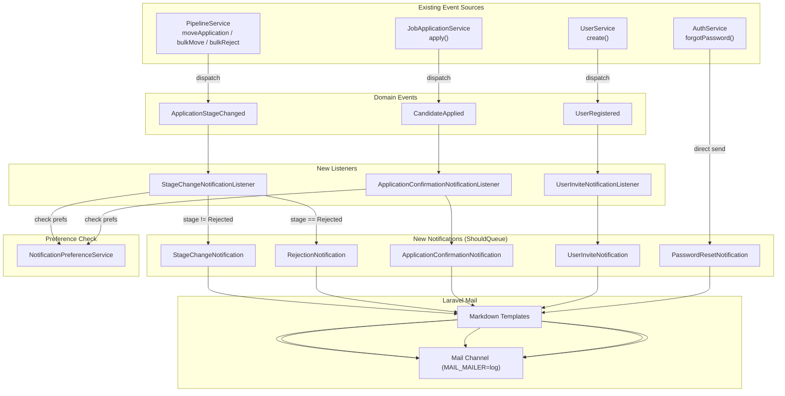
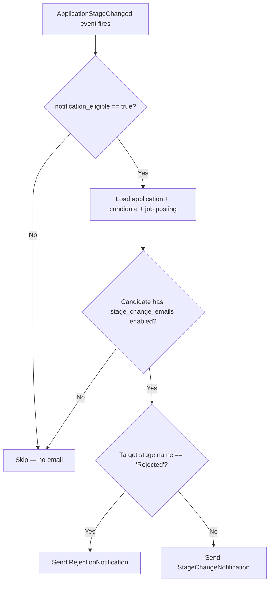
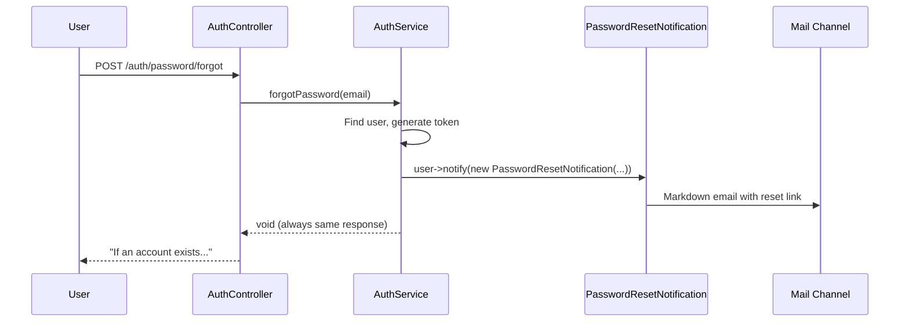
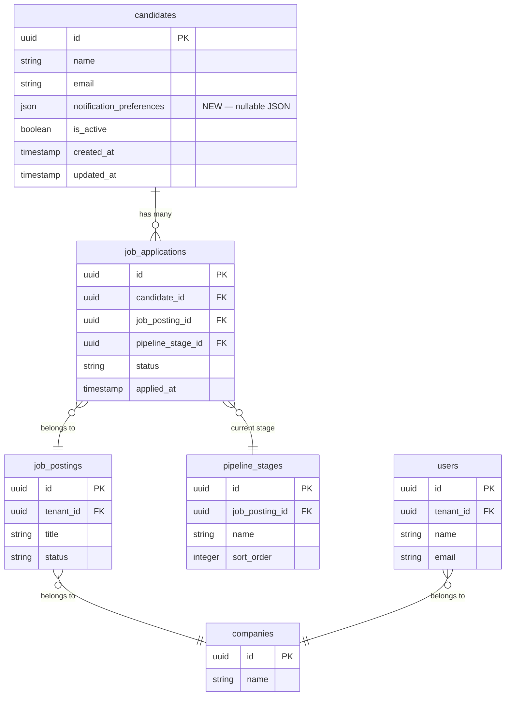

# Design Document — Email Notifications

## Overview

The Email Notifications feature adds transactional email delivery to the HavenHR platform using Laravel's built-in Notification framework with Markdown mail templates. The system listens to existing domain events (`ApplicationStageChanged`, `CandidateApplied`, `UserRegistered`) and dispatches email notifications to candidates and users. Candidates can manage their notification preferences via API endpoints.

The implementation is entirely backend-focused. No frontend changes are required beyond future UI consumption of the preferences API. The system leverages the existing event infrastructure — domain events already fire from `PipelineService`, `JobApplicationService`, `UserService`, and `AuthService`. New event listeners will subscribe to these events alongside the existing `AuditLogListener`.

### Key Design Decisions

| Decision | Choice | Rationale |
|---|---|---|
| Notification framework | Laravel Notification classes with `mail` channel | Built-in, well-tested, supports queuing, Markdown templates, and the `Notifiable` trait already on both `User` and `Candidate` models |
| Template engine | Laravel Markdown mail (`@component('mail::message')`) | Generates mobile-responsive HTML automatically; consistent styling; easy to maintain |
| Queue strategy | `ShouldQueue` on all Notification classes | Non-blocking delivery; retries on failure; works with current `QUEUE_CONNECTION=sync` and scales to async drivers later |
| Preference storage | JSON column on `candidates` table | Simple, no extra table; preferences are a small fixed-key object; avoids join overhead |
| Preference defaults | All enabled on creation | Candidates receive all emails by default; opt-out model is standard for transactional emails |
| Password reset email | Dispatched directly from `AuthService::forgotPassword()` | The existing flow already generates the token; sending the notification there avoids a separate event listener and keeps the token in scope |
| Listener registration | `EventServiceProvider` explicit mapping | Matches existing pattern used by `AuditLogListener`; clear, auditable event-to-listener wiring |
| Rejection vs stage change | Separate Notification classes and templates | Rejection emails need a different tone (encouragement message) and template; cleaner separation of concerns |

---

## Architecture

### Notification Flow



### Listener Decision Flow (ApplicationStageChanged)



### Password Reset Notification Flow



---

## Components and Interfaces

### 1. Notification Classes

All notification classes extend `Illuminate\Notifications\Notification`, implement `ShouldQueue`, and deliver via the `mail` channel using Markdown templates.

#### StageChangeNotification

**File:** `backend/app/Notifications/StageChangeNotification.php`

```php
class StageChangeNotification extends Notification implements ShouldQueue
{
    use Queueable;

    public int $tries = 3;

    public function __construct(
        protected string $jobTitle,
        protected string $stageName,
        protected string $companyName,
    ) {}

    public function via(object $notifiable): array
    {
        return ['mail'];
    }

    public function toMail(object $notifiable): MailMessage
    {
        return (new MailMessage)
            ->subject("Application Update — {$this->jobTitle}")
            ->markdown('emails.stage-change', [
                'candidateName' => $notifiable->name,
                'jobTitle' => $this->jobTitle,
                'stageName' => $this->stageName,
                'companyName' => $this->companyName,
                'preferencesUrl' => config('app.frontend_url') . '/profile/notification-preferences',
            ]);
    }
}
```

#### RejectionNotification

**File:** `backend/app/Notifications/RejectionNotification.php`

```php
class RejectionNotification extends Notification implements ShouldQueue
{
    use Queueable;

    public int $tries = 3;

    public function __construct(
        protected string $jobTitle,
        protected string $companyName,
    ) {}

    public function via(object $notifiable): array
    {
        return ['mail'];
    }

    public function toMail(object $notifiable): MailMessage
    {
        return (new MailMessage)
            ->subject("Application Update — {$this->jobTitle}")
            ->markdown('emails.rejection', [
                'candidateName' => $notifiable->name,
                'jobTitle' => $this->jobTitle,
                'companyName' => $this->companyName,
                'preferencesUrl' => config('app.frontend_url') . '/profile/notification-preferences',
            ]);
    }
}
```

#### ApplicationConfirmationNotification

**File:** `backend/app/Notifications/ApplicationConfirmationNotification.php`

```php
class ApplicationConfirmationNotification extends Notification implements ShouldQueue
{
    use Queueable;

    public int $tries = 3;

    public function __construct(
        protected string $jobTitle,
        protected string $companyName,
    ) {}

    public function via(object $notifiable): array
    {
        return ['mail'];
    }

    public function toMail(object $notifiable): MailMessage
    {
        return (new MailMessage)
            ->subject("Application Received — {$this->jobTitle}")
            ->markdown('emails.application-confirmation', [
                'candidateName' => $notifiable->name,
                'jobTitle' => $this->jobTitle,
                'companyName' => $this->companyName,
                'preferencesUrl' => config('app.frontend_url') . '/profile/notification-preferences',
            ]);
    }
}
```

#### UserInviteNotification

**File:** `backend/app/Notifications/UserInviteNotification.php`

```php
class UserInviteNotification extends Notification implements ShouldQueue
{
    use Queueable;

    public int $tries = 3;

    public function __construct(
        protected string $userName,
        protected string $email,
        protected string $temporaryPassword,
        protected string $loginUrl,
    ) {}

    public function via(object $notifiable): array
    {
        return ['mail'];
    }

    public function toMail(object $notifiable): MailMessage
    {
        return (new MailMessage)
            ->subject('Welcome to HavenHR — Your Account Details')
            ->markdown('emails.user-invite', [
                'userName' => $this->userName,
                'email' => $this->email,
                'temporaryPassword' => $this->temporaryPassword,
                'loginUrl' => $this->loginUrl,
            ]);
    }
}
```

#### PasswordResetNotification

**File:** `backend/app/Notifications/PasswordResetNotification.php`

```php
class PasswordResetNotification extends Notification implements ShouldQueue
{
    use Queueable;

    public int $tries = 3;

    public function __construct(
        protected string $resetUrl,
        protected string $userName,
    ) {}

    public function via(object $notifiable): array
    {
        return ['mail'];
    }

    public function toMail(object $notifiable): MailMessage
    {
        return (new MailMessage)
            ->subject('Reset Your Password — HavenHR')
            ->markdown('emails.password-reset', [
                'userName' => $this->userName,
                'resetUrl' => $this->resetUrl,
            ]);
    }
}
```

### 2. Event Listeners

#### StageChangeNotificationListener

**File:** `backend/app/Listeners/StageChangeNotificationListener.php`

Listens to `ApplicationStageChanged`. Checks `notification_eligible`, loads the application with candidate and job posting relationships, checks candidate preferences, determines whether to send a stage change or rejection notification based on the target stage name.

```php
class StageChangeNotificationListener implements ShouldQueue
{
    public int $tries = 3;

    public function handle(ApplicationStageChanged $event): void
    {
        if (empty($event->data['notification_eligible'])) {
            return;
        }

        $application = JobApplication::with(['candidate', 'jobPosting.company'])
            ->find($event->data['application_id']);

        if (!$application || !$application->candidate) {
            return;
        }

        $candidate = $application->candidate;
        $preferences = $candidate->notification_preferences ?? [];

        if (($preferences['stage_change_emails'] ?? true) === false) {
            return;
        }

        $targetStage = PipelineStage::find($event->data['to_stage']);
        $jobTitle = $application->jobPosting->title ?? 'Unknown Position';
        $companyName = $application->jobPosting->company->name ?? 'HavenHR';

        if ($targetStage && $targetStage->name === 'Rejected') {
            $candidate->notify(new RejectionNotification($jobTitle, $companyName));
        } else {
            $stageName = $targetStage->name ?? 'Next Stage';
            $candidate->notify(new StageChangeNotification($jobTitle, $stageName, $companyName));
        }
    }
}
```

#### ApplicationConfirmationNotificationListener

**File:** `backend/app/Listeners/ApplicationConfirmationNotificationListener.php`

Listens to `CandidateApplied`. Loads the application with job posting and company, checks candidate preferences, sends confirmation email.

```php
class ApplicationConfirmationNotificationListener implements ShouldQueue
{
    public int $tries = 3;

    public function handle(CandidateApplied $event): void
    {
        $application = JobApplication::with(['candidate', 'jobPosting.company'])
            ->find($event->data['application_id']);

        if (!$application || !$application->candidate) {
            return;
        }

        $candidate = $application->candidate;
        $preferences = $candidate->notification_preferences ?? [];

        if (($preferences['application_confirmation_emails'] ?? true) === false) {
            return;
        }

        $jobTitle = $application->jobPosting->title ?? 'Unknown Position';
        $companyName = $application->jobPosting->company->name ?? 'HavenHR';

        $candidate->notify(new ApplicationConfirmationNotification($jobTitle, $companyName));
    }
}
```

#### UserInviteNotificationListener

**File:** `backend/app/Listeners/UserInviteNotificationListener.php`

Listens to `UserRegistered`. Loads the user, extracts the temporary password from the event data, sends the invite email.

```php
class UserInviteNotificationListener implements ShouldQueue
{
    public int $tries = 3;

    public function handle(UserRegistered $event): void
    {
        $user = User::withoutGlobalScopes()->find($event->user_id);

        if (!$user) {
            return;
        }

        $temporaryPassword = $event->data['password'] ?? null;

        if (!$temporaryPassword) {
            return;
        }

        $loginUrl = config('app.frontend_url', 'http://localhost:3001') . '/login';

        $user->notify(new UserInviteNotification(
            userName: $user->name,
            email: $user->email,
            temporaryPassword: $temporaryPassword,
            loginUrl: $loginUrl,
        ));
    }
}
```

### 3. NotificationPreferenceService

**File:** `backend/app/Services/NotificationPreferenceService.php`

Handles reading and updating candidate notification preferences.

```php
class NotificationPreferenceService
{
    public const DEFAULT_PREFERENCES = [
        'stage_change_emails' => true,
        'application_confirmation_emails' => true,
    ];

    public const ALLOWED_KEYS = [
        'stage_change_emails',
        'application_confirmation_emails',
    ];

    public function getPreferences(Candidate $candidate): array
    {
        return array_merge(
            self::DEFAULT_PREFERENCES,
            $candidate->notification_preferences ?? [],
        );
    }

    public function updatePreferences(Candidate $candidate, array $preferences): array
    {
        $current = $this->getPreferences($candidate);

        foreach ($preferences as $key => $value) {
            if (in_array($key, self::ALLOWED_KEYS, true)) {
                $current[$key] = (bool) $value;
            }
        }

        $candidate->notification_preferences = $current;
        $candidate->save();

        return $current;
    }
}
```

### 4. NotificationPreferenceController

**File:** `backend/app/Http/Controllers/NotificationPreferenceController.php`

Exposes GET and PUT endpoints for candidate notification preferences under the existing `candidate/profile` route group.

```php
class NotificationPreferenceController extends Controller
{
    public function __construct(
        protected NotificationPreferenceService $preferenceService,
    ) {}

    public function show(Request $request): JsonResponse
    {
        $candidate = $request->user();
        $preferences = $this->preferenceService->getPreferences($candidate);

        return response()->json(['data' => $preferences]);
    }

    public function update(UpdateNotificationPreferencesRequest $request): JsonResponse
    {
        $candidate = $request->user();
        $updated = $this->preferenceService->updatePreferences(
            $candidate,
            $request->validated(),
        );

        return response()->json(['data' => $updated]);
    }
}
```

### 5. UpdateNotificationPreferencesRequest

**File:** `backend/app/Http/Requests/UpdateNotificationPreferencesRequest.php`

```php
class UpdateNotificationPreferencesRequest extends BaseFormRequest
{
    public function rules(): array
    {
        return [
            'stage_change_emails' => 'sometimes|boolean',
            'application_confirmation_emails' => 'sometimes|boolean',
        ];
    }
}
```

### 6. Markdown Mail Templates

All templates use `@component('mail::message')` for consistent, mobile-responsive rendering.

#### Stage Change Template

**File:** `backend/resources/views/emails/stage-change.blade.php`

```blade
@component('mail::message')
# Application Update

Hello {{ $candidateName }},

Your application for **{{ $jobTitle }}** at **{{ $companyName }}** has moved to a new stage: **{{ $stageName }}**.

We'll keep you updated as your application progresses.

@component('mail::button', ['url' => $preferencesUrl])
Manage Notification Preferences
@endcomponent

Thanks,<br>
{{ $companyName }}

<small>[Manage your notification preferences]({{ $preferencesUrl }})</small>
@endcomponent
```

#### Rejection Template

**File:** `backend/resources/views/emails/rejection.blade.php`

```blade
@component('mail::message')
# Application Update

Hello {{ $candidateName }},

Thank you for your interest in the **{{ $jobTitle }}** position at **{{ $companyName }}**.

After careful consideration, we've decided to move forward with other candidates for this role. This was a difficult decision, and we appreciate the time and effort you put into your application.

We encourage you to apply for future openings that match your skills and experience. We wish you the best in your job search.

@component('mail::button', ['url' => $preferencesUrl])
Manage Notification Preferences
@endcomponent

Thanks,<br>
{{ $companyName }}

<small>[Manage your notification preferences]({{ $preferencesUrl }})</small>
@endcomponent
```

#### Application Confirmation Template

**File:** `backend/resources/views/emails/application-confirmation.blade.php`

```blade
@component('mail::message')
# Application Received

Hello {{ $candidateName }},

Your application for **{{ $jobTitle }}** at **{{ $companyName }}** has been received.

Our team will review your application and get back to you. You can track your application status in your candidate dashboard.

@component('mail::button', ['url' => $preferencesUrl])
Manage Notification Preferences
@endcomponent

Thanks,<br>
{{ $companyName }}

<small>[Manage your notification preferences]({{ $preferencesUrl }})</small>
@endcomponent
```

#### User Invite Template

**File:** `backend/resources/views/emails/user-invite.blade.php`

```blade
@component('mail::message')
# Welcome to HavenHR

Hello {{ $userName }},

An account has been created for you on HavenHR. Here are your login credentials:

- **Email:** {{ $email }}
- **Temporary Password:** {{ $temporaryPassword }}

Please log in and change your password as soon as possible.

@component('mail::button', ['url' => $loginUrl])
Log In to HavenHR
@endcomponent

Thanks,<br>
HavenHR
@endcomponent
```

#### Password Reset Template

**File:** `backend/resources/views/emails/password-reset.blade.php`

```blade
@component('mail::message')
# Reset Your Password

Hello {{ $userName }},

We received a request to reset your password. Click the button below to set a new password. This link expires in 60 minutes.

@component('mail::button', ['url' => $resetUrl])
Reset Password
@endcomponent

If you did not request a password reset, no action is needed.

Thanks,<br>
HavenHR
@endcomponent
```

### 7. Route Registration

New routes added to `backend/routes/api.php` inside the existing `candidate/profile` middleware group:

```php
// Inside Route::prefix('candidate/profile')->middleware('candidate.auth')
Route::get('/notification-preferences', [NotificationPreferenceController::class, 'show']);
Route::put('/notification-preferences', [NotificationPreferenceController::class, 'update']);
```

### 8. EventServiceProvider Updates

New listener registrations added alongside existing `AuditLogListener` entries:

```php
use App\Events\CandidateApplied;
use App\Listeners\StageChangeNotificationListener;
use App\Listeners\ApplicationConfirmationNotificationListener;
use App\Listeners\UserInviteNotificationListener;

protected $listen = [
    // ... existing mappings ...
    ApplicationStageChanged::class => [
        AuditLogListener::class,
        StageChangeNotificationListener::class,  // NEW
    ],
    CandidateApplied::class => [
        AuditLogListener::class,                              // existing (if present)
        ApplicationConfirmationNotificationListener::class,   // NEW
    ],
    UserRegistered::class => [
        AuditLogListener::class,
        UserInviteNotificationListener::class,  // NEW
    ],
];
```

### 9. AuthService Modification

The `forgotPassword()` method in `AuthService` is modified to send a `PasswordResetNotification` instead of logging the reset link:

```php
// Replace the Log::info() call with:
$user->notify(new PasswordResetNotification(
    resetUrl: config('app.frontend_url', 'http://localhost:3001') . '/reset-password/' . $rawToken,
    userName: $user->name,
));
```

### 10. UserService Modification

The `create()` method in `UserService` must include the plaintext password in the `UserRegistered` event data so the `UserInviteNotificationListener` can include it in the invite email:

```php
// In UserService::create(), update the event dispatch:
UserRegistered::dispatch(
    $tenantId,
    $user->id,
    [
        'name' => $data['name'],
        'email' => $data['email'],
        'password' => $data['password'],  // ADD: plaintext password for invite email
        'role' => $data['role'],
        'created_by' => $createdById,
    ],
);
```

---

## Data Models

### Database Migration: Add notification_preferences Column

**Migration:** `add_notification_preferences_to_candidates_table`

```php
Schema::table('candidates', function (Blueprint $table) {
    $table->json('notification_preferences')->nullable()->after('is_active');
});
```

- Column: `notification_preferences`, type `JSON`, nullable
- Default: `NULL` (service layer treats null as all-enabled via `DEFAULT_PREFERENCES` merge)
- No index needed (never queried by preference values)

### Updated Candidate Model

The `Candidate` model gains the `notification_preferences` field in `$fillable` and `$casts`:

```php
protected $fillable = [
    // ... existing fields ...
    'notification_preferences',
];

protected function casts(): array
{
    return [
        // ... existing casts ...
        'notification_preferences' => 'array',
    ];
}
```

### Entity Relationship (Notification Focus)



### Schema Changes Summary

| Table | Change | Details |
|---|---|---|
| `candidates` | Add column | `notification_preferences JSON NULLABLE` after `is_active` |
| `candidates` | Update model | Add to `$fillable` and `$casts` |


---

## Correctness Properties

*A property is a characteristic or behavior that should hold true across all valid executions of a system — essentially, a formal statement about what the system should do. Properties serve as the bridge between human-readable specifications and machine-verifiable correctness guarantees.*

### Property 1: Correct notification type dispatched based on stage name

*For any* `ApplicationStageChanged` event with `notification_eligible` set to true and a candidate with `stage_change_emails` enabled, if the target stage name is "Rejected" then a `RejectionNotification` SHALL be sent to the candidate, otherwise a `StageChangeNotification` SHALL be sent. In both cases, exactly one notification of the correct type SHALL be dispatched.

**Validates: Requirements 2.1, 3.1**

### Property 2: Stage change email content completeness

*For any* job posting title, stage name, and company name, the rendered `StageChangeNotification` email SHALL contain the job posting title, the stage name, and the company name in the email body.

**Validates: Requirements 1.4, 2.2**

### Property 3: Rejection email content completeness

*For any* job posting title and company name, the rendered `RejectionNotification` email SHALL contain the job posting title, the company name, and an encouragement message in the email body.

**Validates: Requirements 1.4, 3.2**

### Property 4: Preference gating prevents stage change and rejection emails

*For any* `ApplicationStageChanged` event with `notification_eligible` set to true, if the candidate has `stage_change_emails` set to false in their notification preferences, then no `StageChangeNotification` and no `RejectionNotification` SHALL be dispatched, regardless of the target stage name.

**Validates: Requirements 2.3, 3.4**

### Property 5: notification_eligible=false prevents all stage-related emails

*For any* `ApplicationStageChanged` event with `notification_eligible` set to false, no `StageChangeNotification` and no `RejectionNotification` SHALL be dispatched, regardless of the candidate's notification preferences or the target stage name.

**Validates: Requirements 2.4**

### Property 6: Application confirmation email content and dispatch

*For any* `CandidateApplied` event where the candidate has `application_confirmation_emails` enabled, an `ApplicationConfirmationNotification` SHALL be sent to the candidate, and the rendered email SHALL contain the job posting title, the company name, and a confirmation message.

**Validates: Requirements 4.1, 4.2**

### Property 7: Preference gating prevents application confirmation emails

*For any* `CandidateApplied` event where the candidate has `application_confirmation_emails` set to false in their notification preferences, no `ApplicationConfirmationNotification` SHALL be dispatched.

**Validates: Requirements 4.3**

### Property 8: User invite email content completeness

*For any* `UserRegistered` event containing a password in the event data, the rendered `UserInviteNotification` email SHALL contain the user name, email address, temporary password, and a login URL.

**Validates: Requirements 5.1, 5.2**

### Property 9: Password reset email content completeness

*For any* user name and reset token, the rendered `PasswordResetNotification` email SHALL contain the user name, a reset URL incorporating the token, and a message indicating the link expires in 60 minutes.

**Validates: Requirements 6.2, 6.3**

### Property 10: Notification preferences round-trip

*For any* candidate and *for any* valid preference update (a subset of `{stage_change_emails, application_confirmation_emails}` with boolean values), updating preferences via `NotificationPreferenceService::updatePreferences()` and then reading them via `getPreferences()` SHALL return the updated values. Keys not included in the update SHALL retain their previous values.

**Validates: Requirements 7.3, 7.4**

### Property 11: Notification preferences validation rejects invalid input

*For any* preference update payload containing a non-boolean value for `stage_change_emails` or `application_confirmation_emails`, the `UpdateNotificationPreferencesRequest` validation SHALL reject the request with a 422 status code.

**Validates: Requirements 7.5, 7.6**

---

## Error Handling

| Scenario | Handling | Response |
|---|---|---|
| Notification fails to send (mail transport error) | Laravel's `ShouldQueue` retries up to 3 times with exponential backoff. After 3 failures, the failed job is logged via Laravel's `failed()` method. | No user-facing error; failure logged with notification type, recipient, and error message |
| Application not found during listener execution | Listener returns early without sending notification | Silent skip; no error response |
| Candidate not found on application | Listener returns early | Silent skip |
| Job posting or company not found | Listener uses fallback values ("Unknown Position", "HavenHR") | Email sent with fallback content |
| UserRegistered event missing password field | `UserInviteNotificationListener` returns early without sending | Silent skip; no invite email sent |
| Unauthenticated request to preferences API | `candidate.auth` middleware rejects | 401 Unauthorized JSON response |
| Invalid preference values in PUT request | `UpdateNotificationPreferencesRequest` validation fails | 422 Unprocessable Entity with field-level error messages |
| Unknown preference keys in PUT request | `UpdateNotificationPreferencesRequest` ignores unknown keys (only validates known keys with `sometimes` rule) | Unknown keys silently ignored; valid keys processed |
| Database error saving preferences | Standard Laravel exception handling | 500 Internal Server Error |

---

## Testing Strategy

### Property-Based Tests

Property-based testing is appropriate for this feature because the notification logic involves pure decision-making functions (preference checking, notification type selection, email content rendering) that have clear input/output behavior and universal properties across a wide input space.

**Library:** [Pest PHP](https://pestphp.com/) with a custom property-testing helper using `repeat()` for iteration, or PHPUnit data providers with Faker-generated data. Since the project uses Pest (Laravel's default), we'll use Pest's `with()` combined with `fake()` to generate randomized inputs across 100+ iterations.

**Configuration:**
- Minimum 100 iterations per property test
- Each test tagged with: `Feature: email-notifications, Property {number}: {property_text}`

**Property tests to implement:**

| Property | Test Description | Key Generators |
|---|---|---|
| 1 | Correct notification type based on stage name | Random stage names (including "Rejected"), random candidates, random job postings |
| 2 | Stage change email contains job title, stage name, company name | Random strings for job title, stage name, company name |
| 3 | Rejection email contains job title, company name, encouragement | Random strings for job title, company name |
| 4 | stage_change_emails=false prevents both notification types | Random events with notification_eligible=true, random stage names |
| 5 | notification_eligible=false prevents all notifications | Random events, random preferences, random stage names |
| 6 | Application confirmation email content and dispatch | Random job titles, company names, candidate names |
| 7 | application_confirmation_emails=false prevents confirmation | Random CandidateApplied events |
| 8 | User invite email contains all credential fields | Random user names, emails, passwords, login URLs |
| 9 | Password reset email contains name, reset URL, expiry message | Random user names, reset tokens |
| 10 | Preferences round-trip (update then read) | Random boolean combinations for preference keys |
| 11 | Validation rejects non-boolean preference values | Random non-boolean values (strings, integers, arrays, null) |

### Unit Tests (Example-Based)

| Test | Description | Validates |
|---|---|---|
| Notification classes implement ShouldQueue | Verify all 5 notification classes implement the interface | Req 1.2 |
| Notification classes use mail channel | Verify `via()` returns `['mail']` | Req 1.1 |
| Templates use Markdown components | Verify each template file uses `@component('mail::message')` | Req 1.3 |
| Rejection uses separate template from stage change | Verify different markdown paths in `toMail()` | Req 3.3 |
| Default preferences are all enabled | Create candidate, verify `getPreferences()` returns all true | Req 7.2 |
| Unauthenticated GET returns 401 | Hit preferences endpoint without auth | Req 8.3 |
| Unauthenticated PUT returns 401 | Hit preferences endpoint without auth | Req 8.3 |
| GET response contains both preference keys | Verify JSON structure | Req 8.4 |
| PUT response contains updated preferences | Verify response body | Req 8.5 |
| forgotPassword with non-existent email sends no notification | Verify no notification dispatched | Req 6.4 |
| forgotPassword with valid email sends PasswordResetNotification | Verify notification dispatched | Req 6.1 |
| Failure logging after 3 retries | Mock mail failure, verify log output | Req 1.7 |

### Integration Tests

| Test | Description |
|---|---|
| Full stage change flow | Move application via PipelineService, verify notification dispatched to candidate |
| Full application flow | Submit application via JobApplicationService, verify confirmation email dispatched |
| Full user creation flow | Create user via UserService, verify invite email dispatched |
| Full password reset flow | Call forgotPassword, verify reset email dispatched with correct URL |
| Preferences API round-trip | GET defaults → PUT update → GET updated values |
