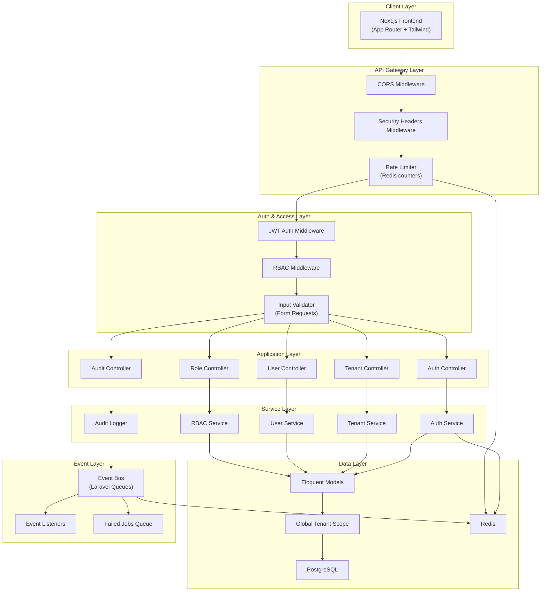
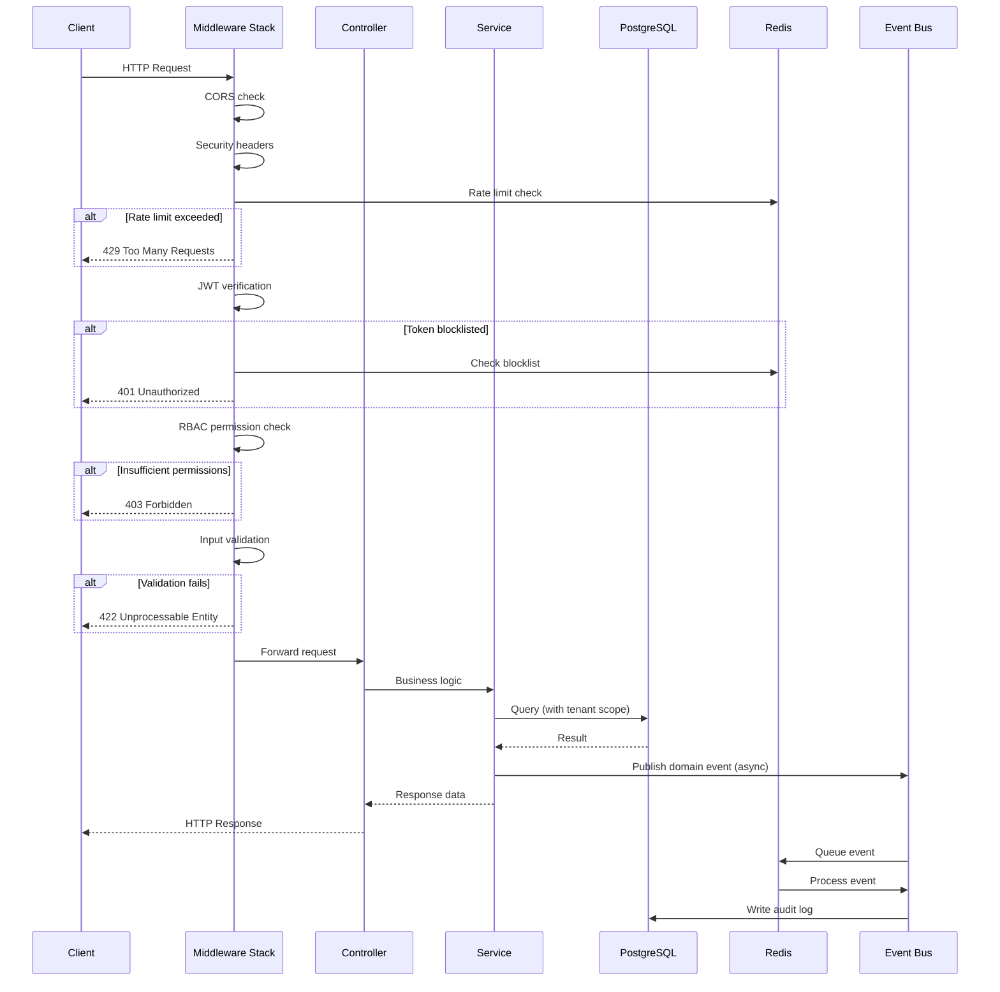
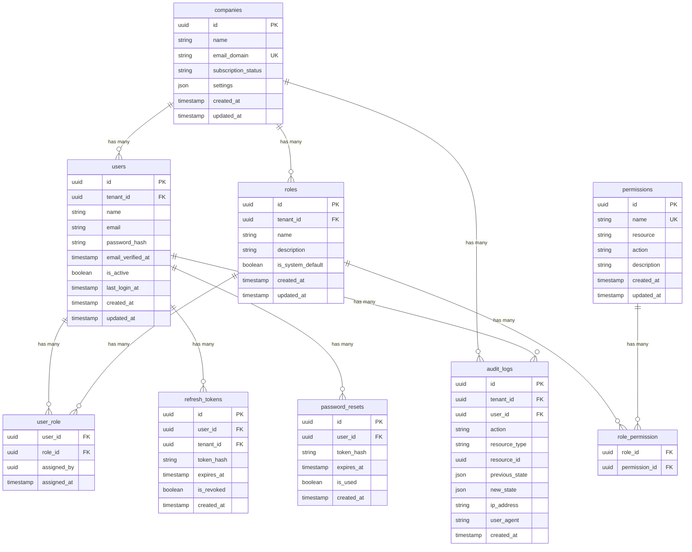
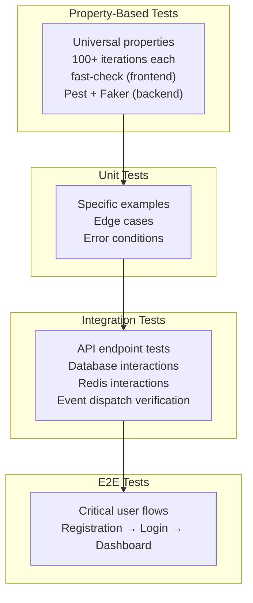

# Design Document — HavenHR Multi-Tenant Foundation & Auth

## Overview

This design covers the foundational layer of HavenHR: multi-tenant isolation, authentication, role-based access control (RBAC), audit logging, input validation, rate limiting, secure API communication, event-driven architecture, and the frontend authentication/dashboard pages.

The system follows a layered architecture with a Next.js (App Router) frontend communicating with a Laravel REST API backend. PostgreSQL provides persistence, Redis handles caching, token blocklists, rate limiting counters, and queue-backed event processing. Every tenant-scoped operation is filtered by `tenant_id` using Laravel global query scopes, ensuring strict data isolation at the ORM level.

### Key Design Decisions

| Decision | Choice | Rationale |
|---|---|---|
| Tenant isolation strategy | Shared database, `tenant_id` column | Scales to 100k+ tenants without per-tenant DB overhead; enforced via global scopes |
| Primary keys | UUIDs (v4) | Prevents ID enumeration, supports distributed generation |
| Token transport | HTTP-only Secure cookies (browser), Authorization header (API) | Prevents XSS token theft for browser clients |
| Token format | JWT (Access), opaque hashed (Refresh) | JWT enables stateless verification; refresh tokens are DB-backed for revocation |
| Password hashing | bcrypt, cost factor 12 | Industry standard, tunable cost |
| Event processing | Redis-backed Laravel queues | Native Laravel integration, ordered per-tenant processing |
| RBAC model | Role → Permissions (many-to-many), checked via middleware | Flexible, auditable, enforced before controller logic |

---

## Architecture

### High-Level System Architecture



### Request Lifecycle



### Middleware Chain Order

The Laravel middleware stack is applied in this exact order for every request:

1. **ForceHttps** — Redirect HTTP → HTTPS
2. **SecurityHeaders** — Attach `X-Content-Type-Options`, `X-Frame-Options`, `Strict-Transport-Security`, `Content-Security-Policy`
3. **CorsMiddleware** — Validate origin against allowlist
4. **RateLimiter** — Check Redis counters (60/min general, 5/min auth endpoints)
5. **JwtAuth** — Verify Access_Token signature, expiration, and blocklist
6. **TenantResolver** — Extract `tenant_id` from token claims, bind to request context
7. **RbacMiddleware** — Check user's permissions against route requirements
8. **ValidateInput** — Run Laravel Form Request validation

---

## Components and Interfaces

### Backend Components

#### 1. Registration Service

**Responsibility:** Create new tenants and their owner accounts.

```
POST /api/v1/register
```

| Field | Type | Validation |
|---|---|---|
| company_name | string | required, max:255 |
| company_email_domain | string | required, unique:companies,email_domain, valid domain format |
| owner_name | string | required, max:255 |
| owner_email | string | required, RFC 5322 email |
| owner_password | string | required, min:12, 1 uppercase, 1 lowercase, 1 digit, 1 special char |

**Response (201):**
```json
{
  "data": {
    "tenant": { "id": "uuid", "name": "string", "email_domain": "string" },
    "user": { "id": "uuid", "name": "string", "email": "string", "role": "owner" }
  }
}
```

**Flow:**
1. Validate input (Form Request)
2. Check domain uniqueness
3. Begin DB transaction
4. Create `companies` record (UUID PK)
5. Create `users` record linked to tenant
6. Create system default roles for tenant
7. Assign Owner role to user
8. Commit transaction
9. Dispatch `tenant.created` event
10. Return response

#### 2. Auth Service

**Responsibility:** Handle login, token refresh, password reset, and logout.

**Endpoints:**

| Method | Path | Rate Limit | Auth Required |
|---|---|---|---|
| POST | `/api/v1/auth/login` | 5/min/IP | No |
| POST | `/api/v1/auth/refresh` | 60/min/user | No (uses refresh token) |
| POST | `/api/v1/auth/logout` | 60/min/user | Yes |
| POST | `/api/v1/auth/password/forgot` | 5/min/IP | No |
| POST | `/api/v1/auth/password/reset` | 5/min/IP | No |

**Login Flow:**
1. Validate email + password input
2. Look up user by email (timing-safe: always hash even if user not found)
3. Verify password with bcrypt
4. Generate JWT Access_Token (15 min, claims: user_id, tenant_id, role)
5. Generate opaque Refresh_Token, store hash in `refresh_tokens` table (7 day expiry)
6. Set tokens as HTTP-only Secure SameSite=Strict cookies
7. Dispatch `user.login` audit event
8. Return user profile

**Token Refresh Flow:**
1. Extract refresh token from cookie
2. Hash token, look up in `refresh_tokens` table
3. If not found or revoked → revoke ALL user refresh tokens (replay detection), return 401
4. If expired → return 401
5. Revoke current refresh token
6. Issue new Access_Token + Refresh_Token pair
7. Return new tokens

**Logout Flow:**
1. Extract Access_Token
2. Add Access_Token JTI to Redis blocklist with TTL = remaining token lifetime
3. Revoke associated Refresh_Token in DB
4. Dispatch `user.logout` audit event
5. Clear cookies

**Password Reset Flow:**
1. Receive email → always return same success response (prevent enumeration)
2. If user exists: generate cryptographically random token (64 bytes, hex), store hash in `password_resets` table with 60-min expiry
3. Queue email with reset link
4. On reset submission: verify token hash, update password (bcrypt), revoke all refresh tokens, delete reset token
5. Dispatch `user.password_reset` audit event

#### 3. User Management Service

**Responsibility:** CRUD operations on users within a tenant.

| Method | Path | Permission Required |
|---|---|---|
| GET | `/api/v1/users` | `users.list` |
| POST | `/api/v1/users` | `users.create` |
| GET | `/api/v1/users/{id}` | `users.view` |
| PUT | `/api/v1/users/{id}` | `users.update` |
| DELETE | `/api/v1/users/{id}` | `users.delete` |

All queries automatically scoped by `tenant_id` via global scope.

#### 4. Role Management Service

**Responsibility:** Manage role assignments within a tenant.

| Method | Path | Permission Required |
|---|---|---|
| GET | `/api/v1/roles` | `roles.list` |
| GET | `/api/v1/roles/{id}` | `roles.view` |
| POST | `/api/v1/users/{id}/roles` | `manage_roles` |
| PUT | `/api/v1/users/{id}/roles` | `manage_roles` |

**Role Assignment Flow:**
1. Verify requesting user has `manage_roles` permission
2. Verify target role is assignable by requesting user's role (Owner can assign all; Admin cannot assign Owner)
3. Update `user_role` pivot
4. Invalidate all Access_Tokens for affected user (add current token JTI to Redis blocklist)
5. Dispatch `role.changed` audit event

#### 5. Audit Logger

**Responsibility:** Asynchronously record all state-changing actions.

- Receives events from Event_Bus
- Writes to `audit_logs` table (append-only, no update/delete endpoints)
- All queries scoped by `tenant_id`

| Method | Path | Permission Required |
|---|---|---|
| GET | `/api/v1/audit-logs` | `audit_logs.view` |

#### 6. Event Bus

**Responsibility:** Publish and consume domain events via Redis-backed Laravel queues.

**Event Payload Schema:**
```json
{
  "event_type": "string",
  "tenant_id": "uuid",
  "user_id": "uuid|null",
  "data": {},
  "timestamp": "ISO 8601"
}
```

**Configuration:**
- Queue connection: Redis
- Retry attempts: 3 (with exponential backoff)
- Failed events → `failed_jobs` table
- Per-tenant ordering: events dispatched to tenant-specific queue channels (`tenant:{id}:events`)

### Frontend Components

#### 7. Auth Pages (Next.js)

| Page | Route | Description |
|---|---|---|
| Tenant Registration | `/register` | Company + owner registration form |
| Login | `/login` | Email + password login form |
| Forgot Password | `/forgot-password` | Email input for reset link |
| Reset Password | `/reset-password/[token]` | New password + confirmation form |

**Shared Behaviors:**
- Mobile-first responsive layout (320px–2560px)
- Inline validation errors mapped from API 422 responses
- WCAG 2.1 AA: proper `<label>` associations, `aria-describedby` for errors, keyboard navigation, focus management, color contrast ≥ 4.5:1
- Loading states during API calls
- CSRF protection via SameSite cookies

#### 8. Dashboard Pages (Next.js)

| Page | Route | Permission |
|---|---|---|
| Dashboard Home | `/dashboard` | Any authenticated role |
| User Management | `/dashboard/users` | `users.list` |
| Role Management | `/dashboard/users/[id]/roles` | `manage_roles` |

**Navigation:** Role-aware sidebar — menu items filtered by user's permissions. Server-side rendering checks permissions before rendering routes.

**User List:** Paginated (server-side), sortable, shows name, email, role, status, last login. Pagination via `?page=1&per_page=20`.

---

## Data Models

### Entity Relationship Diagram



### Table Details

**companies**
- `id`: UUID v4, primary key
- `email_domain`: unique index, used to prevent duplicate tenant registration
- `subscription_status`: enum (`trial`, `active`, `suspended`, `cancelled`), default `trial`
- `settings`: JSON column for tenant-specific configuration

**users**
- Composite unique index on `(tenant_id, email)` — same email can exist in different tenants
- `tenant_id`: NOT NULL, foreign key to `companies.id`, indexed
- `is_active`: default `true`, used for soft-disabling accounts
- `password_hash`: bcrypt hash, cost factor 12

**roles**
- `tenant_id`: NOT NULL, foreign key to `companies.id`
- `is_system_default`: marks the 5 default roles (Owner, Admin, Recruiter, Hiring_Manager, Viewer) seeded on tenant creation
- Composite index on `(tenant_id, name)` for uniqueness within tenant

**permissions**
- Global table (not tenant-scoped) — permissions are system-wide definitions
- `name`: unique, format `resource.action` (e.g., `users.create`, `roles.manage`)
- `resource`: the entity type (e.g., `users`, `roles`, `jobs`)
- `action`: the operation (e.g., `create`, `view`, `update`, `delete`, `manage`)

**role_permission**
- Composite primary key on `(role_id, permission_id)`
- Links roles to their granted permissions

**user_role**
- Composite primary key on `(user_id, role_id)`
- `assigned_by`: nullable (null for initial owner assignment during registration)
- `assigned_at`: timestamp of assignment

**refresh_tokens**
- `token_hash`: SHA-256 hash of the opaque token (raw token never stored)
- `is_revoked`: default `false`, set to `true` on logout or token rotation
- `tenant_id`: indexed, for tenant-scoped queries
- Index on `token_hash` for fast lookup

**password_resets**
- `token_hash`: SHA-256 hash of the reset token
- `expires_at`: 60 minutes from creation
- `is_used`: default `false`, set to `true` after successful reset
- Index on `token_hash` for fast lookup

**audit_logs**
- Append-only (no UPDATE/DELETE endpoints)
- `tenant_id`: NOT NULL, indexed for tenant-scoped queries
- `previous_state` / `new_state`: nullable JSON for capturing state changes
- Composite index on `(tenant_id, created_at)` for chronological queries
- Composite index on `(tenant_id, action)` for filtering by action type

### Indexes Summary

| Table | Index | Type |
|---|---|---|
| companies | `email_domain` | Unique |
| users | `(tenant_id, email)` | Unique composite |
| users | `tenant_id` | Standard |
| roles | `(tenant_id, name)` | Unique composite |
| permissions | `name` | Unique |
| role_permission | `(role_id, permission_id)` | Primary composite |
| user_role | `(user_id, role_id)` | Primary composite |
| refresh_tokens | `token_hash` | Standard |
| refresh_tokens | `(user_id, is_revoked)` | Composite |
| refresh_tokens | `tenant_id` | Standard |
| password_resets | `token_hash` | Standard |
| password_resets | `(user_id, is_used)` | Composite |
| audit_logs | `(tenant_id, created_at)` | Composite |
| audit_logs | `(tenant_id, action)` | Composite |


---

## Correctness Properties

*A property is a characteristic or behavior that should hold true across all valid executions of a system — essentially, a formal statement about what the system should do. Properties serve as the bridge between human-readable specifications and machine-verifiable correctness guarantees.*

### Property 1: Registration creates tenant, owner, and role assignment

*For any* valid registration payload (company name, domain, owner name, email, password), calling the registration service SHALL produce a new tenant record, a user record linked to that tenant, and a user_role record assigning the Owner role to that user — all sharing the same tenant_id.

**Validates: Requirements 1.1**

### Property 2: Duplicate domain registration is rejected

*For any* email domain that is already associated with an existing tenant, a registration attempt using that same domain SHALL be rejected and no new tenant or user records SHALL be created.

**Validates: Requirements 1.2**

### Property 3: Invalid registration input produces field-specific errors

*For any* registration payload with one or more invalid or missing required fields, the input validator SHALL reject the request and return a structured error response listing each invalid field with a specific validation message.

**Validates: Requirements 1.3**

### Property 4: Tenant scoping applied to all queries

*For any* tenant-scoped Eloquent model and any authenticated tenant context, every database query executed through that model SHALL include a WHERE clause filtering by the authenticated tenant_id.

**Validates: Requirements 2.4**

### Property 5: Cross-tenant resource access denied

*For any* resource belonging to tenant A, a request from a user authenticated in tenant B SHALL receive a 403 Forbidden response and no resource data SHALL be returned.

**Validates: Requirements 2.5**

### Property 6: User creation with valid role assignment

*For any* valid user creation payload (name, email, password, role) submitted by an authorized Admin or Owner, the service SHALL create a user record associated with the current tenant_id and a user_role record with the specified role.

**Validates: Requirements 3.1**

### Property 7: Email uniqueness is enforced per-tenant

*For any* email address, creating two users with that email within the same tenant SHALL be rejected on the second attempt, but creating users with that same email in two different tenants SHALL both succeed.

**Validates: Requirements 3.2, 3.3**

### Property 8: Passwords are hashed with bcrypt cost factor ≥ 12

*For any* password submitted during registration or password reset, the stored hash SHALL be a valid bcrypt hash with a cost factor of at least 12, and verifying the original password against the hash SHALL succeed.

**Validates: Requirements 3.4**

### Property 9: Unauthorized role assignment is rejected

*For any* user who does not have the permission to assign the requested role, a role assignment request SHALL be rejected with a 403 Forbidden response and no role change SHALL occur.

**Validates: Requirements 3.6**

### Property 10: Valid login issues correctly-structured tokens

*For any* user with valid credentials, a login request SHALL return an Access_Token containing the user_id, tenant_id, and role claims with a 15-minute expiration, and a Refresh_Token with a 7-day expiration.

**Validates: Requirements 4.1, 4.2**

### Property 11: Token refresh issues new pair and invalidates old

*For any* valid, non-expired, non-revoked refresh token, submitting it SHALL return a new Access_Token and Refresh_Token pair, and the previous refresh token SHALL be marked as revoked.

**Validates: Requirements 5.1**

### Property 12: Reused refresh token triggers full revocation

*For any* previously revoked refresh token, submitting it SHALL cause ALL refresh tokens for that user to be revoked and SHALL return a 401 Unauthorized response.

**Validates: Requirements 5.3**

### Property 13: Password reset generates time-limited token

*For any* registered user email, a password reset request SHALL create a reset token record with a 60-minute expiration and a securely hashed token value.

**Validates: Requirements 6.1**

### Property 14: Valid reset token updates password and revokes sessions

*For any* valid, non-expired, unused reset token submitted with a new password, the service SHALL update the user's password hash, mark the reset token as used, and revoke all existing refresh tokens for that user.

**Validates: Requirements 6.3**

### Property 15: Logout invalidates refresh token and blocklists access token

*For any* authenticated user performing logout, the associated refresh token SHALL be revoked in the database and the access token's JTI SHALL be added to the Redis blocklist with a TTL equal to the token's remaining lifetime.

**Validates: Requirements 7.1**

### Property 16: Blocklisted access token is rejected

*For any* access token whose JTI exists in the Redis blocklist, any API request using that token SHALL receive a 401 Unauthorized response.

**Validates: Requirements 7.3**

### Property 17: Owner role includes all system permissions

*For any* permission defined in the system, the Owner role SHALL include that permission.

**Validates: Requirements 8.2**

### Property 18: Admin role includes all permissions except tenant deletion and owner role modification

*For any* permission defined in the system that is not `tenant.delete` or `owner.assign`, the Admin role SHALL include that permission. The Admin role SHALL NOT include `tenant.delete` or `owner.assign`.

**Validates: Requirements 8.3**

### Property 19: Viewer role has only read permissions

*For any* permission assigned to the Viewer role, the permission's action SHALL be a read-only action (view or list).

**Validates: Requirements 8.6**

### Property 20: RBAC grants access if and only if user has required permission

*For any* authenticated user and any protected API endpoint, the RBAC middleware SHALL allow the request if and only if the user's role includes the permission required by that endpoint. Requests without the required permission SHALL receive a 403 Forbidden response.

**Validates: Requirements 9.1, 9.2**

### Property 21: Role assignment requires manage_roles permission

*For any* user attempting to assign or change a role, the operation SHALL succeed only if the requesting user has the `manage_roles` permission. Requests without this permission SHALL receive a 403 Forbidden response.

**Validates: Requirements 9.3**

### Property 22: Role change invalidates affected user's access tokens

*For any* role change applied to a user, all existing access tokens for that user SHALL be invalidated (added to the Redis blocklist) so the new role takes effect on the next token refresh.

**Validates: Requirements 9.4**

### Property 23: Audit log entries contain all required fields

*For any* state-changing action, the resulting audit log entry SHALL contain: id (UUID), tenant_id, user_id, action, resource_type, resource_id, ip_address, user_agent, and created_at. The previous_state and new_state fields SHALL be present (nullable).

**Validates: Requirements 11.1**

### Property 24: Input validation rejects invalid data before controller with structured errors

*For any* API request with invalid data, the input validator SHALL reject the request before it reaches the controller layer and return a 422 response with a JSON body listing each invalid field, the rejected value (excluding passwords), and a human-readable error message.

**Validates: Requirements 12.1, 12.6**

### Property 25: Unknown request fields are rejected

*For any* API request containing fields not defined in the endpoint's request schema, the input validator SHALL reject the request and return a 422 Unprocessable Entity response.

**Validates: Requirements 12.2**

### Property 26: Email validation follows RFC 5322

*For any* string submitted as an email field, the input validator SHALL accept it if and only if it conforms to RFC 5322 email format.

**Validates: Requirements 12.3**

### Property 27: Password complexity validation

*For any* string submitted as a password, the input validator SHALL accept it if and only if it has at least 12 characters, at least one uppercase letter, one lowercase letter, one digit, and one special character.

**Validates: Requirements 12.4**

### Property 28: Input sanitization prevents injection

*For any* string input containing SQL injection or XSS payloads, the system SHALL use parameterized queries (preventing SQL injection) and HTML entity encoding on output (preventing XSS), ensuring no raw user input is interpolated into queries or rendered as executable HTML.

**Validates: Requirements 12.5**

### Property 29: Security headers present on all responses

*For any* API response, the headers SHALL include X-Content-Type-Options: nosniff, X-Frame-Options: DENY, Strict-Transport-Security with max-age=31536000 and includeSubDomains, and a Content-Security-Policy with a restrictive default-src policy.

**Validates: Requirements 14.2**

### Property 30: CORS enforces origin allowlist

*For any* request origin, the API SHALL include CORS headers in the response if and only if the origin is on the configured allowlist. Requests from origins not on the allowlist SHALL be rejected.

**Validates: Requirements 14.3**

### Property 31: Frontend displays inline validation errors

*For any* set of field-level validation errors returned by the API, the frontend form SHALL display each error message inline next to its corresponding form field.

**Validates: Requirements 15.5**

### Property 32: Role-aware navigation shows only permitted items

*For any* authenticated user role, the dashboard navigation SHALL display only the menu items for which the user's role has the required permissions.

**Validates: Requirements 16.1**

### Property 33: Role selection filtered by requester's assignable roles

*For any* Owner or Admin initiating a role change, the role selection interface SHALL show only the roles that the requesting user's role has permission to assign.

**Validates: Requirements 16.3**

### Property 34: Event payload contains required schema fields

*For any* domain event published to the Event_Bus, the payload SHALL contain event_type (string), tenant_id (UUID), user_id (UUID or null), data (JSON object), and timestamp (ISO 8601).

**Validates: Requirements 17.2**

### Property 35: Events processed in publication order within a tenant

*For any* sequence of events published for a single tenant, the Event_Bus SHALL process them in the order they were published.

**Validates: Requirements 17.4**

### Property 36: Events delivered to all registered listeners

*For any* published domain event, the Event_Bus SHALL deliver the event to every listener registered for that event type.

**Validates: Requirements 17.5**

---

## Error Handling

### Error Response Format

All API errors follow a consistent JSON structure:

```json
{
  "error": {
    "code": "ERROR_CODE",
    "message": "Human-readable message",
    "details": {}
  }
}
```

### HTTP Status Code Mapping

| Status | Usage |
|---|---|
| 400 | Malformed request (bad JSON, missing Content-Type) |
| 401 | Authentication failure (invalid/expired/blocklisted token) |
| 403 | Authorization failure (insufficient permissions, cross-tenant access) |
| 404 | Resource not found (within tenant scope) |
| 409 | Conflict (duplicate email domain, duplicate user email in tenant) |
| 422 | Validation failure (invalid fields, unknown fields) |
| 429 | Rate limit exceeded |
| 500 | Unexpected server error |

### Validation Errors (422)

```json
{
  "error": {
    "code": "VALIDATION_ERROR",
    "message": "The given data was invalid.",
    "details": {
      "fields": {
        "owner_email": {
          "value": "not-an-email",
          "messages": ["The owner email must be a valid email address."]
        },
        "owner_password": {
          "value": "[REDACTED]",
          "messages": ["The password must be at least 12 characters."]
        }
      }
    }
  }
}
```

### Authentication Errors

- **Invalid credentials**: Always return generic `"Invalid credentials"` message (no email/password distinction)
- **Expired token**: Return 401 with `"TOKEN_EXPIRED"` code
- **Blocklisted token**: Return 401 with `"TOKEN_REVOKED"` code
- **Invalid refresh token**: Return 401 with `"INVALID_REFRESH_TOKEN"` code

### Rate Limit Errors (429)

```json
{
  "error": {
    "code": "RATE_LIMIT_EXCEEDED",
    "message": "Too many requests. Please try again later.",
    "details": {
      "retry_after": 45
    }
  }
}
```

Response includes `Retry-After` header with seconds until reset.

### Cross-Tenant Access (403)

```json
{
  "error": {
    "code": "FORBIDDEN",
    "message": "You do not have permission to access this resource."
  }
}
```

The error message intentionally does not reveal that the resource belongs to another tenant.

### Unhandled Exceptions

- Log full stack trace and context to application logs (not exposed to client)
- Return generic 500 response with a correlation ID for support reference
- Dispatch `system.error` event for monitoring

### Event Processing Failures

- Events retry up to 3 times with exponential backoff (1s, 4s, 16s)
- After 3 failures, event moves to `failed_jobs` queue with full payload and error details
- Failed events do not block subsequent events in the queue

---

## Testing Strategy

### Testing Layers



### Property-Based Testing

**Backend Library:** [Pest PHP](https://pestphp.com/) with custom generators using [Faker](https://fakerphp.org/) for random data generation. Properties will be implemented as Pest tests that run 100+ iterations with randomly generated inputs.

**Frontend Library:** [fast-check](https://fast-check.dev/) for TypeScript property-based testing.

**Configuration:**
- Minimum 100 iterations per property test
- Each test tagged with: `Feature: havenhr-platform, Property {N}: {title}`
- Generators produce valid and invalid data covering edge cases (empty strings, unicode, max-length strings, special characters)

**Backend Properties to Implement (Pest + Faker):**
- Properties 1–5: Tenant registration and isolation
- Properties 6–9: User management and role assignment
- Properties 10–16: Authentication lifecycle (login, refresh, reset, logout)
- Properties 17–22: RBAC role definitions and enforcement
- Properties 23: Audit log structure
- Properties 24–28: Input validation and sanitization
- Properties 29–30: Security headers and CORS
- Properties 34–36: Event bus behavior

**Frontend Properties to Implement (fast-check):**
- Property 31: Validation error display mapping
- Property 32: Role-aware navigation filtering
- Property 33: Role selection filtering

### Unit Tests

Focus on specific examples and edge cases not covered by property tests:

- **Auth:** Incorrect password returns generic error (4.3), non-existent email returns same error (4.4), expired refresh token returns 401 (5.2), expired/used reset token rejected (6.4), logout returns success (7.2)
- **RBAC:** Recruiter has correct permissions (8.4), Hiring_Manager has correct permissions (8.5), five roles exist (8.1)
- **Rate Limiting:** 61st request returns 429 (13.1), 6th auth request returns 429 (13.2), 429 includes Retry-After header (13.3)
- **Security:** Cookies have HttpOnly/Secure/SameSite flags (14.1), HTTPS redirect (14.4)
- **Frontend:** Auth pages render correct fields (15.1–15.4), WCAG basic checks with axe-core (15.6, 16.5), paginated user list (16.2), responsive layout (16.4)

### Integration Tests

- **Audit Logging:** Events dispatched asynchronously (11.3), all action types recorded (11.4), audit log append-only (11.2)
- **Event Bus:** Redis queue configuration (17.1), failed events after 3 retries (17.3), rate limit Redis storage (13.4)
- **Auth:** Login/logout full flow, token refresh full flow, password reset email dispatch
- **Database:** Schema smoke tests for all tables (10.1–10.7), UUID primary keys, constraints

### E2E Tests

Critical user journeys tested with Playwright:

1. **Tenant Registration → Login → Dashboard**: Register company, login as owner, verify dashboard loads with full navigation
2. **User Invitation → Role Assignment**: Owner creates user, assigns Recruiter role, new user logs in with limited navigation
3. **Password Reset Flow**: Request reset, use token, login with new password
4. **Cross-Tenant Isolation**: Two tenants created, verify no data leakage between them

### Test Organization

```
tests/
├── Feature/           # Integration tests (Laravel)
│   ├── Auth/
│   ├── Tenant/
│   ├── User/
│   ├── Role/
│   └── AuditLog/
├── Unit/              # Unit tests (Laravel)
│   ├── Services/
│   ├── Middleware/
│   ├── Validators/
│   └── Models/
├── Property/          # Property-based tests (Pest + Faker)
│   ├── TenantPropertyTest.php
│   ├── AuthPropertyTest.php
│   ├── RbacPropertyTest.php
│   ├── ValidationPropertyTest.php
│   ├── SecurityPropertyTest.php
│   └── EventBusPropertyTest.php
└── E2E/               # End-to-end tests (Playwright)
    └── flows/

frontend/
├── __tests__/
│   ├── components/    # Component unit tests
│   ├── properties/    # Property-based tests (fast-check)
│   │   ├── validation-errors.property.test.ts
│   │   ├── navigation.property.test.ts
│   │   └── role-selection.property.test.ts
│   └── e2e/           # Playwright E2E tests
```
