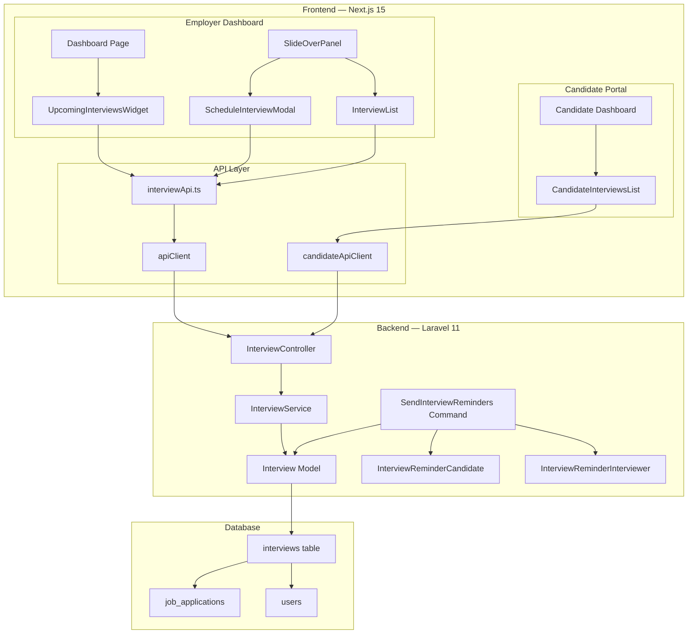
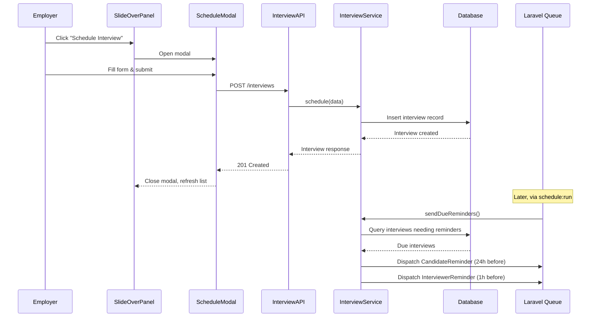
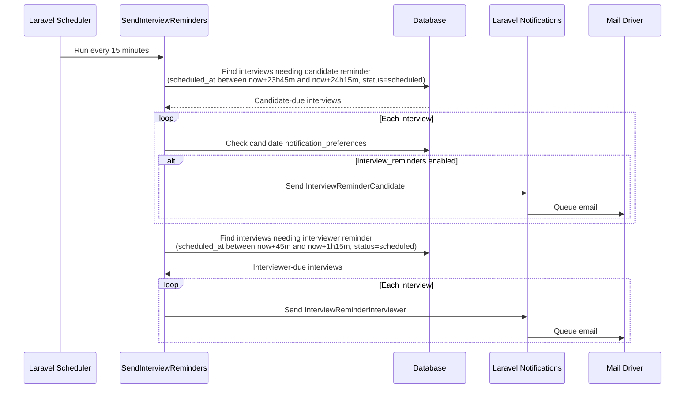
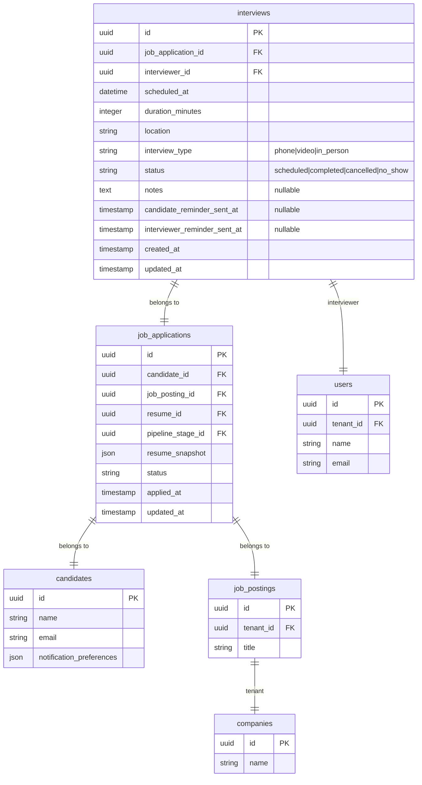

# Design Document — Interview Scheduling

## Overview

The Interview Scheduling feature adds the ability for employers to schedule, update, and cancel interviews linked to job applications, and for candidates to view their upcoming interviews. The system sends automated email reminders before interviews and provides a dashboard widget showing the week's interview schedule.

The feature spans backend (new `interviews` table, `Interview` model, `InterviewController`, `InterviewService`, two notification classes, a scheduled command for reminders) and frontend (schedule form in the SlideOverPanel, interview list in application detail, candidate interview view, employer dashboard widget).

### Key Design Decisions

| Decision | Choice | Rationale |
|---|---|---|
| Tenant scoping | Join through `job_applications → job_postings.tenant_id` | Interview has no direct `tenant_id` column — scoping via the existing relationship chain avoids schema duplication and stays consistent with how `job_applications` are already scoped |
| Reminder dispatch | Laravel scheduled command (`schedule:run`) checking interviews due for reminders | Simpler than event-driven approach; a single query finds interviews needing reminders at each interval. Uses `ShouldQueue` notifications for async delivery, matching existing notification pattern |
| Reminder timing | 24h for candidates, 1h for interviewers | Candidates need more lead time to prepare; interviewers need a timely nudge. Two separate notification classes keep email content distinct |
| Duration validation | Enum of 30, 45, 60, 90 | Covers standard interview lengths; prevents unreasonable values. Validated at the form request level |
| Interview status transitions | Free-form update (any status can be set) | Keeps the API simple — no state machine needed. The cancel endpoint is a convenience shortcut that sets status to "cancelled" |
| Frontend interview form | Modal dialog triggered from SlideOverPanel | Avoids navigating away from the pipeline view; keeps the scheduling flow contextual to the candidate being reviewed |
| Upcoming interviews widget | Separate API endpoint returning max 10 interviews in next 7 days | Dedicated endpoint avoids over-fetching; limit of 10 keeps the widget compact |
| Candidate interview view | Inline section on candidate applications page | Candidates see interviews in context of their applications rather than a separate page |

---

## Architecture

### High-Level Architecture



### Interview Scheduling Flow



### Reminder Dispatch Flow



---

## Components and Interfaces

### Backend Components

#### 1. Interview Model

**File:** `backend/app/Models/Interview.php`

**Responsibility:** Eloquent model for the `interviews` table. Uses `HasUuid` trait for UUID primary keys.

```php
class Interview extends Model
{
    use HasFactory, HasUuid;

    protected $table = 'interviews';

    protected $fillable = [
        'job_application_id',
        'interviewer_id',
        'scheduled_at',
        'duration_minutes',
        'location',
        'interview_type',
        'status',
        'notes',
    ];

    protected function casts(): array
    {
        return [
            'scheduled_at' => 'datetime',
            'duration_minutes' => 'integer',
        ];
    }

    // Relationships
    public function jobApplication(): BelongsTo;  // → JobApplication
    public function interviewer(): BelongsTo;      // → User
}
```

**Tenant Scoping:** The Interview model does NOT use `BelongsToTenant` directly. Instead, all queries scope through the `job_applications → job_postings` chain where `job_postings` has `tenant_id` with the `BelongsToTenant` trait.

#### 2. InterviewService

**File:** `backend/app/Services/InterviewService.php`

**Responsibility:** Business logic for interview CRUD and reminder dispatch.

**Methods:**

```php
class InterviewService
{
    /**
     * Create a new interview for a job application.
     * Validates that the application and interviewer belong to the current tenant.
     */
    public function schedule(array $data, string $tenantId): Interview;

    /**
     * Update an existing interview's fields.
     * Validates tenant ownership.
     */
    public function update(Interview $interview, array $data): Interview;

    /**
     * Cancel an interview (set status to 'cancelled').
     * Returns error if already cancelled.
     */
    public function cancel(Interview $interview): Interview;

    /**
     * List all interviews for a specific job application.
     * Ordered by scheduled_at descending.
     */
    public function listForApplication(string $applicationId, string $tenantId): Collection;

    /**
     * Get a single interview with full details.
     * Includes interviewer, candidate name, job title.
     */
    public function getDetail(string $interviewId, string $tenantId): ?Interview;

    /**
     * Get upcoming interviews for the tenant (next 7 days, max 10).
     */
    public function getUpcoming(string $tenantId, int $limit = 10): Collection;

    /**
     * Get interviews for a specific candidate's applications.
     * Used by candidate-facing endpoint.
     */
    public function listForCandidate(string $candidateId): Collection;

    /**
     * Find and send reminders for interviews due within the current window.
     * Called by the scheduled command.
     */
    public function sendDueReminders(): void;
}
```

**Tenant Scoping Pattern (used in all employer-facing methods):**
```php
$interview = Interview::whereHas('jobApplication', function ($q) use ($tenantId) {
    $q->whereHas('jobPosting', function ($q2) use ($tenantId) {
        $q2->where('tenant_id', $tenantId);
    });
})->find($interviewId);
```

#### 3. InterviewController

**File:** `backend/app/Http/Controllers/InterviewController.php`

**Responsibility:** REST API endpoints for interview operations.

**Endpoints:**

| Method | Path | Permission | Action |
|---|---|---|---|
| POST | `/api/v1/interviews` | `applications.manage` | Schedule a new interview |
| GET | `/api/v1/applications/{appId}/interviews` | `applications.view` | List interviews for an application |
| GET | `/api/v1/interviews/{id}` | `applications.view` | Get interview detail |
| PUT | `/api/v1/interviews/{id}` | `applications.manage` | Update an interview |
| PATCH | `/api/v1/interviews/{id}/cancel` | `applications.manage` | Cancel an interview |
| GET | `/api/v1/dashboard/upcoming-interviews` | (auth + tenant) | Upcoming interviews widget data |
| GET | `/api/v1/candidate/interviews` | `candidate.auth` | Candidate's interviews |

**Response Formats:**

Schedule/Update/Cancel response:
```json
{
  "data": {
    "id": "uuid",
    "job_application_id": "uuid",
    "interviewer_id": "uuid",
    "interviewer_name": "Jane Smith",
    "interviewer_email": "jane@company.com",
    "scheduled_at": "2025-02-15T10:00:00Z",
    "duration_minutes": 60,
    "location": "Zoom link",
    "interview_type": "video",
    "status": "scheduled",
    "notes": "Technical round",
    "created_at": "2025-02-10T08:00:00Z",
    "updated_at": "2025-02-10T08:00:00Z"
  }
}
```

List for application response (includes interviewer info):
```json
{
  "data": [
    {
      "id": "uuid",
      "interviewer_name": "Jane Smith",
      "interviewer_email": "jane@company.com",
      "scheduled_at": "2025-02-15T10:00:00Z",
      "duration_minutes": 60,
      "interview_type": "video",
      "status": "scheduled",
      "location": "Zoom link",
      "notes": "Technical round"
    }
  ]
}
```

Interview detail response (includes candidate and job info):
```json
{
  "data": {
    "id": "uuid",
    "job_application_id": "uuid",
    "interviewer_id": "uuid",
    "interviewer_name": "Jane Smith",
    "interviewer_email": "jane@company.com",
    "candidate_name": "John Doe",
    "job_title": "Senior Developer",
    "scheduled_at": "2025-02-15T10:00:00Z",
    "duration_minutes": 60,
    "location": "Zoom link",
    "interview_type": "video",
    "status": "scheduled",
    "notes": "Technical round",
    "created_at": "2025-02-10T08:00:00Z",
    "updated_at": "2025-02-10T08:00:00Z"
  }
}
```

Upcoming interviews response:
```json
{
  "data": [
    {
      "id": "uuid",
      "candidate_name": "John Doe",
      "job_title": "Senior Developer",
      "scheduled_at": "2025-02-15T10:00:00Z",
      "duration_minutes": 60,
      "interview_type": "video",
      "location": "Zoom link"
    }
  ]
}
```

Candidate interviews response (no notes field):
```json
{
  "data": [
    {
      "id": "uuid",
      "job_title": "Senior Developer",
      "interview_type": "video",
      "location": "Zoom link",
      "interviewer_name": "Jane Smith",
      "scheduled_at": "2025-02-15T10:00:00Z",
      "duration_minutes": 60
    }
  ]
}
```

#### 4. Form Request Classes

**ScheduleInterviewRequest:**
```php
class ScheduleInterviewRequest extends BaseFormRequest
{
    public function rules(): array
    {
        return [
            'job_application_id' => 'required|uuid',
            'interviewer_id' => 'required|uuid',
            'scheduled_at' => 'required|date|after:now',
            'duration_minutes' => 'required|integer|in:30,45,60,90',
            'interview_type' => 'required|string|in:phone,video,in_person',
            'location' => 'required|string|max:500',
            'notes' => 'sometimes|nullable|string|max:2000',
        ];
    }
}
```

**UpdateInterviewRequest:**
```php
class UpdateInterviewRequest extends BaseFormRequest
{
    public function rules(): array
    {
        return [
            'scheduled_at' => 'sometimes|date|after:now',
            'duration_minutes' => 'sometimes|integer|in:30,45,60,90',
            'interview_type' => 'sometimes|string|in:phone,video,in_person',
            'location' => 'sometimes|string|max:500',
            'interviewer_id' => 'sometimes|uuid',
            'notes' => 'sometimes|nullable|string|max:2000',
            'status' => 'sometimes|string|in:scheduled,completed,cancelled,no_show',
        ];
    }
}
```

#### 5. Notification Classes

**InterviewReminderCandidate:**

**File:** `backend/app/Notifications/InterviewReminderCandidate.php`

Implements `ShouldQueue`. Sent to the `Candidate` model 24 hours before the interview. Includes: interview date/time, type, location, job title. Uses the `mail` channel with a Blade markdown template.

```php
class InterviewReminderCandidate extends Notification implements ShouldQueue
{
    use Queueable;
    public int $tries = 3;

    public function __construct(
        protected string $jobTitle,
        protected Carbon $scheduledAt,
        protected string $interviewType,
        protected string $location,
    ) {}

    public function via(object $notifiable): array { return ['mail']; }

    public function toMail(object $notifiable): MailMessage
    {
        return (new MailMessage)
            ->subject("Interview Reminder — {$this->jobTitle}")
            ->markdown('emails.interview-reminder-candidate', [
                'candidateName' => $notifiable->name,
                'jobTitle' => $this->jobTitle,
                'scheduledAt' => $this->scheduledAt->format('l, F j, Y \a\t g:i A'),
                'interviewType' => $this->interviewType,
                'location' => $this->location,
            ]);
    }
}
```

**InterviewReminderInterviewer:**

**File:** `backend/app/Notifications/InterviewReminderInterviewer.php`

Implements `ShouldQueue`. Sent to the `User` model 1 hour before the interview. Includes: interview date/time, type, location, candidate name.

```php
class InterviewReminderInterviewer extends Notification implements ShouldQueue
{
    use Queueable;
    public int $tries = 3;

    public function __construct(
        protected string $candidateName,
        protected Carbon $scheduledAt,
        protected string $interviewType,
        protected string $location,
    ) {}

    public function via(object $notifiable): array { return ['mail']; }

    public function toMail(object $notifiable): MailMessage
    {
        return (new MailMessage)
            ->subject("Interview in 1 Hour — {$this->candidateName}")
            ->markdown('emails.interview-reminder-interviewer', [
                'interviewerName' => $notifiable->name,
                'candidateName' => $this->candidateName,
                'scheduledAt' => $this->scheduledAt->format('l, F j, Y \a\t g:i A'),
                'interviewType' => $this->interviewType,
                'location' => $this->location,
            ]);
    }
}
```

#### 6. SendInterviewReminders Command

**File:** `backend/app/Console/Commands/SendInterviewReminders.php`

**Responsibility:** Artisan command registered in the Laravel scheduler to run every 15 minutes. Queries for interviews needing reminders and dispatches notifications.

```php
class SendInterviewReminders extends Command
{
    protected $signature = 'interviews:send-reminders';
    protected $description = 'Send interview reminder emails to candidates and interviewers';

    public function handle(InterviewService $service): int
    {
        $service->sendDueReminders();
        return Command::SUCCESS;
    }
}
```

**Scheduler registration** in `bootstrap/app.php` or `routes/console.php`:
```php
Schedule::command('interviews:send-reminders')->everyFifteenMinutes();
```

**Reminder window logic** (in `InterviewService::sendDueReminders`):
- Candidate reminders: interviews where `scheduled_at` is between `now + 23h45m` and `now + 24h15m` (30-minute window centered on 24h)
- Interviewer reminders: interviews where `scheduled_at` is between `now + 45m` and `now + 1h15m` (30-minute window centered on 1h)
- Only interviews with `status = 'scheduled'`
- Uses a `reminder_sent_at` column (nullable timestamp) to prevent duplicate sends — only sends if `reminder_sent_at` is null for the respective reminder type
- Actually two columns: `candidate_reminder_sent_at` and `interviewer_reminder_sent_at`

### Frontend Components

#### 7. InterviewApi Functions

**File:** `frontend/src/lib/interviewApi.ts`

```typescript
import { apiClient } from "@/lib/api";
import type { ApiResponse } from "@/types/api";
import type {
  Interview,
  InterviewDetail,
  InterviewListItem,
  UpcomingInterview,
  CandidateInterview,
  ScheduleInterviewPayload,
  UpdateInterviewPayload,
} from "@/types/interview";

export async function scheduleInterview(
  payload: ScheduleInterviewPayload
): Promise<ApiResponse<Interview>>;

export async function listInterviewsForApplication(
  applicationId: string
): Promise<ApiResponse<InterviewListItem[]>>;

export async function getInterviewDetail(
  interviewId: string
): Promise<ApiResponse<InterviewDetail>>;

export async function updateInterview(
  interviewId: string,
  payload: UpdateInterviewPayload
): Promise<ApiResponse<Interview>>;

export async function cancelInterview(
  interviewId: string
): Promise<ApiResponse<Interview>>;

export async function fetchUpcomingInterviews():
  Promise<ApiResponse<UpcomingInterview[]>>;
```

**Candidate interview API** (in `candidateApi.ts`):
```typescript
export async function fetchCandidateInterviews():
  Promise<ApiResponse<CandidateInterview[]>>;
```

#### 8. Interview TypeScript Types

**File:** `frontend/src/types/interview.ts`

```typescript
export type InterviewType = "phone" | "video" | "in_person";
export type InterviewStatus = "scheduled" | "completed" | "cancelled" | "no_show";

export interface Interview {
  id: string;
  job_application_id: string;
  interviewer_id: string;
  interviewer_name: string;
  interviewer_email: string;
  scheduled_at: string;
  duration_minutes: number;
  location: string;
  interview_type: InterviewType;
  status: InterviewStatus;
  notes: string | null;
  created_at: string;
  updated_at: string;
}

export interface InterviewListItem {
  id: string;
  interviewer_name: string;
  interviewer_email: string;
  scheduled_at: string;
  duration_minutes: number;
  interview_type: InterviewType;
  status: InterviewStatus;
  location: string;
  notes: string | null;
}

export interface InterviewDetail extends Interview {
  candidate_name: string;
  job_title: string;
}

export interface UpcomingInterview {
  id: string;
  candidate_name: string;
  job_title: string;
  scheduled_at: string;
  duration_minutes: number;
  interview_type: InterviewType;
  location: string;
}

export interface CandidateInterview {
  id: string;
  job_title: string;
  interview_type: InterviewType;
  location: string;
  interviewer_name: string;
  scheduled_at: string;
  duration_minutes: number;
}

export interface ScheduleInterviewPayload {
  job_application_id: string;
  interviewer_id: string;
  scheduled_at: string;
  duration_minutes: 30 | 45 | 60 | 90;
  interview_type: InterviewType;
  location: string;
  notes?: string;
}

export interface UpdateInterviewPayload {
  scheduled_at?: string;
  duration_minutes?: 30 | 45 | 60 | 90;
  interview_type?: InterviewType;
  location?: string;
  interviewer_id?: string;
  notes?: string | null;
  status?: InterviewStatus;
}
```

#### 9. ScheduleInterviewModal

**File:** `frontend/src/components/interviews/ScheduleInterviewModal.tsx`

**Responsibility:** Modal dialog for scheduling a new interview. Triggered from the SlideOverPanel.

**Key Behaviors:**
- Form fields: date/time picker (`<input type="datetime-local">`), duration select (30/45/60/90), interviewer dropdown (fetched from tenant team members via existing `/users` endpoint), interview type radio group (phone/video/in-person), location text input, notes textarea
- On submit: calls `scheduleInterview()`, shows success toast, closes modal, triggers parent refresh
- Validation: client-side required field checks + server-side 422 error display
- Focus trap and Escape to close
- ARIA: `role="dialog"`, `aria-modal="true"`, `aria-labelledby`

**Props:**
```typescript
interface ScheduleInterviewModalProps {
  applicationId: string;
  onClose: () => void;
  onScheduled: () => void;
}
```

#### 10. InterviewList

**File:** `frontend/src/components/interviews/InterviewList.tsx`

**Responsibility:** Displays all interviews for a specific application within the SlideOverPanel.

**Key Behaviors:**
- Fetches interviews via `listInterviewsForApplication(applicationId)`
- Displays each interview as a card: interviewer name, date/time, duration, type badge, status badge, location
- Status actions: "Mark Completed", "Cancel", "Mark No-Show" buttons (calls `updateInterview` with new status)
- Cancel action shows a confirmation dialog before proceeding
- Loading skeleton while fetching
- Empty state: "No interviews scheduled"

**Props:**
```typescript
interface InterviewListProps {
  applicationId: string;
  canManage: boolean;
}
```

#### 11. UpcomingInterviewsWidget

**File:** `frontend/src/components/dashboard/UpcomingInterviewsWidget.tsx`

**Responsibility:** Dashboard widget showing interviews in the next 7 days.

**Key Behaviors:**
- Fetches data via `fetchUpcomingInterviews()`
- Displays up to 10 interviews: candidate name, job title, date/time, interview type badge
- Empty state: "No upcoming interviews this week"
- Loading skeleton while fetching
- Compact card layout matching existing dashboard widget style

#### 12. CandidateInterviewsList

**File:** `frontend/src/components/candidate/CandidateInterviewsList.tsx`

**Responsibility:** Displays upcoming interviews on the candidate applications dashboard.

**Key Behaviors:**
- Fetches data via `fetchCandidateInterviews()` from `candidateApiClient`
- Filters to show only future interviews with status "scheduled"
- Displays: date/time, interview type, location, interviewer name, job title
- Ordered by `scheduled_at` ascending (nearest first)
- Read-only — no create/update/cancel actions
- Empty state: "No upcoming interviews"

### Route Registration

New routes added to `backend/routes/api.php`:

```php
// Inside the havenhr.auth + tenant.resolve middleware group:

// Interview CRUD
Route::post('/interviews', [InterviewController::class, 'store'])
    ->middleware('rbac:applications.manage');
Route::get('/applications/{appId}/interviews', [InterviewController::class, 'listForApplication'])
    ->middleware('rbac:applications.view');
Route::get('/interviews/{id}', [InterviewController::class, 'show'])
    ->middleware('rbac:applications.view');
Route::put('/interviews/{id}', [InterviewController::class, 'update'])
    ->middleware('rbac:applications.manage');
Route::patch('/interviews/{id}/cancel', [InterviewController::class, 'cancel'])
    ->middleware('rbac:applications.manage');

// Dashboard upcoming interviews
Route::get('/dashboard/upcoming-interviews', [InterviewController::class, 'upcoming']);

// Inside the candidate.auth middleware group:
Route::get('/candidate/interviews', [InterviewController::class, 'candidateInterviews']);
```

---

## Data Models

### Entity Relationship Diagram



### Migration

**File:** `backend/database/migrations/2025_01_05_000001_create_interviews_table.php`

```php
Schema::create('interviews', function (Blueprint $table) {
    $table->uuid('id')->primary();
    $table->uuid('job_application_id');
    $table->uuid('interviewer_id');
    $table->dateTime('scheduled_at');
    $table->unsignedSmallInteger('duration_minutes');
    $table->string('location', 500);
    $table->string('interview_type', 20);   // phone, video, in_person
    $table->string('status', 20)->default('scheduled');
    $table->text('notes')->nullable();
    $table->timestamp('candidate_reminder_sent_at')->nullable();
    $table->timestamp('interviewer_reminder_sent_at')->nullable();
    $table->timestamps();

    $table->foreign('job_application_id')
        ->references('id')->on('job_applications')
        ->cascadeOnDelete();
    $table->foreign('interviewer_id')
        ->references('id')->on('users')
        ->cascadeOnDelete();

    $table->index('job_application_id');
    $table->index(['status', 'scheduled_at']);  // For reminder queries and upcoming widget
    $table->index('interviewer_id');
});
```

### Schema Summary

| Table | Change | Details |
|---|---|---|
| `interviews` | New table | UUID PK, FK to `job_applications` and `users`, datetime/enum/text columns, reminder tracking timestamps |

No changes to existing tables.

---

## Correctness Properties

*A property is a characteristic or behavior that should hold true across all valid executions of a system — essentially, a formal statement about what the system should do. Properties serve as the bridge between human-readable specifications and machine-verifiable correctness guarantees.*

### Property 1: Interview creation round-trip

*For any* valid combination of `job_application_id`, `interviewer_id`, `scheduled_at` (future datetime), `duration_minutes` (one of 30, 45, 60, 90), `interview_type` (one of phone, video, in_person), `location`, and optional `notes`, creating an interview SHALL return a record with all provided fields matching the input, status set to "scheduled", and valid `id`, `created_at`, and `updated_at` timestamps. Re-fetching the interview by ID SHALL return the same data.

**Validates: Requirements 1.4, 2.1**

### Property 2: Tenant isolation

*For any* interview belonging to tenant A, querying from tenant B (via list, detail, update, or cancel endpoints) SHALL return a 404 NOT_FOUND error. No interview data from tenant A SHALL appear in tenant B's responses. This applies to all employer-facing interview endpoints.

**Validates: Requirements 1.5, 2.3, 2.4, 3.4, 4.3, 5.4, 6.3**

### Property 3: Validation rejects invalid input

*For any* interview schedule or update request containing at least one invalid field (e.g., `duration_minutes` not in {30, 45, 60, 90}, `interview_type` not in {phone, video, in_person}, `scheduled_at` in the past, missing required fields), the API SHALL return HTTP 422 with field-level validation messages. The set of error fields SHALL include every invalid field in the request.

**Validates: Requirements 2.5, 2.6, 2.7, 5.5**

### Property 4: List interviews returns correct set in correct order

*For any* job application with N interviews (N ≥ 0), the list endpoint SHALL return exactly N interview records, each including `interviewer_name` and `interviewer_email`. The results SHALL be ordered by `scheduled_at` descending. No interviews from other applications SHALL appear in the results.

**Validates: Requirements 3.1, 3.3**

### Property 5: Interview detail includes all required fields

*For any* interview, the detail endpoint SHALL return a response containing `interviewer_name`, `interviewer_email`, `candidate_name`, `job_title`, and all interview attributes (`id`, `job_application_id`, `interviewer_id`, `scheduled_at`, `duration_minutes`, `location`, `interview_type`, `status`, `notes`, `created_at`, `updated_at`).

**Validates: Requirements 4.1**

### Property 6: Update applies and persists changes

*For any* existing interview and *for any* valid subset of updatable fields (`scheduled_at`, `duration_minutes`, `interview_type`, `location`, `interviewer_id`, `notes`, `status`), updating the interview SHALL return a record where every provided field matches the new value and every non-provided field retains its previous value. Re-fetching the interview SHALL confirm persistence.

**Validates: Requirements 5.1, 5.3**

### Property 7: Cancel sets status to cancelled

*For any* interview with status other than "cancelled", cancelling it SHALL set the status to "cancelled" and return the updated record. *For any* interview already in "cancelled" status, cancelling it again SHALL return HTTP 422 with the message "Interview is already cancelled".

**Validates: Requirements 6.1, 6.4**

### Property 8: Candidate API returns scoped data without notes

*For any* authenticated candidate with N job applications having M total interviews, the candidate interviews endpoint SHALL return exactly M interview records. Each record SHALL include `job_title`, `interview_type`, `location`, `interviewer_name`, `scheduled_at`, and `duration_minutes`. No record SHALL include a `notes` field. No interviews from other candidates' applications SHALL appear in the results.

**Validates: Requirements 9.1, 9.3, 9.4**

### Property 9: Reminder timing correctness

*For any* set of interviews with status "scheduled", running the reminder service SHALL send a candidate reminder for exactly those interviews where `scheduled_at` falls within the 24-hour reminder window (±15 minutes of 24 hours from now) and `candidate_reminder_sent_at` is null. It SHALL send an interviewer reminder for exactly those interviews where `scheduled_at` falls within the 1-hour reminder window (±15 minutes of 1 hour from now) and `interviewer_reminder_sent_at` is null. After sending, the respective `reminder_sent_at` column SHALL be set, preventing duplicate sends on subsequent runs.

**Validates: Requirements 10.1, 10.2**

### Property 10: Reminder skipping for cancelled and opted-out

*For any* interview with status "cancelled" that falls within a reminder window, the reminder service SHALL NOT send any reminder. *For any* candidate whose `notification_preferences` has `interview_reminders` set to false, the reminder service SHALL NOT send a candidate reminder even if the interview is within the reminder window.

**Validates: Requirements 10.5, 10.6**

### Property 11: Upcoming interviews API filtering, ordering, and limiting

*For any* tenant with interviews across various statuses and dates, the upcoming interviews endpoint SHALL return only interviews with status "scheduled" and `scheduled_at` within the next 7 days. Results SHALL be ordered by `scheduled_at` ascending. Results SHALL be limited to at most 10 records. Each result SHALL include `candidate_name`, `job_title`, `scheduled_at`, `duration_minutes`, `interview_type`, and `location`.

**Validates: Requirements 12.1, 12.2, 12.3**

---

## Error Handling

### API Error Responses

All error responses follow the existing HavenHR error format:

```json
{
  "error": {
    "code": "ERROR_CODE",
    "message": "Human-readable message.",
    "details": { ... }
  }
}
```

| Scenario | HTTP Status | Error Code | Message |
|---|---|---|---|
| Interview not found (or wrong tenant) | 404 | NOT_FOUND | Interview not found. |
| Application not found (or wrong tenant) | 404 | NOT_FOUND | Application not found. |
| Interviewer not found (or wrong tenant) | 404 | NOT_FOUND | Interviewer not found. |
| Validation failure | 422 | VALIDATION_ERROR | The given data was invalid. |
| Cancel already-cancelled interview | 422 | VALIDATION_ERROR | Interview is already cancelled. |
| Missing permission | 403 | FORBIDDEN | You do not have permission to perform this action. |
| Unauthenticated request | 401 | UNAUTHENTICATED | Unauthenticated. |

### Validation Rules Summary

| Field | Create | Update | Rules |
|---|---|---|---|
| `job_application_id` | required | — | UUID, must exist in tenant |
| `interviewer_id` | required | optional | UUID, must exist in tenant |
| `scheduled_at` | required | optional | ISO 8601 datetime, must be in the future |
| `duration_minutes` | required | optional | Integer, one of: 30, 45, 60, 90 |
| `interview_type` | required | optional | String, one of: phone, video, in_person |
| `location` | required | optional | String, max 500 characters |
| `notes` | optional | optional | Nullable string, max 2000 characters |
| `status` | — | optional | String, one of: scheduled, completed, cancelled, no_show |

### Reminder Error Handling

- If a notification fails to send (mail driver error), the `ShouldQueue` retry mechanism (3 attempts) handles retries automatically
- If the interview is deleted between the query and the notification dispatch, the notification gracefully handles the missing record by checking for null
- If the candidate or interviewer user record is missing, the reminder is silently skipped (defensive null check)
- The `reminder_sent_at` timestamp is set before dispatching the notification to prevent duplicate sends even if the notification fails (at-most-once delivery for reminders)

---

## Testing Strategy

### Dual Testing Approach

This feature uses both unit/example-based tests and property-based tests for comprehensive coverage.

**Property-Based Testing Library:** [Pest PHP](https://pestphp.com/) with a custom property testing helper that runs each property test for a minimum of 100 iterations with randomly generated inputs. On the frontend, [fast-check](https://fast-check.dev/) for TypeScript property tests.

### Property-Based Tests (Backend — PHP/Pest)

Each property test runs a minimum of 100 iterations. Tests are tagged with the design property they validate.

| Property | Test Description | Tag |
|---|---|---|
| Property 1 | Generate random valid interview payloads, create via service, verify all fields match and status is "scheduled" | `Feature: interview-scheduling, Property 1: Interview creation round-trip` |
| Property 2 | Generate interviews across random tenants, query from wrong tenant, verify 404 | `Feature: interview-scheduling, Property 2: Tenant isolation` |
| Property 3 | Generate random invalid payloads (bad duration, bad type, past dates, missing fields), verify 422 with correct error fields | `Feature: interview-scheduling, Property 3: Validation rejects invalid input` |
| Property 4 | Generate random applications with random interview counts, list via service, verify count, order, and interviewer info | `Feature: interview-scheduling, Property 4: List interviews correct set and order` |
| Property 5 | Generate random interviews, fetch detail, verify all required fields present | `Feature: interview-scheduling, Property 5: Interview detail includes all fields` |
| Property 6 | Generate random interviews and random valid update subsets, apply update, verify changed fields updated and unchanged fields preserved | `Feature: interview-scheduling, Property 6: Update applies and persists` |
| Property 7 | Generate random interviews, cancel them, verify status; cancel again, verify 422 | `Feature: interview-scheduling, Property 7: Cancel sets status` |
| Property 8 | Generate random candidates with random applications/interviews, fetch via candidate endpoint, verify scoping and notes exclusion | `Feature: interview-scheduling, Property 8: Candidate API scoped without notes` |
| Property 9 | Generate random interviews at various times, freeze time, run reminder service, verify correct interviews get reminders and sent_at is set | `Feature: interview-scheduling, Property 9: Reminder timing` |
| Property 10 | Generate cancelled interviews and opted-out candidates within reminder windows, run reminder service, verify no reminders sent | `Feature: interview-scheduling, Property 10: Reminder skipping` |
| Property 11 | Generate random interviews across statuses/dates/tenants, query upcoming endpoint, verify filtering, ordering, and limit | `Feature: interview-scheduling, Property 11: Upcoming API filtering` |

### Unit/Example-Based Tests (Backend)

| Test | Description |
|---|---|
| Permission checks | Verify 403 for users without `applications.manage` or `applications.view` |
| Candidate auth check | Verify 401 for unauthenticated candidate interview requests |
| Cancel idempotency | Verify cancelling an already-cancelled interview returns 422 with specific message |
| Reminder ShouldQueue | Verify notification classes implement `ShouldQueue` interface |
| Schema validation | Verify `interviews` table has all required columns |
| Foreign key constraints | Verify FK relationships to `job_applications` and `users` |
| Email content | Verify reminder notification emails contain required fields (date, type, location, names) |

### Frontend Tests

| Test | Description |
|---|---|
| ScheduleInterviewModal rendering | Verify all form fields render (date/time, duration, interviewer, type, location, notes) |
| ScheduleInterviewModal submission | Verify form calls `scheduleInterview` API with correct payload |
| InterviewList rendering | Verify interview cards display all fields (interviewer, date, duration, type, status, location) |
| InterviewList status actions | Verify "Mark Completed", "Cancel", "No-Show" buttons are present and functional |
| Cancel confirmation dialog | Verify confirmation dialog appears before cancel action |
| UpcomingInterviewsWidget rendering | Verify widget displays interviews with candidate name, job title, date, type |
| UpcomingInterviewsWidget empty state | Verify "No upcoming interviews" message when data is empty |
| CandidateInterviewsList rendering | Verify read-only view with correct fields, no action buttons |
| CandidateInterviewsList ordering | Verify interviews ordered by scheduled_at ascending |

### Frontend Property Tests (fast-check)

| Property | Test Description |
|---|---|
| Property 4 (frontend) | Generate random interview list data, render InterviewList, verify all items displayed with correct fields and descending order |
| Property 8 (frontend) | Generate random candidate interview data, render CandidateInterviewsList, verify only future scheduled interviews shown, ordered ascending, no notes displayed |
| Property 11 (frontend) | Generate random upcoming interview data, render UpcomingInterviewsWidget, verify all fields displayed and ascending order |

