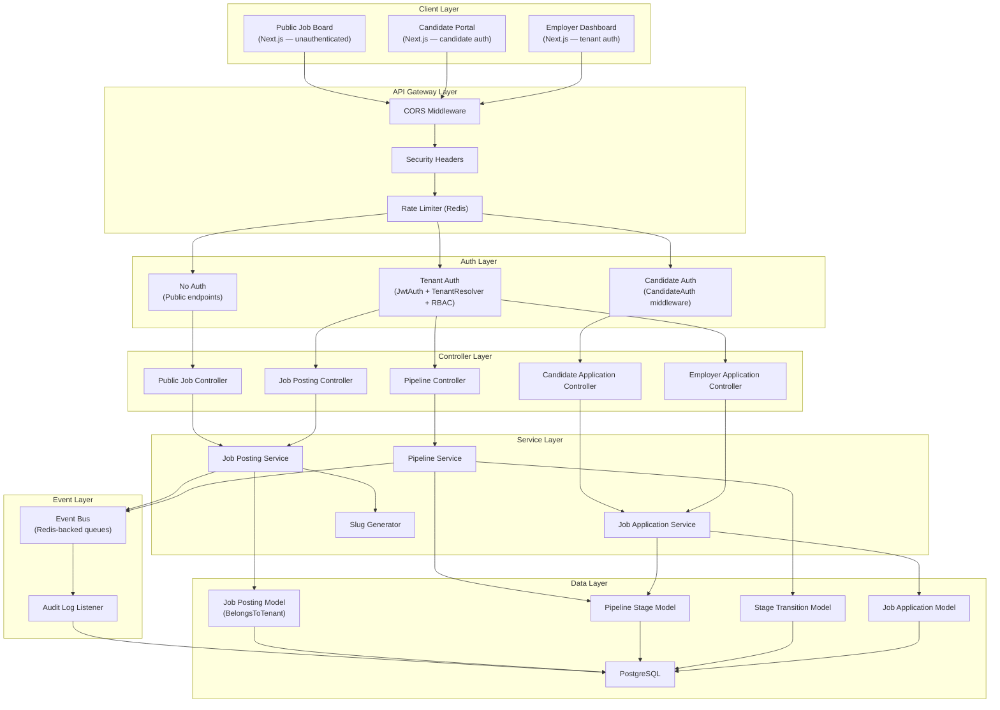
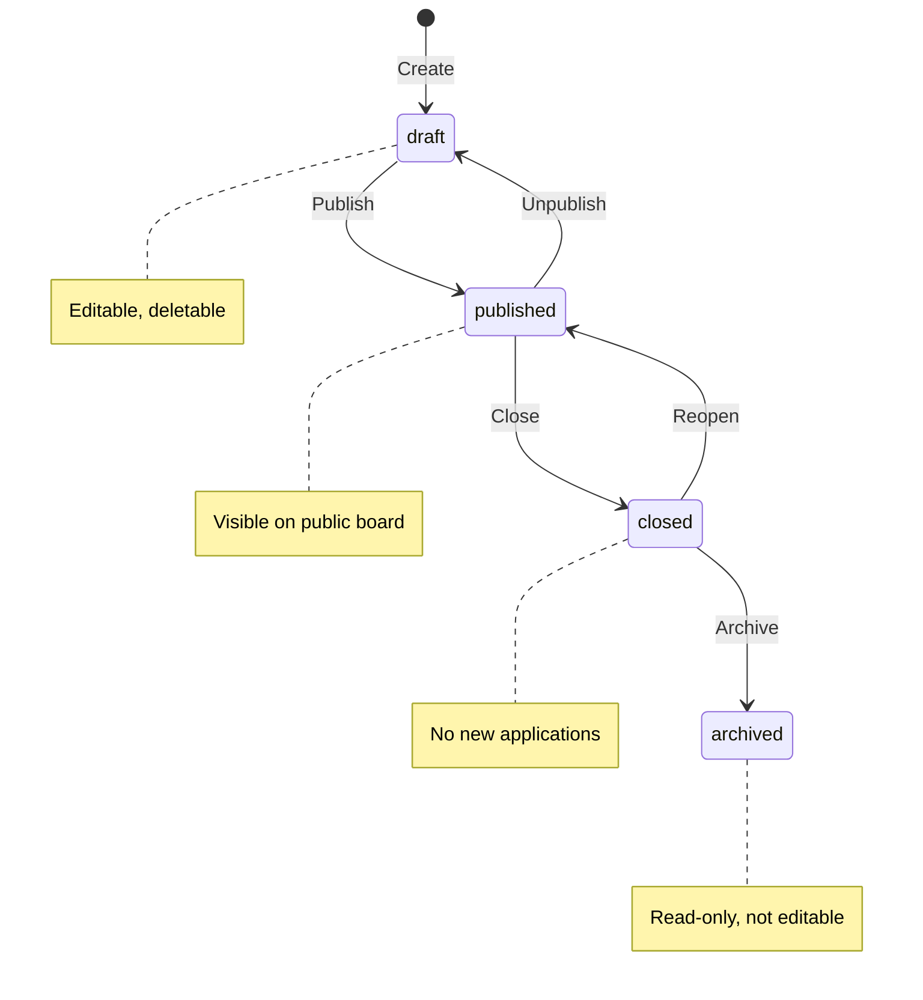
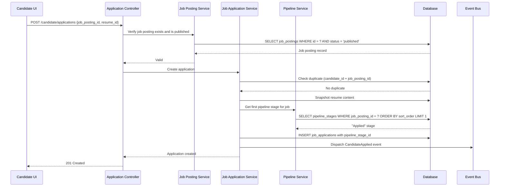
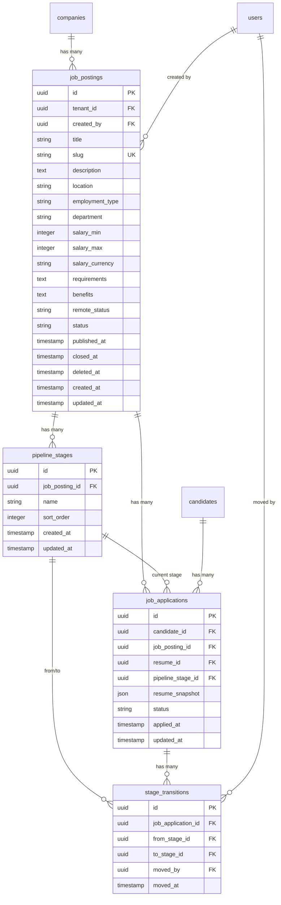

# Design Document — Job Management

## Overview

The Job Management feature completes HavenHR's two-sided hiring marketplace by introducing tenant-scoped job postings, a public job board, configurable hiring pipelines, and candidate application integration. Employers create job postings within their tenant, transition them through a draft → published → closed → archived lifecycle, and track candidates through customizable pipeline stages. Candidates discover jobs via a public, searchable job board and apply using their existing resumes. The feature connects the existing `job_applications` table (which already references a placeholder `job_posting_id`) to real, tenant-scoped `job_postings` records.

The design follows the established patterns: Laravel REST API with `BelongsToTenant` trait for data isolation, RBAC middleware for permission enforcement, domain events for audit logging, and a Next.js App Router frontend with Tailwind CSS. No new infrastructure is required — the feature builds entirely on the existing middleware stack, event system, and authentication paths.

### Key Design Decisions

| Decision | Choice | Rationale |
|---|---|---|
| Job posting tenant isolation | `BelongsToTenant` trait + `TenantScope` | Consistent with all existing tenant-scoped models; automatic query filtering |
| Status transitions | Explicit state machine in service layer | Prevents invalid transitions; easy to audit and test |
| Pipeline stages | Per-job-posting, stored in `pipeline_stages` table | Each job can have a customized workflow; default stages seeded on creation |
| Stage transitions | Append-only `stage_transitions` table | Full audit trail of candidate movement; never loses history |
| Slug generation | Lowercase title + short UUID suffix | SEO-friendly, guaranteed unique, stable after creation (regenerated only on title edit while published) |
| Soft delete | Only for draft job postings | Prevents accidental data loss; published/closed/archived postings cannot be deleted |
| Public job board | Unauthenticated endpoints, cross-tenant | Candidates and visitors browse all published jobs without login |
| Application count | Computed via COUNT query (with caching) | Avoids denormalization; cached per-job for list performance |
| Job application pipeline link | `pipeline_stage_id` column on `job_applications` | Direct FK to current stage; stage_transitions table tracks history |

---

## Architecture

### High-Level System Architecture



### Job Posting Status State Machine



### Candidate Application Flow



---

## Components and Interfaces

### Backend Components

#### 1. Job Posting Controller

**Responsibility:** Handle CRUD operations and status transitions for tenant-scoped job postings.

**Endpoints:**

| Method | Path | Permission | Description |
|---|---|---|---|
| GET | `/api/v1/jobs` | `jobs.list` | List tenant job postings (dashboard) |
| POST | `/api/v1/jobs` | `jobs.create` | Create new job posting |
| GET | `/api/v1/jobs/{id}` | `jobs.view` | Get job posting detail (employer) |
| PUT | `/api/v1/jobs/{id}` | `jobs.update` | Update job posting |
| DELETE | `/api/v1/jobs/{id}` | `jobs.delete` | Soft-delete draft job posting |
| PATCH | `/api/v1/jobs/{id}/status` | `jobs.update` | Transition job posting status |

All endpoints require `havenhr.auth`, `tenant.resolve`, and `rbac:{permission}` middleware.

**Create Job Posting Request:**

| Field | Type | Required | Validation |
|---|---|---|---|
| title | string | yes | max:255 |
| description | string | yes | max:10000 |
| location | string | yes | max:255 |
| employment_type | string | yes | in:full-time,part-time,contract,internship |
| department | string | no | max:255 |
| salary_min | integer | no | min:0 |
| salary_max | integer | no | min:0 |
| salary_currency | string | no | max:3, ISO 4217 |
| requirements | string | no | max:5000 |
| benefits | string | no | max:5000 |
| remote_status | string | no | in:remote,on-site,hybrid |

**Create Response (201):**
```json
{
  "data": {
    "id": "uuid",
    "title": "Senior Laravel Developer",
    "slug": "senior-laravel-developer-a1b2c3",
    "status": "draft",
    "department": "Engineering",
    "location": "San Francisco, CA",
    "employment_type": "full-time",
    "remote_status": "hybrid",
    "salary_min": 120000,
    "salary_max": 180000,
    "salary_currency": "USD",
    "description": "...",
    "requirements": "...",
    "benefits": "...",
    "published_at": null,
    "closed_at": null,
    "created_at": "2025-01-15T10:00:00Z",
    "updated_at": "2025-01-15T10:00:00Z"
  }
}
```

**Status Transition Request (PATCH):**
```json
{
  "status": "published"
}
```

**Status Transition Response (200):**
Returns the full updated job posting record.

**Allowed Transitions:**

| From | To |
|---|---|
| draft | published |
| published | draft |
| published | closed |
| closed | published |
| closed | archived |

Invalid transitions return 422 with allowed transitions listed.

**Dashboard List (GET /api/v1/jobs):**

| Parameter | Type | Default | Description |
|---|---|---|---|
| page | integer | 1 | Page number |
| per_page | integer | 20 | Items per page (max 100) |
| status | string | — | Comma-separated: draft,published,closed,archived |
| sort | string | created_at | Sort field: created_at, title, status, application_count |
| direction | string | desc | Sort direction: asc, desc |

**Dashboard List Response:**
```json
{
  "data": [
    {
      "id": "uuid",
      "title": "Senior Laravel Developer",
      "status": "published",
      "department": "Engineering",
      "location": "San Francisco, CA",
      "employment_type": "full-time",
      "application_count": 12,
      "published_at": "2025-01-15T12:00:00Z",
      "created_at": "2025-01-15T10:00:00Z"
    }
  ],
  "meta": {
    "current_page": 1,
    "per_page": 20,
    "total": 45,
    "last_page": 3
  }
}
```

#### 2. Job Posting Service

**Responsibility:** Business logic for job posting CRUD, status transitions, and slug generation.

**Key Methods:**

```
create(array $data, string $userId): JobPosting
update(string $id, array $data, string $userId): JobPosting
transitionStatus(string $id, string $newStatus, string $userId): JobPosting
delete(string $id, string $userId): void
listForTenant(array $filters, array $pagination, array $sort): LengthAwarePaginator
getDetail(string $id): JobPosting
```

**Create Flow:**
1. Validate input via Form Request
2. Generate slug from title (lowercase, hyphens, append short UUID)
3. Create `job_postings` record with status `draft` (tenant_id auto-set by `BelongsToTenant`)
4. Create default pipeline stages via `PipelineService`
5. Dispatch `job_posting.created` domain event
6. Return created record

**Status Transition Flow:**
1. Load job posting (tenant-scoped)
2. Validate transition is allowed (check state machine map)
3. If transitioning to `published`: set `published_at` if null
4. If transitioning to `closed`: set `closed_at`
5. Update status
6. If title changed on a published posting: regenerate slug
7. Dispatch `job_posting.status_changed` domain event with previous and new state
8. Return updated record

**Slug Generation Algorithm:**
1. Convert title to lowercase
2. Replace non-alphanumeric characters with hyphens
3. Collapse consecutive hyphens to single hyphen
4. Trim leading/trailing hyphens
5. Append `-` + first 8 characters of a UUID v4 (e.g., `senior-laravel-developer-a1b2c3d4`)

#### 3. Public Job Controller

**Responsibility:** Serve unauthenticated public job listing and detail endpoints.

**Endpoints:**

| Method | Path | Auth | Description |
|---|---|---|---|
| GET | `/api/v1/public/jobs` | None | List published jobs (public board) |
| GET | `/api/v1/public/jobs/{slug}` | None | Get job detail by slug |

**Public Job List (GET /api/v1/public/jobs):**

| Parameter | Type | Default | Description |
|---|---|---|---|
| page | integer | 1 | Page number |
| per_page | integer | 20 | Items per page (max 100) |
| q | string | — | Search query (title, department, location) |
| employment_type | string | — | Comma-separated filter |
| remote_status | string | — | Comma-separated filter |
| sort | string | published_at | Sort: published_at, title |
| direction | string | desc | Sort direction: asc, desc |

**Public List Response:**
```json
{
  "data": [
    {
      "id": "uuid",
      "title": "Senior Laravel Developer",
      "slug": "senior-laravel-developer-a1b2c3d4",
      "company_name": "Acme Corp",
      "department": "Engineering",
      "location": "San Francisco, CA",
      "employment_type": "full-time",
      "remote_status": "hybrid",
      "salary_min": 120000,
      "salary_max": 180000,
      "salary_currency": "USD",
      "published_at": "2025-01-15T12:00:00Z",
      "application_count": 12
    }
  ],
  "meta": {
    "current_page": 1,
    "per_page": 20,
    "total": 150,
    "last_page": 8
  }
}
```

**Public Detail Response (GET /api/v1/public/jobs/{slug}):**
```json
{
  "data": {
    "id": "uuid",
    "title": "Senior Laravel Developer",
    "slug": "senior-laravel-developer-a1b2c3d4",
    "company_name": "Acme Corp",
    "company_logo_url": "https://...",
    "department": "Engineering",
    "location": "San Francisco, CA",
    "employment_type": "full-time",
    "remote_status": "hybrid",
    "salary_min": 120000,
    "salary_max": 180000,
    "salary_currency": "USD",
    "description": "Full markdown description...",
    "requirements": "...",
    "benefits": "...",
    "published_at": "2025-01-15T12:00:00Z",
    "application_count": 12,
    "og": {
      "title": "Senior Laravel Developer — Acme Corp",
      "description": "First 200 characters of description...",
      "url": "https://havenhr.com/jobs/senior-laravel-developer-a1b2c3d4",
      "type": "website"
    }
  }
}
```

Fields explicitly excluded from public responses: `tenant_id`, `created_by`, `closed_at`, `deleted_at`.

**Search Implementation:**
- Case-insensitive `ILIKE` (PostgreSQL) / `LIKE` (SQLite) on `title`, `department`, `location`
- Combined with employment_type and remote_status `WHERE IN` filters
- All filters composable in a single query

#### 4. Pipeline Controller

**Responsibility:** Manage pipeline stages and candidate stage transitions for a job posting.

**Endpoints:**

| Method | Path | Permission | Description |
|---|---|---|---|
| GET | `/api/v1/jobs/{jobId}/stages` | `jobs.view` | List pipeline stages |
| POST | `/api/v1/jobs/{jobId}/stages` | `pipeline.manage` | Add pipeline stage |
| PUT | `/api/v1/jobs/{jobId}/stages/reorder` | `pipeline.manage` | Reorder stages |
| DELETE | `/api/v1/jobs/{jobId}/stages/{stageId}` | `pipeline.manage` | Remove stage |
| POST | `/api/v1/applications/{appId}/move` | `applications.manage` | Move application to stage |
| GET | `/api/v1/applications/{appId}/transitions` | `applications.view` | Get transition history |

**Add Stage Request:**
```json
{
  "name": "Technical Assessment",
  "sort_order": 3
}
```

**Move Application Request:**
```json
{
  "stage_id": "uuid-of-target-stage"
}
```

**Transition History Response:**
```json
{
  "data": [
    {
      "id": "uuid",
      "from_stage": { "id": "uuid", "name": "Applied" },
      "to_stage": { "id": "uuid", "name": "Screening" },
      "moved_by": { "id": "uuid", "name": "Jane Recruiter" },
      "moved_at": "2025-01-16T09:30:00Z"
    }
  ]
}
```

#### 5. Pipeline Service

**Responsibility:** Business logic for pipeline stage management and candidate stage transitions.

**Key Methods:**

```
createDefaultStages(string $jobPostingId): void
addStage(string $jobPostingId, string $name, int $sortOrder): PipelineStage
reorderStages(string $jobPostingId, array $stageOrder): void
removeStage(string $stageId): void
moveApplication(string $applicationId, string $targetStageId, string $userId): StageTransition
getTransitionHistory(string $applicationId): Collection
```

**Default Stages (created on job posting creation):**

| Name | sort_order |
|---|---|
| Applied | 0 |
| Screening | 1 |
| Interview | 2 |
| Offer | 3 |
| Hired | 4 |
| Rejected | 5 |

**Move Application Flow:**
1. Load application (verify it belongs to a job posting in the current tenant)
2. Load target stage (verify it belongs to the same job posting)
3. Record current stage as `from_stage`
4. Update `job_applications.pipeline_stage_id` to target stage
5. Create `stage_transitions` record with from_stage, to_stage, moved_by, timestamp
6. Dispatch `application.stage_changed` domain event
7. Return the transition record

**Remove Stage Flow:**
1. Load stage (verify it belongs to a job posting in the current tenant)
2. Check if any applications are currently in this stage
3. If applications exist → return 422
4. Delete stage
5. Reorder remaining stages to close gaps

#### 6. Updated Job Application Service

**Responsibility:** Extends the existing `JobApplicationService` to integrate with job postings and pipeline stages.

**Changes to existing `apply()` method:**
1. Verify job posting exists and has `published` status (new)
2. Check for duplicate application (existing)
3. Snapshot resume content (existing)
4. Get first pipeline stage ("Applied") for the job posting (new)
5. Create `job_applications` record with `pipeline_stage_id` (updated)
6. Dispatch `CandidateApplied` event (existing)

**Updated Candidate Application List:**
Returns job posting title, company name, current pipeline stage name, and status.

**Employer Application Endpoints (updated from placeholders):**

| Method | Path | Permission | Description |
|---|---|---|---|
| GET | `/api/v1/jobs/{jobId}/applications` | `applications.view` | List applications for a job |
| GET | `/api/v1/applications/{id}` | `applications.view` | Get application detail |
| GET | `/api/v1/talent-pool` | `applications.view` | List all applicant candidates |

**Employer Application List Response:**
```json
{
  "data": [
    {
      "id": "uuid",
      "candidate_name": "John Doe",
      "candidate_email": "john@example.com",
      "current_stage": "Screening",
      "status": "submitted",
      "applied_at": "2025-01-16T08:00:00Z"
    }
  ],
  "meta": {
    "current_page": 1,
    "per_page": 20,
    "total": 12
  }
}
```

#### 7. Employer Job Detail (Enhanced)

**GET /api/v1/jobs/{id} Response (employer view):**
```json
{
  "data": {
    "id": "uuid",
    "title": "Senior Laravel Developer",
    "slug": "senior-laravel-developer-a1b2c3d4",
    "status": "published",
    "department": "Engineering",
    "location": "San Francisco, CA",
    "employment_type": "full-time",
    "remote_status": "hybrid",
    "salary_min": 120000,
    "salary_max": 180000,
    "salary_currency": "USD",
    "description": "...",
    "requirements": "...",
    "benefits": "...",
    "published_at": "2025-01-15T12:00:00Z",
    "closed_at": null,
    "created_at": "2025-01-15T10:00:00Z",
    "updated_at": "2025-01-15T12:00:00Z",
    "application_count": 12,
    "pipeline_stages": [
      { "id": "uuid", "name": "Applied", "sort_order": 0, "application_count": 5 },
      { "id": "uuid", "name": "Screening", "sort_order": 1, "application_count": 3 },
      { "id": "uuid", "name": "Interview", "sort_order": 2, "application_count": 2 },
      { "id": "uuid", "name": "Offer", "sort_order": 3, "application_count": 1 },
      { "id": "uuid", "name": "Hired", "sort_order": 4, "application_count": 1 },
      { "id": "uuid", "name": "Rejected", "sort_order": 5, "application_count": 0 }
    ]
  }
}
```

### Frontend Components

#### 8. Public Job Board Pages

| Page | Route | Auth |
|---|---|---|
| Job Board (listing) | `/jobs` | None |
| Job Detail | `/jobs/[slug]` | None |

**Job Board Page:**
- Search bar with real-time query parameter updates
- Filter sidebar/dropdown: employment type, remote status
- Sort dropdown: newest first (default), title A-Z
- Paginated card grid with job title, company, location, type, salary range, posted date
- Mobile-responsive: filters collapse into a bottom sheet on mobile

**Job Detail Page:**
- Full job description with company branding (name, logo)
- Salary range, location, employment type, remote status
- "Apply Now" button (links to candidate application flow, prompts login if unauthenticated)
- Open Graph meta tags for social sharing
- Application count badge

#### 9. Employer Dashboard Pages

| Page | Route | Permission |
|---|---|---|
| Job Dashboard | `/dashboard/jobs` | `jobs.list` |
| Create Job | `/dashboard/jobs/new` | `jobs.create` |
| Edit Job | `/dashboard/jobs/[id]/edit` | `jobs.update` |
| Job Detail + Pipeline | `/dashboard/jobs/[id]` | `jobs.view` |

**Job Dashboard Page:**
- Table view with status badges, application counts, action buttons
- Status filter tabs: All, Draft, Published, Closed, Archived
- Sort by date, title, applications
- Quick actions: Publish, Close, Edit

**Job Detail + Pipeline Page:**
- Job details summary at top
- Kanban-style pipeline board showing candidates in each stage
- Drag-and-drop to move candidates between stages (triggers PATCH)
- Click candidate card to view application detail and resume snapshot

---

## Data Models

### Entity Relationship Diagram



### Table Details

**job_postings**
- `id`: UUID v4, primary key
- `tenant_id`: NOT NULL, foreign key to `companies.id`, indexed — uses `BelongsToTenant` trait
- `created_by`: NOT NULL, foreign key to `users.id` — the tenant user who created the posting
- `title`: NOT NULL, max 255 characters
- `slug`: NOT NULL, unique index — SEO-friendly URL segment
- `description`: NOT NULL, max 10000 characters
- `location`: NOT NULL, max 255 characters
- `employment_type`: NOT NULL, enum (`full-time`, `part-time`, `contract`, `internship`)
- `department`: nullable, max 255 characters
- `salary_min`: nullable, non-negative integer
- `salary_max`: nullable, non-negative integer
- `salary_currency`: nullable, max 3 characters (ISO 4217)
- `requirements`: nullable, max 5000 characters
- `benefits`: nullable, max 5000 characters
- `remote_status`: nullable, enum (`remote`, `on-site`, `hybrid`)
- `status`: NOT NULL, default `draft`, enum (`draft`, `published`, `closed`, `archived`)
- `published_at`: nullable timestamp, set on first publish
- `closed_at`: nullable timestamp, set on close
- `deleted_at`: nullable timestamp (soft delete)
- `created_at`, `updated_at`: standard Laravel timestamps

**pipeline_stages**
- `id`: UUID v4, primary key
- `job_posting_id`: NOT NULL, foreign key to `job_postings.id`, cascade on delete
- `name`: NOT NULL, max 255 characters
- `sort_order`: NOT NULL, integer for ordering
- Composite index on `(job_posting_id, sort_order)`

**stage_transitions**
- `id`: UUID v4, primary key
- `job_application_id`: NOT NULL, foreign key to `job_applications.id`, cascade on delete
- `from_stage_id`: NOT NULL, foreign key to `pipeline_stages.id`
- `to_stage_id`: NOT NULL, foreign key to `pipeline_stages.id`
- `moved_by`: NOT NULL, foreign key to `users.id` — the tenant user who initiated the move
- `moved_at`: NOT NULL, timestamp
- Index on `(job_application_id, moved_at)` for chronological history queries

**job_applications (modifications to existing table)**
- Add `pipeline_stage_id`: nullable UUID, foreign key to `pipeline_stages.id` — the current pipeline stage
- Existing columns remain unchanged: `id`, `candidate_id`, `job_posting_id`, `resume_id`, `resume_snapshot`, `status`, `applied_at`, `updated_at`
- Add foreign key from `job_posting_id` to `job_postings.id` (currently no FK constraint exists)

### Indexes Summary

| Table | Index | Type |
|---|---|---|
| job_postings | `tenant_id` | Standard |
| job_postings | `slug` | Unique |
| job_postings | `(tenant_id, status)` | Composite |
| job_postings | `(status, published_at)` | Composite (for public board queries) |
| job_postings | `deleted_at` | Standard (soft delete) |
| pipeline_stages | `(job_posting_id, sort_order)` | Composite |
| stage_transitions | `(job_application_id, moved_at)` | Composite |
| job_applications | `pipeline_stage_id` | Standard |

### Domain Events

| Event Type | Trigger | Payload Data |
|---|---|---|
| `job_posting.created` | Job posting created | `resource_id`, `new_state` (title, status) |
| `job_posting.updated` | Job posting fields updated | `resource_id`, `previous_state`, `new_state` |
| `job_posting.status_changed` | Status transition | `resource_id`, `previous_state` (old status), `new_state` (new status) |
| `job_posting.deleted` | Soft delete of draft | `resource_id`, `previous_state` |
| `application.stage_changed` | Candidate moved between stages | `application_id`, `from_stage`, `to_stage` |

All events extend the existing `DomainEvent` base class and include `tenant_id`, `user_id`, `data`, and `timestamp` per the established schema.


---

## Correctness Properties

*A property is a characteristic or behavior that should hold true across all valid executions of a system — essentially, a formal statement about what the system should do. Properties serve as the bridge between human-readable specifications and machine-verifiable correctness guarantees.*

### Property 1: Valid job posting creation produces a draft record with correct tenant

*For any* valid job posting payload (title ≤ 255 chars, description ≤ 10000 chars, location ≤ 255 chars, employment_type in allowed set, optional fields within constraints), calling the create method SHALL produce a new `job_postings` record with status `draft`, the authenticated user's `tenant_id`, a valid UUID primary key, and all provided field values stored correctly.

**Validates: Requirements 1.1, 1.2, 1.3**

### Property 2: Invalid job posting payloads are rejected

*For any* job posting payload that violates validation rules (missing required fields, title > 255 chars, description > 10000 chars, invalid employment_type, salary_min > salary_max, invalid remote_status, or unknown fields), the service SHALL reject the request with a 422 response and the database SHALL remain unchanged. This applies to both create and update operations.

**Validates: Requirements 1.2, 1.3, 1.4, 2.2**

### Property 3: Slug generation produces URL-safe, unique slugs

*For any* job title string, the slug generator SHALL produce a string that is lowercase, contains only alphanumeric characters and hyphens, has no consecutive hyphens, has no leading or trailing hyphens, and ends with a unique identifier suffix. For any two distinct job postings, their slugs SHALL be different.

**Validates: Requirements 1.5, 2.5, 15.1**

### Property 4: Status transition state machine enforcement

*For any* job posting with a current status and any target status, the transition SHALL succeed if and only if the (current, target) pair is in the allowed set: {(draft, published), (published, draft), (published, closed), (closed, published), (closed, archived)}. All other transitions SHALL be rejected with a 422 response and the status SHALL remain unchanged.

**Validates: Requirements 3.1, 3.4, 3.5**

### Property 5: Publishing sets published_at only on first publish

*For any* job posting transitioning to `published` status, if `published_at` is null, it SHALL be set to the current timestamp. If `published_at` is already set (from a previous publish), it SHALL be preserved unchanged.

**Validates: Requirements 3.2**

### Property 6: Only draft job postings can be deleted

*For any* job posting in a non-draft status (published, closed, archived), a delete request SHALL be rejected with a 422 response. *For any* job posting in draft status, a delete request SHALL soft-delete the record (set `deleted_at`), making it invisible to normal queries.

**Validates: Requirements 4.1, 4.2**

### Property 7: Public job board returns only published postings with correct fields

*For any* set of job postings across multiple tenants with mixed statuses, the public job listing endpoint SHALL return only those with status `published`, each containing id, title, slug, company_name, department, location, employment_type, remote_status, salary_min, salary_max, salary_currency, published_at, and application_count. The response SHALL NOT contain tenant_id, created_by, or closed_at.

**Validates: Requirements 5.1, 5.2, 5.5**

### Property 8: Public job detail returns correct data with OG metadata, 404 for non-published

*For any* published job posting fetched by its slug, the response SHALL include all detail fields plus Open Graph metadata where og:title equals "{title} — {company_name}", og:description equals the first 200 characters of description, og:url is the canonical URL, and og:type is "website". *For any* job posting that is not in `published` status, a public detail request SHALL return 404.

**Validates: Requirements 6.1, 6.2, 6.4, 15.2, 15.3**

### Property 9: Search and filter results satisfy all applied constraints

*For any* combination of search query, employment_type filter, remote_status filter, and sort parameter applied to the public job board, every returned result SHALL: (a) have status `published`, (b) contain the search term in title, department, or location (case-insensitive) if a search query is provided, (c) match the employment_type filter if provided, (d) match the remote_status filter if provided, and (e) be ordered according to the sort parameter.

**Validates: Requirements 7.1, 7.2, 7.3, 7.4, 7.5**

### Property 10: Application creation requires published status and assigns to Applied stage

*For any* candidate application submission, the service SHALL create a `job_applications` record with the correct candidate_id, job_posting_id, a frozen resume_snapshot, and pipeline_stage_id pointing to the "Applied" stage (sort_order 0) of that job posting, if and only if the job posting has `published` status. Applications to non-published postings SHALL be rejected with 422.

**Validates: Requirements 8.1, 8.2, 8.3**

### Property 11: Candidate application list includes job and pipeline context

*For any* candidate with applications, the application list response SHALL include for each application: the job posting title, company name, current pipeline stage name, and application status.

**Validates: Requirements 8.5**

### Property 12: Stage transitions create audit trail and update current stage

*For any* application moved to a valid target stage within the same job posting, the service SHALL update the application's `pipeline_stage_id` to the target stage and create a `stage_transitions` record with the correct from_stage_id, to_stage_id, moved_by (user ID), and moved_at timestamp. Moving to a stage belonging to a different job posting SHALL be rejected with 422. When transition history is requested, records SHALL be returned ordered by moved_at ascending.

**Validates: Requirements 10.1, 10.2, 10.3**

### Property 13: Tenant scoping isolates job postings per tenant

*For any* set of job postings across multiple tenants, when a tenant context is active, all queries through the JobPosting model SHALL return only records matching the active tenant_id. Job postings belonging to other tenants SHALL never be returned.

**Validates: Requirements 13.2, 2.3, 12.3**

### Property 14: Job posting actions dispatch domain events with correct payload

*For any* job posting create, update, status transition, or delete action, the service SHALL dispatch a domain event containing tenant_id, user_id, action type, resource_type "job_posting", resource_id, and the previous/new state. *For any* pipeline stage transition, the service SHALL dispatch a domain event containing tenant_id, user_id, application_id, previous stage, and new stage.

**Validates: Requirements 14.1, 14.3**

### Property 15: Company branding appears in public responses

*For any* published job posting, the public list and detail responses SHALL include the company_name. *For any* company with a logo_url in its settings, the public detail response SHALL include the logo_url.

**Validates: Requirements 16.1, 16.2**

### Property 16: Employer dashboard returns tenant-scoped postings with filters

*For any* tenant with job postings, the dashboard list SHALL return only that tenant's postings. When a status filter is applied, only postings matching the specified statuses SHALL be returned. Results SHALL be sortable by created_at, title, status, and application_count.

**Validates: Requirements 11.1, 11.2, 11.3**

### Property 17: Employer job detail includes pipeline stages with per-stage counts

*For any* job posting viewed by an employer, the response SHALL include all job fields, an array of pipeline_stages each with id, name, sort_order, and application_count, and the total application_count.

**Validates: Requirements 12.1**

---

## Error Handling

### Error Response Format

All errors follow the existing HavenHR JSON structure:

```json
{
  "error": {
    "code": "ERROR_CODE",
    "message": "Human-readable message",
    "details": {}
  }
}
```

### HTTP Status Code Mapping

| Status | Usage in Job Management |
|---|---|
| 201 | Job posting created, application submitted, pipeline stage added |
| 200 | Successful read, update, status transition |
| 204 | Successful delete |
| 403 | Insufficient RBAC permissions (jobs.create, jobs.update, etc.) |
| 404 | Job posting not found (wrong tenant, wrong slug, non-published for public) |
| 409 | Duplicate application (candidate already applied to this job) |
| 422 | Validation failure, invalid status transition, archived posting edit, non-draft delete, stage has applications |
| 429 | Rate limit exceeded |

### Specific Error Scenarios

**Invalid Status Transition (422):**
```json
{
  "error": {
    "code": "INVALID_STATUS_TRANSITION",
    "message": "Cannot transition from 'draft' to 'closed'.",
    "details": {
      "current_status": "draft",
      "requested_status": "closed",
      "allowed_transitions": ["published"]
    }
  }
}
```

**Archived Posting Edit (422):**
```json
{
  "error": {
    "code": "ARCHIVED_NOT_EDITABLE",
    "message": "Archived job postings cannot be edited."
  }
}
```

**Non-Draft Delete (422):**
```json
{
  "error": {
    "code": "DELETE_DRAFT_ONLY",
    "message": "Only draft job postings can be deleted.",
    "details": {
      "current_status": "published"
    }
  }
}
```

**Stage Has Applications (422):**
```json
{
  "error": {
    "code": "STAGE_HAS_APPLICATIONS",
    "message": "Cannot remove a pipeline stage that has active applications.",
    "details": {
      "application_count": 3
    }
  }
}
```

**Cross-Job Stage Move (422):**
```json
{
  "error": {
    "code": "INVALID_STAGE",
    "message": "The target stage does not belong to this job posting."
  }
}
```

**Duplicate Application (409):**
```json
{
  "error": {
    "code": "DUPLICATE_APPLICATION",
    "message": "You have already applied to this job."
  }
}
```

**Salary Validation (422):**
```json
{
  "error": {
    "code": "VALIDATION_ERROR",
    "message": "The given data was invalid.",
    "details": {
      "fields": {
        "salary_max": {
          "value": 50000,
          "messages": ["The salary max must be greater than or equal to salary min."]
        }
      }
    }
  }
}
```

---

## Testing Strategy

### Dual Testing Approach

This feature uses both unit tests and property-based tests for comprehensive coverage.

**Property-Based Testing Library:** [Pest PHP](https://pestphp.com/) with a custom property testing helper that runs each property test for a minimum of 100 iterations using randomized inputs. Each property test references its design document property.

**Tag Format:** `Feature: job-management, Property {number}: {property_text}`

### Property-Based Tests

Each correctness property (1–17) maps to a property-based test:

- **Properties 1–3**: Test job posting creation, validation, and slug generation with random payloads
- **Property 4**: Test state machine with random (from, to) status pairs
- **Property 5**: Test published_at behavior with random publish/unpublish sequences
- **Property 6**: Test deletion with random job postings in various statuses
- **Properties 7–9**: Test public board listing, detail, and search/filter with random job posting datasets
- **Properties 10–11**: Test application creation and listing with random candidates and job postings
- **Property 12**: Test stage transitions with random applications and stages
- **Property 13**: Test tenant isolation with random multi-tenant datasets
- **Properties 14**: Test event dispatching with random actions
- **Properties 15–17**: Test company branding, dashboard listing, and employer detail with random data

**Configuration:**
- Minimum 100 iterations per property test
- Random seed logged for reproducibility
- Generators produce valid and invalid payloads, random strings within length constraints, random enum values

### Unit Tests (Example-Based)

| Area | Test Cases |
|---|---|
| Default pipeline stages | Verify exactly 6 stages with correct names and sort_order on job creation |
| Duplicate application | Apply twice → 409 on second attempt |
| Pagination defaults | Verify page=1, per_page=20 defaults; per_page capped at 100 |
| Archived edit rejection | Update archived posting → 422 |
| Stage with applications | Delete stage with applications → 422 |
| Cross-job stage move | Move to stage from different job → 422 |
| Public endpoint auth | Verify public endpoints return 200 without authentication |
| Closed_at timestamp | Verify closed_at set on close transition |

### Integration Tests

| Area | Test Cases |
|---|---|
| RBAC enforcement | Verify 403 for each endpoint without required permission |
| Tenant isolation | Cross-tenant access returns 404 |
| Audit log creation | Verify audit_logs entries for job CRUD and stage transitions |
| Full application flow | Create job → publish → apply → move through stages → close |
| Existing job_applications FK | Verify existing applications work with new job_postings table |
