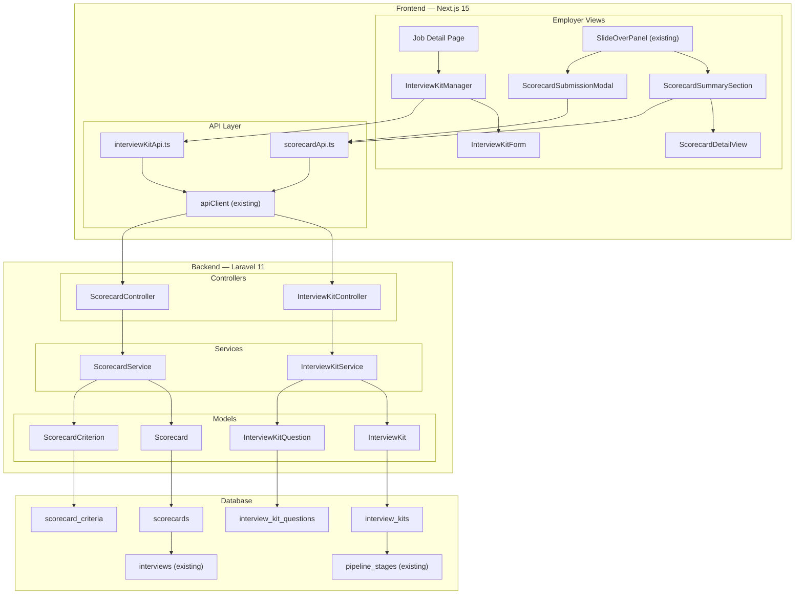
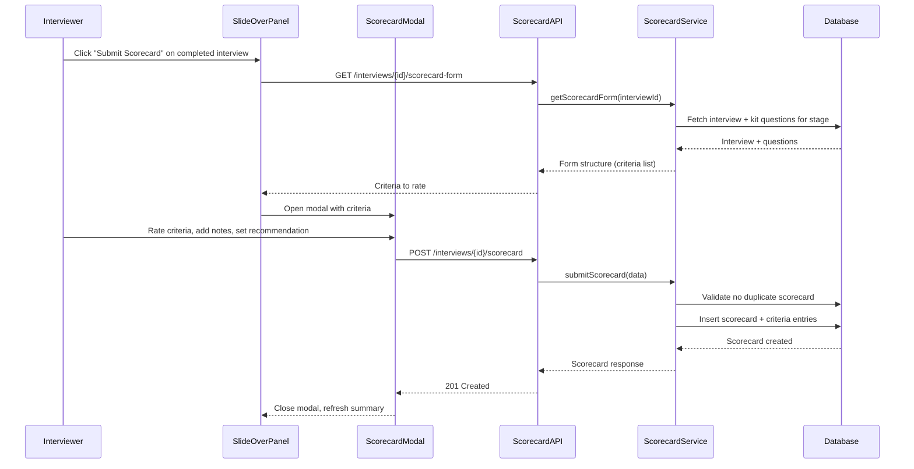
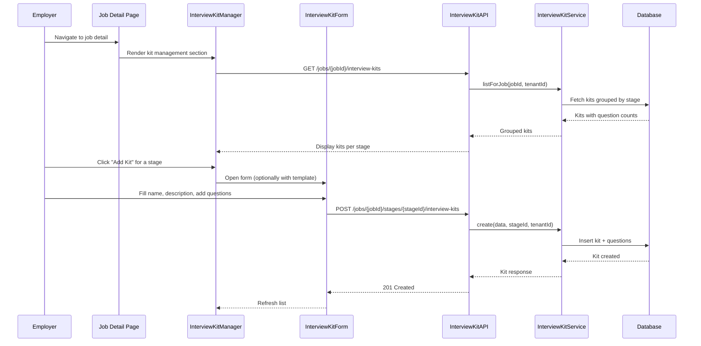
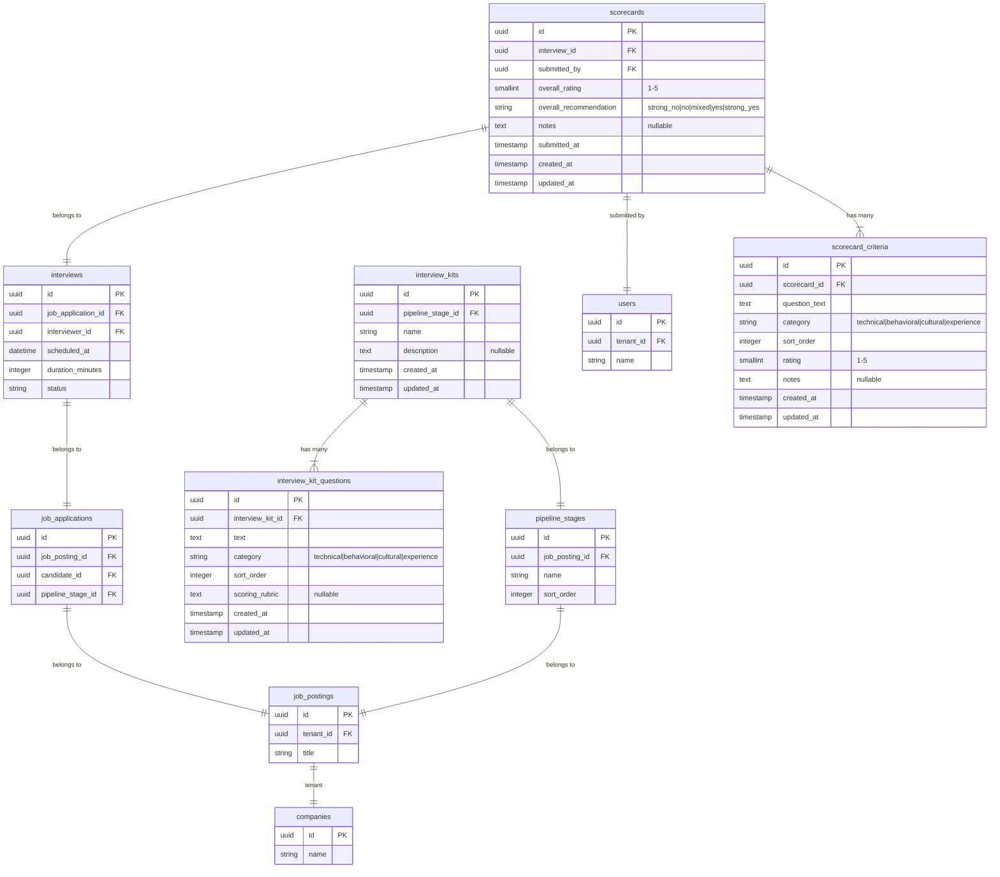

# Design Document — Structured Scorecards & Interview Kits

## Overview

This feature adds structured evaluation tools to HavenHR: interview kits (question templates per pipeline stage) and scorecards (structured evaluation forms interviewers fill out after interviews). The system integrates with the existing Interview, PipelineStage, and JobPosting models to provide consistent interviewing and data-driven hiring decisions.

The feature spans backend (three new tables, three new models, two new controllers, two new services, new form requests) and frontend (interview kit management UI, scorecard submission form, scorecard summary in the SlideOverPanel, new API client functions and TypeScript types).

### Key Design Decisions

| Decision | Choice | Rationale |
|---|---|---|
| Interview kit scoping | Kit belongs to a PipelineStage, which belongs to a JobPosting with tenant_id | Follows existing tenant scoping pattern — no direct tenant_id on kit tables. Consistent with how interviews are scoped |
| Scorecard linked to Interview | Scorecard has interview_id FK, not job_application_id directly | Each scorecard is tied to a specific interview event. Summary aggregation queries across all interviews for an application. This supports panel interviews naturally |
| Criteria stored on scorecard | Scorecard criteria entries store question_text snapshot, not just FK to kit question | If the kit is later modified or deleted, historical scorecard data remains intact and meaningful. Follows the same pattern as resume_snapshot on job_applications |
| Overall recommendation as enum | string column with 5 fixed values (strong_no, no, mixed, yes, strong_yes) | Matches Greenhouse's proven model. Enum validation at request level keeps the DB simple |
| Rating scale | Integer 1–5 for both criteria and overall | Simple, universally understood scale. Stored as smallint for efficiency |
| Default kit templates | Seeded in a JSON config file, copied on demand | Avoids a separate templates table. Templates are static reference data that rarely changes. Copying creates independent kit instances |
| Kit questions as separate table | interview_kit_questions with FK to interview_kit | Allows reordering, individual CRUD, and clean normalization. Sort order stored as integer column |
| Scorecard criteria as separate table | scorecard_criteria with FK to scorecard | Each criterion has its own rating and notes. Normalized for clean aggregation queries |
| Frontend scorecard form | Inline section in SlideOverPanel + dedicated modal for full form | Quick access from candidate view. Modal provides focused form experience without navigation |
| Kit management UI | Section within job detail page | Kits are per-job-per-stage, so managing them in the job context is natural |
| Tenant scoping for scorecards | Join through interview → job_application → job_posting.tenant_id | Same chain as existing interview scoping. No new tenant_id columns needed |


---

## Architecture

### High-Level Architecture



### Scorecard Submission Flow



### Interview Kit Management Flow



---

## Components and Interfaces

### Backend Components

#### 1. InterviewKit Model

**File:** `backend/app/Models/InterviewKit.php`

**Responsibility:** Eloquent model for the `interview_kits` table. Represents a template of questions assigned to a pipeline stage.

```php
class InterviewKit extends Model
{
    use HasFactory, HasUuid;

    protected $table = 'interview_kits';

    protected $fillable = [
        'pipeline_stage_id',
        'name',
        'description',
    ];

    // Relationships
    public function pipelineStage(): BelongsTo;    // → PipelineStage
    public function questions(): HasMany;           // → InterviewKitQuestion (ordered by sort_order)
}
```

**Tenant Scoping:** Scoped through `pipeline_stages → job_postings.tenant_id`.

#### 2. InterviewKitQuestion Model

**File:** `backend/app/Models/InterviewKitQuestion.php`

**Responsibility:** Eloquent model for the `interview_kit_questions` table. Represents a single question/focus area within a kit.

```php
class InterviewKitQuestion extends Model
{
    use HasFactory, HasUuid;

    protected $table = 'interview_kit_questions';

    protected $fillable = [
        'interview_kit_id',
        'text',
        'category',
        'sort_order',
        'scoring_rubric',
    ];

    protected function casts(): array
    {
        return [
            'sort_order' => 'integer',
        ];
    }

    // Relationships
    public function interviewKit(): BelongsTo;  // → InterviewKit
}
```

#### 3. Scorecard Model

**File:** `backend/app/Models/Scorecard.php`

**Responsibility:** Eloquent model for the `scorecards` table. Represents an interviewer's evaluation of a candidate for a specific interview.

```php
class Scorecard extends Model
{
    use HasFactory, HasUuid;

    protected $table = 'scorecards';

    protected $fillable = [
        'interview_id',
        'submitted_by',
        'overall_rating',
        'overall_recommendation',
        'notes',
        'submitted_at',
    ];

    protected function casts(): array
    {
        return [
            'overall_rating' => 'integer',
            'submitted_at' => 'datetime',
        ];
    }

    // Relationships
    public function interview(): BelongsTo;     // → Interview
    public function submitter(): BelongsTo;     // → User (submitted_by)
    public function criteria(): HasMany;        // → ScorecardCriterion (ordered by sort_order)
}
```

**Tenant Scoping:** Scoped through `interviews → job_applications → job_postings.tenant_id`.

#### 4. ScorecardCriterion Model

**File:** `backend/app/Models/ScorecardCriterion.php`

**Responsibility:** Eloquent model for the `scorecard_criteria` table. Stores the rating and notes for a single evaluation criterion on a scorecard.

```php
class ScorecardCriterion extends Model
{
    use HasFactory, HasUuid;

    protected $table = 'scorecard_criteria';

    protected $fillable = [
        'scorecard_id',
        'question_text',
        'category',
        'sort_order',
        'rating',
        'notes',
    ];

    protected function casts(): array
    {
        return [
            'sort_order' => 'integer',
            'rating' => 'integer',
        ];
    }

    // Relationships
    public function scorecard(): BelongsTo;  // → Scorecard
}
```

**Note:** `question_text` and `category` are snapshot copies from the InterviewKitQuestion at submission time. This ensures scorecard data remains meaningful even if the kit is later modified or deleted.

#### 5. InterviewKitService

**File:** `backend/app/Services/InterviewKitService.php`

**Responsibility:** Business logic for interview kit CRUD and default template management.

```php
class InterviewKitService
{
    /**
     * List all interview kits for a job posting, grouped by pipeline stage.
     * Returns kits with question counts.
     */
    public function listForJob(string $jobId, string $tenantId): Collection;

    /**
     * Get a single interview kit with all questions.
     * Validates tenant ownership.
     */
    public function getDetail(string $kitId, string $tenantId): ?InterviewKit;

    /**
     * Create a new interview kit with questions for a pipeline stage.
     * Validates that the stage belongs to the job and tenant.
     */
    public function create(array $data, string $stageId, string $jobId, string $tenantId): InterviewKit;

    /**
     * Update an interview kit's name, description, and replace questions.
     * Validates tenant ownership.
     */
    public function update(InterviewKit $kit, array $data): InterviewKit;

    /**
     * Delete an interview kit and its questions.
     * Scorecard data referencing these questions is preserved (snapshot copies).
     */
    public function delete(InterviewKit $kit): void;

    /**
     * Get available default kit templates for a given stage name.
     * Returns template data from the config file.
     */
    public function getDefaultTemplates(string $stageName): array;

    /**
     * Create a kit from a default template, copying it as an independent instance.
     */
    public function createFromTemplate(string $templateKey, string $stageId, string $jobId, string $tenantId): InterviewKit;
}
```

**Tenant Scoping Pattern:**
```php
$kit = InterviewKit::whereHas('pipelineStage', function ($q) use ($tenantId) {
    $q->whereHas('jobPosting', function ($q2) use ($tenantId) {
        $q2->where('tenant_id', $tenantId);
    });
})->find($kitId);
```

#### 6. ScorecardService

**File:** `backend/app/Services/ScorecardService.php`

**Responsibility:** Business logic for scorecard submission, updates, and summary aggregation.

```php
class ScorecardService
{
    /**
     * Get the scorecard form structure for an interview.
     * Returns criteria from the interview kit linked to the interview's pipeline stage.
     * If no kit exists, returns an empty criteria list.
     */
    public function getScorecardForm(string $interviewId, string $tenantId): array;

    /**
     * Submit a new scorecard for an interview.
     * Validates: interview is completed, no duplicate scorecard for this interviewer.
     * Creates scorecard + criteria entries with snapshot question data.
     */
    public function submit(array $data, string $interviewId, string $userId, string $tenantId): Scorecard;

    /**
     * Update an existing scorecard.
     * Validates: scorecard belongs to the requesting user.
     */
    public function update(Scorecard $scorecard, array $data): Scorecard;

    /**
     * Get a single scorecard with all criteria.
     * Validates tenant ownership.
     */
    public function getDetail(string $scorecardId, string $tenantId): ?Scorecard;

    /**
     * Get the aggregated scorecard summary for a job application.
     * Returns: total count, average overall rating, recommendation distribution,
     * per-criterion averages, and individual interviewer entries.
     */
    public function getSummary(string $applicationId, string $tenantId): array;

    /**
     * List all scorecards for a specific interview.
     */
    public function listForInterview(string $interviewId, string $tenantId): Collection;
}
```

**Tenant Scoping Pattern (for scorecards):**
```php
$scorecard = Scorecard::whereHas('interview', function ($q) use ($tenantId) {
    $q->whereHas('jobApplication', function ($q2) use ($tenantId) {
        $q2->whereHas('jobPosting', function ($q3) use ($tenantId) {
            $q3->where('tenant_id', $tenantId);
        });
    });
})->find($scorecardId);
```


#### 7. InterviewKitController

**File:** `backend/app/Http/Controllers/InterviewKitController.php`

**Responsibility:** REST API endpoints for interview kit management.

**Endpoints:**

| Method | Path | Permission | Action |
|---|---|---|---|
| GET | `/api/v1/jobs/{jobId}/interview-kits` | `jobs.view` | List all kits for a job grouped by stage |
| GET | `/api/v1/interview-kits/{id}` | `jobs.view` | Get kit detail with questions |
| POST | `/api/v1/jobs/{jobId}/stages/{stageId}/interview-kits` | `pipeline.manage` | Create a new kit for a stage |
| PUT | `/api/v1/interview-kits/{id}` | `pipeline.manage` | Update a kit and its questions |
| DELETE | `/api/v1/interview-kits/{id}` | `pipeline.manage` | Delete a kit |
| GET | `/api/v1/interview-kit-templates` | `jobs.view` | List available default templates |
| POST | `/api/v1/jobs/{jobId}/stages/{stageId}/interview-kits/from-template` | `pipeline.manage` | Create kit from a default template |

**Response Formats:**

List kits for job response:
```json
{
  "data": [
    {
      "stage_id": "uuid",
      "stage_name": "Technical Interview",
      "kits": [
        {
          "id": "uuid",
          "name": "Technical Assessment Kit",
          "description": "Evaluate coding and system design skills",
          "question_count": 5,
          "created_at": "2025-02-10T08:00:00Z"
        }
      ]
    }
  ]
}
```

Kit detail response:
```json
{
  "data": {
    "id": "uuid",
    "pipeline_stage_id": "uuid",
    "name": "Technical Assessment Kit",
    "description": "Evaluate coding and system design skills",
    "questions": [
      {
        "id": "uuid",
        "text": "Describe your approach to system design for a high-traffic application",
        "category": "technical",
        "sort_order": 1,
        "scoring_rubric": "1: No understanding. 3: Basic concepts. 5: Expert-level design with trade-off analysis"
      }
    ],
    "created_at": "2025-02-10T08:00:00Z",
    "updated_at": "2025-02-10T08:00:00Z"
  }
}
```

Default templates response:
```json
{
  "data": [
    {
      "key": "phone_screen",
      "name": "Phone Screen Kit",
      "description": "Initial screening questions for phone interviews",
      "questions": [
        {
          "text": "Tell me about your background and what interests you about this role",
          "category": "experience",
          "scoring_rubric": null
        }
      ]
    }
  ]
}
```

#### 8. ScorecardController

**File:** `backend/app/Http/Controllers/ScorecardController.php`

**Responsibility:** REST API endpoints for scorecard operations.

**Endpoints:**

| Method | Path | Permission | Action |
|---|---|---|---|
| GET | `/api/v1/interviews/{interviewId}/scorecard-form` | `applications.view` | Get scorecard form structure (criteria from kit) |
| POST | `/api/v1/interviews/{interviewId}/scorecard` | `applications.manage` | Submit a scorecard |
| GET | `/api/v1/scorecards/{id}` | `applications.view` | Get scorecard detail |
| PUT | `/api/v1/scorecards/{id}` | `applications.manage` | Update a scorecard |
| GET | `/api/v1/interviews/{interviewId}/scorecards` | `applications.view` | List scorecards for an interview |
| GET | `/api/v1/applications/{appId}/scorecard-summary` | `applications.view` | Get aggregated scorecard summary |

**Response Formats:**

Scorecard form response:
```json
{
  "data": {
    "interview_id": "uuid",
    "interview_status": "completed",
    "has_kit": true,
    "criteria": [
      {
        "question_text": "Describe your approach to system design",
        "category": "technical",
        "sort_order": 1,
        "scoring_rubric": "1: No understanding. 3: Basic concepts. 5: Expert-level design"
      }
    ]
  }
}
```

Scorecard detail response:
```json
{
  "data": {
    "id": "uuid",
    "interview_id": "uuid",
    "submitted_by": "uuid",
    "submitter_name": "Jane Smith",
    "overall_rating": 4,
    "overall_recommendation": "yes",
    "notes": "Strong candidate overall",
    "criteria": [
      {
        "id": "uuid",
        "question_text": "Describe your approach to system design",
        "category": "technical",
        "sort_order": 1,
        "rating": 4,
        "notes": "Good understanding of distributed systems"
      }
    ],
    "submitted_at": "2025-02-15T14:30:00Z",
    "updated_at": "2025-02-15T14:30:00Z"
  }
}
```

Scorecard summary response:
```json
{
  "data": {
    "application_id": "uuid",
    "total_scorecards": 3,
    "average_overall_rating": 3.67,
    "recommendation_distribution": {
      "strong_no": 0,
      "no": 0,
      "mixed": 1,
      "yes": 1,
      "strong_yes": 1
    },
    "criteria_averages": [
      {
        "question_text": "Describe your approach to system design",
        "category": "technical",
        "average_rating": 3.33,
        "rating_count": 3
      }
    ],
    "interviewers": [
      {
        "interviewer_id": "uuid",
        "interviewer_name": "Jane Smith",
        "interview_id": "uuid",
        "overall_rating": 4,
        "overall_recommendation": "yes",
        "submitted_at": "2025-02-15T14:30:00Z"
      }
    ]
  }
}
```

#### 9. Form Request Classes

**CreateInterviewKitRequest:**

**File:** `backend/app/Http/Requests/CreateInterviewKitRequest.php`

```php
class CreateInterviewKitRequest extends BaseFormRequest
{
    public function rules(): array
    {
        return [
            'name' => 'required|string|max:255',
            'description' => 'sometimes|nullable|string|max:2000',
            'questions' => 'required|array|min:1',
            'questions.*.text' => 'required|string|max:1000',
            'questions.*.category' => 'required|string|in:technical,behavioral,cultural,experience',
            'questions.*.sort_order' => 'required|integer|min:0',
            'questions.*.scoring_rubric' => 'sometimes|nullable|string|max:2000',
        ];
    }
}
```

**UpdateInterviewKitRequest:**

**File:** `backend/app/Http/Requests/UpdateInterviewKitRequest.php`

```php
class UpdateInterviewKitRequest extends BaseFormRequest
{
    public function rules(): array
    {
        return [
            'name' => 'sometimes|string|max:255',
            'description' => 'sometimes|nullable|string|max:2000',
            'questions' => 'sometimes|array|min:1',
            'questions.*.text' => 'required_with:questions|string|max:1000',
            'questions.*.category' => 'required_with:questions|string|in:technical,behavioral,cultural,experience',
            'questions.*.sort_order' => 'required_with:questions|integer|min:0',
            'questions.*.scoring_rubric' => 'sometimes|nullable|string|max:2000',
        ];
    }
}
```

**SubmitScorecardRequest:**

**File:** `backend/app/Http/Requests/SubmitScorecardRequest.php`

```php
class SubmitScorecardRequest extends BaseFormRequest
{
    public function rules(): array
    {
        return [
            'overall_rating' => 'required|integer|min:1|max:5',
            'overall_recommendation' => 'required|string|in:strong_no,no,mixed,yes,strong_yes',
            'notes' => 'sometimes|nullable|string|max:5000',
            'criteria' => 'sometimes|array',
            'criteria.*.question_text' => 'required_with:criteria|string|max:1000',
            'criteria.*.category' => 'required_with:criteria|string|in:technical,behavioral,cultural,experience',
            'criteria.*.sort_order' => 'required_with:criteria|integer|min:0',
            'criteria.*.rating' => 'required_with:criteria|integer|min:1|max:5',
            'criteria.*.notes' => 'sometimes|nullable|string|max:2000',
        ];
    }
}
```

**UpdateScorecardRequest:**

**File:** `backend/app/Http/Requests/UpdateScorecardRequest.php`

```php
class UpdateScorecardRequest extends BaseFormRequest
{
    public function rules(): array
    {
        return [
            'overall_rating' => 'sometimes|integer|min:1|max:5',
            'overall_recommendation' => 'sometimes|string|in:strong_no,no,mixed,yes,strong_yes',
            'notes' => 'sometimes|nullable|string|max:5000',
            'criteria' => 'sometimes|array',
            'criteria.*.question_text' => 'required_with:criteria|string|max:1000',
            'criteria.*.category' => 'required_with:criteria|string|in:technical,behavioral,cultural,experience',
            'criteria.*.sort_order' => 'required_with:criteria|integer|min:0',
            'criteria.*.rating' => 'required_with:criteria|integer|min:1|max:5',
            'criteria.*.notes' => 'sometimes|nullable|string|max:2000',
        ];
    }
}
```

### Route Registration

New routes added to `backend/routes/api.php` inside the `havenhr.auth + tenant.resolve` middleware group:

```php
// Interview Kit management
Route::get('/jobs/{jobId}/interview-kits', [InterviewKitController::class, 'listForJob'])
    ->middleware('rbac:jobs.view');
Route::post('/jobs/{jobId}/stages/{stageId}/interview-kits', [InterviewKitController::class, 'store'])
    ->middleware('rbac:pipeline.manage');
Route::post('/jobs/{jobId}/stages/{stageId}/interview-kits/from-template', [InterviewKitController::class, 'createFromTemplate'])
    ->middleware('rbac:pipeline.manage');
Route::get('/interview-kits/{id}', [InterviewKitController::class, 'show'])
    ->middleware('rbac:jobs.view');
Route::put('/interview-kits/{id}', [InterviewKitController::class, 'update'])
    ->middleware('rbac:pipeline.manage');
Route::delete('/interview-kits/{id}', [InterviewKitController::class, 'destroy'])
    ->middleware('rbac:pipeline.manage');
Route::get('/interview-kit-templates', [InterviewKitController::class, 'templates'])
    ->middleware('rbac:jobs.view');

// Scorecard endpoints
Route::get('/interviews/{interviewId}/scorecard-form', [ScorecardController::class, 'form'])
    ->middleware('rbac:applications.view');
Route::post('/interviews/{interviewId}/scorecard', [ScorecardController::class, 'store'])
    ->middleware('rbac:applications.manage');
Route::get('/interviews/{interviewId}/scorecards', [ScorecardController::class, 'listForInterview'])
    ->middleware('rbac:applications.view');
Route::get('/scorecards/{id}', [ScorecardController::class, 'show'])
    ->middleware('rbac:applications.view');
Route::put('/scorecards/{id}', [ScorecardController::class, 'update'])
    ->middleware('rbac:applications.manage');
Route::get('/applications/{appId}/scorecard-summary', [ScorecardController::class, 'summary'])
    ->middleware('rbac:applications.view');
```


### Frontend Components

#### 10. Interview Kit TypeScript Types

**File:** `frontend/src/types/interviewKit.ts`

```typescript
export type QuestionCategory = "technical" | "behavioral" | "cultural" | "experience";

export interface InterviewKitQuestion {
  id: string;
  text: string;
  category: QuestionCategory;
  sort_order: number;
  scoring_rubric: string | null;
}

export interface InterviewKit {
  id: string;
  pipeline_stage_id: string;
  name: string;
  description: string | null;
  questions: InterviewKitQuestion[];
  created_at: string;
  updated_at: string;
}

export interface InterviewKitListItem {
  id: string;
  name: string;
  description: string | null;
  question_count: number;
  created_at: string;
}

export interface StageKits {
  stage_id: string;
  stage_name: string;
  kits: InterviewKitListItem[];
}

export interface InterviewKitTemplate {
  key: string;
  name: string;
  description: string;
  questions: Omit<InterviewKitQuestion, "id" | "sort_order">[];
}

export interface CreateInterviewKitPayload {
  name: string;
  description?: string;
  questions: {
    text: string;
    category: QuestionCategory;
    sort_order: number;
    scoring_rubric?: string;
  }[];
}

export interface UpdateInterviewKitPayload {
  name?: string;
  description?: string;
  questions?: {
    text: string;
    category: QuestionCategory;
    sort_order: number;
    scoring_rubric?: string;
  }[];
}
```

#### 11. Scorecard TypeScript Types

**File:** `frontend/src/types/scorecard.ts`

```typescript
export type OverallRecommendation = "strong_no" | "no" | "mixed" | "yes" | "strong_yes";

export interface ScorecardCriterion {
  id: string;
  question_text: string;
  category: string;
  sort_order: number;
  rating: number;
  notes: string | null;
}

export interface Scorecard {
  id: string;
  interview_id: string;
  submitted_by: string;
  submitter_name: string;
  overall_rating: number;
  overall_recommendation: OverallRecommendation;
  notes: string | null;
  criteria: ScorecardCriterion[];
  submitted_at: string;
  updated_at: string;
}

export interface ScorecardFormCriterion {
  question_text: string;
  category: string;
  sort_order: number;
  scoring_rubric: string | null;
}

export interface ScorecardForm {
  interview_id: string;
  interview_status: string;
  has_kit: boolean;
  criteria: ScorecardFormCriterion[];
}

export interface ScorecardSummary {
  application_id: string;
  total_scorecards: number;
  average_overall_rating: number | null;
  recommendation_distribution: Record<OverallRecommendation, number>;
  criteria_averages: {
    question_text: string;
    category: string;
    average_rating: number;
    rating_count: number;
  }[];
  interviewers: {
    interviewer_id: string;
    interviewer_name: string;
    interview_id: string;
    overall_rating: number;
    overall_recommendation: OverallRecommendation;
    submitted_at: string;
  }[];
}

export interface SubmitScorecardPayload {
  overall_rating: number;
  overall_recommendation: OverallRecommendation;
  notes?: string;
  criteria?: {
    question_text: string;
    category: string;
    sort_order: number;
    rating: number;
    notes?: string;
  }[];
}

export interface UpdateScorecardPayload {
  overall_rating?: number;
  overall_recommendation?: OverallRecommendation;
  notes?: string;
  criteria?: {
    question_text: string;
    category: string;
    sort_order: number;
    rating: number;
    notes?: string;
  }[];
}
```

#### 12. Interview Kit API Functions

**File:** `frontend/src/lib/interviewKitApi.ts`

```typescript
import { apiClient } from "@/lib/api";
import type { ApiResponse } from "@/types/api";
import type {
  InterviewKit,
  InterviewKitTemplate,
  StageKits,
  CreateInterviewKitPayload,
  UpdateInterviewKitPayload,
} from "@/types/interviewKit";

export async function listInterviewKitsForJob(
  jobId: string
): Promise<ApiResponse<StageKits[]>>;

export async function getInterviewKitDetail(
  kitId: string
): Promise<ApiResponse<InterviewKit>>;

export async function createInterviewKit(
  jobId: string,
  stageId: string,
  payload: CreateInterviewKitPayload
): Promise<ApiResponse<InterviewKit>>;

export async function updateInterviewKit(
  kitId: string,
  payload: UpdateInterviewKitPayload
): Promise<ApiResponse<InterviewKit>>;

export async function deleteInterviewKit(
  kitId: string
): Promise<ApiResponse<void>>;

export async function listInterviewKitTemplates():
  Promise<ApiResponse<InterviewKitTemplate[]>>;

export async function createInterviewKitFromTemplate(
  jobId: string,
  stageId: string,
  templateKey: string
): Promise<ApiResponse<InterviewKit>>;
```

#### 13. Scorecard API Functions

**File:** `frontend/src/lib/scorecardApi.ts`

```typescript
import { apiClient } from "@/lib/api";
import type { ApiResponse } from "@/types/api";
import type {
  Scorecard,
  ScorecardForm,
  ScorecardSummary,
  SubmitScorecardPayload,
  UpdateScorecardPayload,
} from "@/types/scorecard";

export async function getScorecardForm(
  interviewId: string
): Promise<ApiResponse<ScorecardForm>>;

export async function submitScorecard(
  interviewId: string,
  payload: SubmitScorecardPayload
): Promise<ApiResponse<Scorecard>>;

export async function getScorecardDetail(
  scorecardId: string
): Promise<ApiResponse<Scorecard>>;

export async function updateScorecard(
  scorecardId: string,
  payload: UpdateScorecardPayload
): Promise<ApiResponse<Scorecard>>;

export async function listScorecardsForInterview(
  interviewId: string
): Promise<ApiResponse<Scorecard[]>>;

export async function getScorecardSummary(
  applicationId: string
): Promise<ApiResponse<ScorecardSummary>>;
```

#### 14. InterviewKitManager Component

**File:** `frontend/src/components/interviews/InterviewKitManager.tsx`

**Responsibility:** Displays all interview kits for a job posting grouped by pipeline stage. Provides controls to add, edit, and delete kits.

**Key Behaviors:**
- Fetches kits via `listInterviewKitsForJob(jobId)` on mount
- Renders each pipeline stage as a section with its associated kits
- "Add Kit" button per stage opens the InterviewKitForm
- Each kit card shows name, description preview, question count, and edit/delete actions
- Delete action shows confirmation dialog before proceeding
- "Use Template" option when adding a new kit

**Props:**
```typescript
interface InterviewKitManagerProps {
  jobId: string;
  stages: { id: string; name: string }[];
}
```

#### 15. InterviewKitForm Component

**File:** `frontend/src/components/interviews/InterviewKitForm.tsx`

**Responsibility:** Form for creating or editing an interview kit with dynamic question management.

**Key Behaviors:**
- Fields: name (text input), description (textarea), questions list
- Each question row: text (textarea), category (dropdown), scoring rubric (optional textarea)
- Add question button appends a new empty row
- Remove button on each question row (with confirmation if question has content)
- Reorder questions via up/down arrow buttons
- Client-side validation: name required, at least one question, each question needs text and category
- On submit: calls create or update API, shows success, closes form
- Template selection: dropdown to pre-fill from a default template

**Props:**
```typescript
interface InterviewKitFormProps {
  jobId: string;
  stageId: string;
  existingKit?: InterviewKit;  // If editing
  onSaved: () => void;
  onCancel: () => void;
}
```

#### 16. ScorecardSubmissionModal Component

**File:** `frontend/src/components/interviews/ScorecardSubmissionModal.tsx`

**Responsibility:** Modal form for submitting or editing a scorecard after an interview.

**Key Behaviors:**
- On open: fetches scorecard form via `getScorecardForm(interviewId)` to get criteria
- If kit exists: renders each criterion with rating selector (1–5 stars) and notes textarea
- If no kit: renders only overall rating, recommendation, and general notes
- Overall rating: star rating selector (1–5)
- Overall recommendation: button group (Strong No / No / Mixed / Yes / Strong Yes)
- Submit button calls `submitScorecard()` or `updateScorecard()`
- Inline validation errors on failed submission
- Success confirmation message on submit
- Focus trap and Escape to close
- ARIA: `role="dialog"`, `aria-modal="true"`, `aria-labelledby`

**Props:**
```typescript
interface ScorecardSubmissionModalProps {
  interviewId: string;
  existingScorecard?: Scorecard;  // If editing
  onClose: () => void;
  onSubmitted: () => void;
}
```

#### 17. ScorecardSummarySection Component

**File:** `frontend/src/components/pipeline/ScorecardSummarySection.tsx`

**Responsibility:** Displays the aggregated scorecard summary within the SlideOverPanel for a candidate application.

**Key Behaviors:**
- Fetches summary via `getScorecardSummary(applicationId)` on mount
- Displays: average overall rating (as stars), total scorecard count, recommendation distribution (as colored badges)
- Side-by-side interviewer comparison: each interviewer's name, rating, and recommendation
- Click on an interviewer entry expands to show full scorecard detail (criteria ratings and notes) inline
- Empty state: "No evaluations submitted yet" message
- Loading skeleton while fetching

**Props:**
```typescript
interface ScorecardSummarySectionProps {
  applicationId: string;
}
```

#### 18. ScorecardDetailView Component

**File:** `frontend/src/components/interviews/ScorecardDetailView.tsx`

**Responsibility:** Renders the full detail of a single scorecard, used both inline (expanded in summary) and standalone.

**Key Behaviors:**
- Displays: submitter name, submission date, overall rating (stars), overall recommendation (badge)
- Per-criterion list: question text, category badge, rating (stars), notes
- Grouped by category for readability
- Edit button (visible only to the scorecard's submitter) opens ScorecardSubmissionModal in edit mode

**Props:**
```typescript
interface ScorecardDetailViewProps {
  scorecard: Scorecard;
  canEdit: boolean;
  onEdit?: () => void;
}
```


---

## Data Models

### Entity Relationship Diagram



### Migrations

**File:** `backend/database/migrations/2025_01_06_000001_create_interview_kits_table.php`

```php
Schema::create('interview_kits', function (Blueprint $table) {
    $table->uuid('id')->primary();
    $table->uuid('pipeline_stage_id');
    $table->string('name', 255);
    $table->text('description')->nullable();
    $table->timestamps();

    $table->foreign('pipeline_stage_id')
        ->references('id')->on('pipeline_stages')
        ->cascadeOnDelete();

    $table->index('pipeline_stage_id');
});
```

**File:** `backend/database/migrations/2025_01_06_000002_create_interview_kit_questions_table.php`

```php
Schema::create('interview_kit_questions', function (Blueprint $table) {
    $table->uuid('id')->primary();
    $table->uuid('interview_kit_id');
    $table->text('text');
    $table->string('category', 20);  // technical, behavioral, cultural, experience
    $table->unsignedSmallInteger('sort_order')->default(0);
    $table->text('scoring_rubric')->nullable();
    $table->timestamps();

    $table->foreign('interview_kit_id')
        ->references('id')->on('interview_kits')
        ->cascadeOnDelete();

    $table->index('interview_kit_id');
    $table->index(['interview_kit_id', 'sort_order']);
});
```

**File:** `backend/database/migrations/2025_01_06_000003_create_scorecards_table.php`

```php
Schema::create('scorecards', function (Blueprint $table) {
    $table->uuid('id')->primary();
    $table->uuid('interview_id');
    $table->uuid('submitted_by');
    $table->unsignedSmallInteger('overall_rating');  // 1-5
    $table->string('overall_recommendation', 20);    // strong_no, no, mixed, yes, strong_yes
    $table->text('notes')->nullable();
    $table->timestamp('submitted_at');
    $table->timestamps();

    $table->foreign('interview_id')
        ->references('id')->on('interviews')
        ->cascadeOnDelete();
    $table->foreign('submitted_by')
        ->references('id')->on('users')
        ->cascadeOnDelete();

    // Unique constraint: one scorecard per interviewer per interview
    $table->unique(['interview_id', 'submitted_by']);

    $table->index('interview_id');
    $table->index('submitted_by');
});
```

**File:** `backend/database/migrations/2025_01_06_000004_create_scorecard_criteria_table.php`

```php
Schema::create('scorecard_criteria', function (Blueprint $table) {
    $table->uuid('id')->primary();
    $table->uuid('scorecard_id');
    $table->text('question_text');
    $table->string('category', 20);
    $table->unsignedSmallInteger('sort_order')->default(0);
    $table->unsignedSmallInteger('rating');  // 1-5
    $table->text('notes')->nullable();
    $table->timestamps();

    $table->foreign('scorecard_id')
        ->references('id')->on('scorecards')
        ->cascadeOnDelete();

    $table->index('scorecard_id');
    $table->index(['scorecard_id', 'sort_order']);
});
```

### Default Kit Templates Config

**File:** `backend/config/interview_kit_templates.php`

```php
return [
    'phone_screen' => [
        'name' => 'Phone Screen Kit',
        'description' => 'Initial screening questions for phone interviews',
        'questions' => [
            ['text' => 'Tell me about your background and what interests you about this role', 'category' => 'experience', 'scoring_rubric' => null],
            ['text' => 'What are your salary expectations?', 'category' => 'experience', 'scoring_rubric' => null],
            ['text' => 'Describe a challenging project you worked on recently', 'category' => 'experience', 'scoring_rubric' => '1: Vague answer. 3: Clear example with some detail. 5: Compelling story with measurable impact'],
            ['text' => 'Why are you looking to leave your current position?', 'category' => 'behavioral', 'scoring_rubric' => null],
        ],
    ],
    'technical_interview' => [
        'name' => 'Technical Interview Kit',
        'description' => 'Technical assessment questions for engineering roles',
        'questions' => [
            ['text' => 'Describe your approach to system design for a high-traffic application', 'category' => 'technical', 'scoring_rubric' => '1: No understanding. 3: Basic concepts. 5: Expert-level design with trade-off analysis'],
            ['text' => 'How do you approach debugging a production issue?', 'category' => 'technical', 'scoring_rubric' => '1: No methodology. 3: Systematic approach. 5: Comprehensive strategy with monitoring and prevention'],
            ['text' => 'Explain a complex technical concept to a non-technical stakeholder', 'category' => 'behavioral', 'scoring_rubric' => '1: Unable to simplify. 3: Adequate explanation. 5: Clear, engaging explanation with analogies'],
            ['text' => 'How do you stay current with technology trends?', 'category' => 'experience', 'scoring_rubric' => null],
        ],
    ],
    'culture_fit' => [
        'name' => 'Culture Fit Kit',
        'description' => 'Questions to assess cultural alignment and team fit',
        'questions' => [
            ['text' => 'Describe your ideal work environment', 'category' => 'cultural', 'scoring_rubric' => null],
            ['text' => 'How do you handle disagreements with team members?', 'category' => 'behavioral', 'scoring_rubric' => '1: Avoids conflict. 3: Addresses constructively. 5: Facilitates resolution and strengthens relationships'],
            ['text' => 'Tell me about a time you received critical feedback', 'category' => 'behavioral', 'scoring_rubric' => '1: Defensive response. 3: Accepted feedback. 5: Sought feedback proactively and demonstrated growth'],
            ['text' => 'What motivates you in your work?', 'category' => 'cultural', 'scoring_rubric' => null],
        ],
    ],
    'final_round' => [
        'name' => 'Final Round Kit',
        'description' => 'Senior leadership and final assessment questions',
        'questions' => [
            ['text' => 'Where do you see yourself in 3-5 years?', 'category' => 'experience', 'scoring_rubric' => null],
            ['text' => 'What unique value would you bring to this team?', 'category' => 'cultural', 'scoring_rubric' => null],
            ['text' => 'Describe a situation where you led a team through a difficult challenge', 'category' => 'behavioral', 'scoring_rubric' => '1: No leadership example. 3: Led with some success. 5: Demonstrated exceptional leadership with clear outcomes'],
            ['text' => 'Do you have any questions for us?', 'category' => 'cultural', 'scoring_rubric' => null],
        ],
    ],
];
```

### Schema Summary

| Table | Change | Details |
|---|---|---|
| `interview_kits` | New table | UUID PK, FK to `pipeline_stages`, name/description columns |
| `interview_kit_questions` | New table | UUID PK, FK to `interview_kits`, text/category/sort_order/rubric columns |
| `scorecards` | New table | UUID PK, FK to `interviews` and `users`, rating/recommendation/notes columns, unique constraint on (interview_id, submitted_by) |
| `scorecard_criteria` | New table | UUID PK, FK to `scorecards`, snapshot question_text/category, rating/notes columns |

No changes to existing tables.

---

## Correctness Properties

### Property 1: Interview kit creation round-trip

*For any* valid combination of name (1–255 chars), optional description, and a list of questions (each with non-empty text, valid category, sort_order, and optional rubric), creating an interview kit SHALL return a record with all provided fields matching the input. Re-fetching the kit by ID SHALL return the same name, description, and questions in the specified sort order.

**Validates: Requirements 1.1, 1.3, 4.2**

### Property 2: Interview kit question sort order preservation

*For any* interview kit with N questions (N >= 1), the questions returned by the detail endpoint SHALL be ordered by sort_order ascending. After updating the kit with a new question order, re-fetching SHALL reflect the new order exactly.

**Validates: Requirements 1.3, 2.2**

### Property 3: Interview kit tenant isolation

*For any* interview kit belonging to tenant A, querying from tenant B (via list, detail, update, or delete endpoints) SHALL return a 404 NOT_FOUND error. No kit data from tenant A SHALL appear in tenant B's responses.

**Validates: Requirements 2.3, 3.3, 4.3**

### Property 4: Interview kit validation rejects invalid input

*For any* create or update request containing at least one of: empty name, name exceeding 255 characters, empty question text, or invalid category (not one of technical/behavioral/cultural/experience), the API SHALL return a 422 validation error. The kit SHALL NOT be created or modified.

**Validates: Requirements 1.2, 1.4**

### Property 5: Kit-to-stage association validation

*For any* request to create an interview kit where the specified pipeline_stage_id does not belong to the specified job_posting_id, or the job posting does not belong to the requesting user's tenant, the API SHALL return a validation error. No kit SHALL be created.

**Validates: Requirement 1.5**

### Property 6: Default template independence

*For any* default template copied to create a new interview kit, modifying the created kit (changing name, adding/removing questions) SHALL NOT affect the original template data. Creating another kit from the same template SHALL produce the original template content.

**Validates: Requirements 5.2, 5.3**

### Property 7: Scorecard submission round-trip

*For any* valid scorecard submission with overall_rating (1–5), overall_recommendation (one of the 5 valid values), optional notes, and a list of criteria (each with question_text, category, sort_order, rating 1–5, and optional notes), creating a scorecard SHALL return a record with all provided fields matching the input. Re-fetching the scorecard by ID SHALL return the same data including the submitter's user ID and a valid submitted_at timestamp.

**Validates: Requirements 6.1, 6.7, 8.1**

### Property 8: Scorecard rating validation

*For any* scorecard submission or update containing a criteria rating or overall_rating outside the range [1, 5] (e.g., 0, 6, -1, or non-integer), the API SHALL return a 422 validation error. The scorecard SHALL NOT be created or modified.

**Validates: Requirements 6.2, 6.3**

### Property 9: Scorecard recommendation validation

*For any* scorecard submission or update containing an overall_recommendation value not in {strong_no, no, mixed, yes, strong_yes}, the API SHALL return a 422 validation error.

**Validates: Requirement 6.4**

### Property 10: Scorecard requires completed interview

*For any* interview with status other than "completed" (i.e., scheduled, cancelled, no_show), attempting to submit a scorecard SHALL return a validation error. No scorecard SHALL be created.

**Validates: Requirement 6.5**

### Property 11: Scorecard uniqueness per interviewer per interview

*For any* interview where an interviewer has already submitted a scorecard, attempting to submit a second scorecard for the same interview by the same interviewer SHALL return a validation error. The original scorecard SHALL remain unchanged.

**Validates: Requirements 6.6, 13.2**

### Property 12: Scorecard ownership enforcement

*For any* scorecard submitted by user A, attempting to update it as user B (where B is not A) SHALL return a 403 Forbidden error. The scorecard SHALL remain unchanged.

**Validates: Requirement 7.2**

### Property 13: Scorecard summary aggregation correctness

*For any* job application with N scorecards (N >= 1), the scorecard summary SHALL report total_scorecards equal to N, average_overall_rating equal to the arithmetic mean of all N overall_ratings (rounded to 2 decimal places), and recommendation_distribution counts that sum to N. The interviewers array SHALL contain exactly N entries.

**Validates: Requirements 9.1, 9.3, 13.3**

### Property 14: Scorecard summary per-criterion averages

*For any* job application with scorecards containing criteria, the per-criterion average ratings in the summary SHALL equal the arithmetic mean of all ratings for that question_text across all scorecards. The rating_count for each criterion SHALL equal the number of scorecards that rated that criterion.

**Validates: Requirement 9.2**

### Property 15: Empty scorecard summary

*For any* job application with zero scorecards, the scorecard summary SHALL return total_scorecards of 0, average_overall_rating of null, all recommendation_distribution counts of 0, empty criteria_averages array, and empty interviewers array.

**Validates: Requirement 9.4**

### Property 16: Scorecard tenant isolation

*For any* scorecard belonging to tenant A, querying from tenant B (via detail, summary, or list endpoints) SHALL return a 404 NOT_FOUND error or exclude the scorecard from results. No scorecard data from tenant A SHALL appear in tenant B's responses.

**Validates: Requirements 8.2, 8.3, 14.4**

### Property 17: Multiple interviewers can submit independent scorecards

*For any* job application with K interviews (K >= 1), each assigned to a different interviewer, each interviewer SHALL be able to submit one scorecard per their interview. The total number of scorecards for the application SHALL equal the number of submitted scorecards across all interviews.

**Validates: Requirements 13.1, 13.3**